<div class="MCWHeader1">
App modernization
</div>

<div class="MCWHeader2">
Hands-on lab step-by-step guide
</div>

<div class="MCWHeader3">
February 2020
</div>

Information in this document, including URL and other Internet Web site references, is subject to change without notice. Unless otherwise noted, the example companies, organizations, products, domain names, e-mail addresses, logos, people, places, and events depicted herein are fictitious, and no association with any real company, organization, product, domain name, e-mail address, logo, person, place or event is intended or should be inferred. Complying with all applicable copyright laws is the responsibility of the user. Without limiting the rights under copyright, no part of this document may be reproduced, stored in or introduced into a retrieval system, or transmitted in any form or by any means (electronic, mechanical, photocopying, recording, or otherwise), or for any purpose, without the express written permission of Microsoft Corporation.

Microsoft may have patents, patent applications, trademarks, copyrights, or other intellectual property rights covering subject matter in this document. Except as expressly provided in any written license agreement from Microsoft, the furnishing of this document does not give you any license to these patents, trademarks, copyrights, or other intellectual property.

The names of manufacturers, products, or URLs are provided for informational purposes only and Microsoft makes no representations and warranties, either expressed, implied, or statutory, regarding these manufacturers or the use of the products with any Microsoft technologies. The inclusion of a manufacturer or product does not imply endorsement of Microsoft of the manufacturer or product. Links may be provided to third party sites. Such sites are not under the control of Microsoft and Microsoft is not responsible for the contents of any linked site or any link contained in a linked site, or any changes or updates to such sites. Microsoft is not responsible for webcasting or any other form of transmission received from any linked site. Microsoft is providing these links to you only as a convenience, and the inclusion of any link does not imply endorsement of Microsoft of the site or the products contained therein.

© 2020 Microsoft Corporation. All rights reserved.

Microsoft and the trademarks listed at <https://www.microsoft.com/en-us/legal/intellectualproperty/Trademarks/Usage/General.aspx> are trademarks of the Microsoft group of companies. All other trademarks are property of their respective owners.

**Contents**

<!-- TOC -->

- [App modernization hands-on lab step-by-step](#app-modernization-hands-on-lab-step-by-step)
  - [Abstract and learning objectives](#abstract-and-learning-objectives)
  - [Overview](#overview)
  - [Solution architecture](#solution-architecture)
  - [Requirements](#requirements)
  - [Exercise 1: Migrate the on-premises database to Azure SQL Database](#exercise-1-migrate-the-on-premises-database-to-azure-sql-database)
    - [Task 1: Configure the ContosoInsurance database on the SqlServer2008 VM](#task-1-configure-the-contosoinsurance-database-on-the-sqlserver2008-vm)
    - [Task 2: Perform assessment for migration to Azure SQL Database](#task-2-perform-assessment-for-migration-to-azure-sql-database)
    - [Task 3: Migrate the database schema using the Data Migration Assistant](#task-3-migrate-the-database-schema-using-the-data-migration-assistant)
    - [Task 4: Retrieve connection information for SQL databases](#task-4-retrieve-connection-information-for-sql-databases)
    - [Task 5: Migrate the database using the Azure Database Migration Service](#task-5-migrate-the-database-using-the-azure-database-migration-service)
  - [Exercise 2: Post upgrade database enhancements](#exercise-2-post-upgrade-database-enhancements)
    - [Task 1: Configure SQL Data Discovery and Classification](#task-1-configure-sql-data-discovery-and-classification)
    - [Task 2: Review Advanced Data Security Vulnerability Assessment](#task-2-review-advanced-data-security-vulnerability-assessment)
    - [Task 3: Enable Dynamic Data Masking](#task-3-enable-dynamic-data-masking)
  - [Exercise 3: Configure Key Vault](#exercise-3-configure-key-vault)
    - [Task 1: Add Key Vault access policy](#task-1-add-key-vault-access-policy)
    - [Task 2: Create a new secret to store the SQL connection string](#task-2-create-a-new-secret-to-store-the-sql-connection-string)
    - [Task 3: Create a service principal](#task-3-create-a-service-principal)
    - [Task 4: Assign the service principal access to Key Vault](#task-4-assign-the-service-principal-access-to-key-vault)
  - [Exercise 4: Deploy Web API into Azure App Services](#exercise-4-deploy-web-api-into-azure-app-services)
    - [Task 1: Connect to the LabVM](#task-1-connect-to-the-labvm)
    - [Task 2: Open starter solution with Visual Studio](#task-2-open-starter-solution-with-visual-studio)
    - [Task 3: Update Web API to use Key Vault](#task-3-update-web-api-to-use-key-vault)
    - [Task 4: Copy KeyVault configuration section to API App in Azure](#task-4-copy-keyvault-configuration-section-to-api-app-in-azure)
    - [Task 5: Deploy the API to Azure](#task-5-deploy-the-api-to-azure)
  - [Exercise 5: Deploy web application into Azure App Services](#exercise-5-deploy-web-application-into-azure-app-services)
    - [Task 1: Add API App URL to Web App Application settings](#task-1-add-api-app-url-to-web-app-application-settings)
    - [Task 2: Deploy web application to Azure](#task-2-deploy-web-application-to-azure)
  - [Exercise 6: Upload policy documents into blob storage](#exercise-6-upload-policy-documents-into-blob-storage)
    - [Task 1: Create container for storing PDFs in Azure storage](#task-1-create-container-for-storing-pdfs-in-azure-storage)
    - [Task 2: Create a SAS token](#task-2-create-a-sas-token)
    - [Task 3: Bulk upload PDFs to blob storage using AzCopy](#task-3-bulk-upload-pdfs-to-blob-storage-using-azcopy)
  - [Exercise 7: Create serverless API for accessing PDFs](#exercise-7-create-serverless-api-for-accessing-pdfs)
    - [Task 1: Add application settings to your Function App](#task-1-add-application-settings-to-your-function-app)
    - [Task 2: Add project environment variables](#task-2-add-project-environment-variables)
    - [Task 3: Create an Azure Function in Visual Studio](#task-3-create-an-azure-function-in-visual-studio)
    - [Task 4: Test the function locally](#task-4-test-the-function-locally)
    - [Task 5: Deploy the function to your Azure Function App](#task-5-deploy-the-function-to-your-azure-function-app)
    - [Task 6: Enable Application Insights on the Function App](#task-6-enable-application-insights-on-the-function-app)
    - [Task 7: Add Function App URL to your Web App Application settings](#task-7-add-function-app-url-to-your-web-app-application-settings)
    - [Task 8: Test document retrieval from web app](#task-8-test-document-retrieval-from-web-app)
    - [Task 9: View Live Metrics Stream](#task-9-view-live-metrics-stream)
  - [Exercise 8: Add Cognitive Search for policy documents](#exercise-8-add-cognitive-search-for-policy-documents)
    - [Task 1: Add Azure Cognitive Search to Storage account](#task-1-add-azure-cognitive-search-to-storage-account)
    - [Task 2: Review search results](#task-2-review-search-results)
  - [Exercise 9: Import and publish APIs into APIM](#exercise-9-import-and-publish-apis-into-apim)
    - [Task 1: Import API App](#task-1-import-api-app)
    - [Task 2: Import Function App](#task-2-import-function-app)
    - [Task 3: Open Developer Portal and retrieve you API key](#task-3-open-developer-portal-and-retrieve-you-api-key)
    - [Task 4: Update Web App to use API Management Endpoints](#task-4-update-web-app-to-use-api-management-endpoints)
  - [Exercise 10: Create an app in PowerApps](#exercise-10-create-an-app-in-powerapps)
    - [Task 1: Sign up for a PowerApps account](#task-1-sign-up-for-a-powerapps-account)
    - [Task 2: Create new SQL connection](#task-2-create-new-sql-connection)
    - [Task 3: Create a new app](#task-3-create-a-new-app)
    - [Task 4: Design app](#task-4-design-app)
    - [Task 5: Edit the app settings and run the app](#task-5-edit-the-app-settings-and-run-the-app)
  - [After the hands-on lab](#after-the-hands-on-lab)
    - [Task 1: Delete Azure resource groups](#task-1-delete-azure-resource-groups)
    - [Task 2: Delete the contoso-apps service principal](#task-2-delete-the-contoso-apps-service-principal)

<!-- /TOC -->

# App modernization hands-on lab step-by-step

## Abstract and learning objectives

In this hands-on lab, you implement the steps to modernize a legacy on-premises application, including upgrading and migrating the database to Azure and updating the application to take advantage of serverless and cloud services.

At the end of this hands-on lab, your ability to build solutions for modernizing legacy on-premises applications and infrastructure using cloud services will be improved.

## Overview

Contoso, Ltd. (Contoso) is a new company in an old business. Founded in Auckland, NZ, in 2011, they provide a full range of long-term insurance services to help individuals who are under-insured, filling a void their founders saw in the market. From the beginning, they grew faster than anticipated and have struggled to cope with rapid growth. During their first year alone, they added over 100 new employees to keep up with the demand for their services. To manage policies and associated documentation, they use a custom-developed Windows Forms application, called PolicyConnect. PolicyConnect uses an on-premises SQL Server 2008 R2 database as its data store, along with a file server on its local area network for storing policy documents. That application and its underlying processes for managing policies have become increasingly overloaded.

Contoso recently started a new web and mobile projects to allow policyholders, brokers, and employees to access policy information without requiring a VPN connection into the Contoso network. The web project is a new .NET Core 2.2 MVC web application, which accesses the PolicyConnect database using REST APIs. They eventually intend to share the REST APIs across all their applications, including the mobile app and WinForms version of PolicyConnect. They have a prototype of the web application running on-premises and are interested in taking their modernization efforts a step further by hosting the app in the cloud. However, they don't know how to take advantage of all the managed services of the cloud since they have no experience with it. They would like some direction converting what they have created so far into a more cloud-native application.

They have not started the development of a mobile app yet. Contoso is looking for guidance on how to take a .NET developer-friendly approach to implement the PolicyConnect mobile app on Android and iOS.

To prepare for hosting their applications in the cloud, they would like to migrate their SQL Server database to a PaaS SQL service in Azure. Contoso is hoping to take advantage of the advanced security features available in a fully-managed SQL service in the Azure. By migrating to the cloud, they hope to improve their technological capabilities and take advantage of enhancements and services that are enabled by moving to the cloud. The new features they would like to add are automated document forwarding from brokers, secure access for brokers, access to policy information, and reliable policy retrieval for a dispersed workforce. They have been clear that they will continue using the PolicyConnect WinForms application on-premises, but want to update the application to use cloud-based APIs and services. Additionally, they want to store policy documents in cloud storage for retrieval via the web and mobile apps.

## Solution architecture

Below is a high-level architecture diagram of the solution you implement in this hands-on lab. Please review this carefully, so you understand the whole of the solution as you are working on the various components.


The solution begins with migrating Contoso's SQL Server 2008 R2 database to Azure SQL Database using the Azure Database Migration Service (DMS). Using the Data Migration Assistant (DMA) assessment, Contoso determined that they can migrate into a fully-managed SQL database service in Azure. The assessment revealed no compatibility issues or unsupported features that would prevent them from using Azure SQL Database. Next, they deploy the web and API apps into Azure App Services. Also, mobile apps, built for Android and iOS using Xamarin, are created to provide remote access to PolicyConnect. The website, hosted in a Web App, provides the user interface for browser-based clients, whereas the Xamarin Forms-based app provides the UI for mobile devices. Both the mobile app and website rely on web services hosted in a Function App, which sits behind API Management. An API App is also deployed to host APIs for the legacy Windows Forms desktop application. Light-weight, serverless APIs are provided by Azure Functions and Azure Functions Proxies to provide access to the database and policy documents stored in Blob Storage.

Azure API Management is used to create an API Store for development teams and affiliated partners. Sensitive configuration data, like connection strings, are stored in Key Vault and accessed from the APIs or Web App on demand so that these settings never live in their file system. The API App implements the cache aside pattern using Azure Redis Cache. A full-text cognitive search pipeline is used to index policy documents in Blob Storage. Cognitive Services are used to enable search index enrichment using cognitive skills in Azure Search. PowerApps is used to enable authorized business users to build mobile and web create, read, update, delete (CRUD) applications. These apps interact with SQL Database and Azure Storage. Microsoft Flow enables them to orchestrations between services such as Office 365 email and services for sending mobile notifications. These orchestrations can be used independently of PowerApps or invoked by PowerApps to provide additional logic. The solution uses user and application identities maintained in Azure AD.

> **Note:** The solution provided is only one of many possible, viable approaches.

## Requirements

- Microsoft Azure subscription must be pay-as-you-go or MSDN.
  - Trial subscriptions will not work.
- A virtual machine configured with Visual Studio Community 2019 or higher (setup in the Before the hands-on lab exercises)
- **IMPORTANT**: To complete this lab, you must have sufficient rights within your Azure AD tenant to:
  - Create an Azure Active Directory application and service principal
  - Assign roles on your subscription
  - Register resource providers

## Exercise 1: Migrate the on-premises database to Azure SQL Database

Duration: 45 minutes

In this exercise, you use the Microsoft Data Migration Assistant (DMA) to assess the `ContosoInsurance` database for a migration to Azure SQL Database. The assessment generates a report detailing any feature parity and compatibility issues between the on-premises database and Azure SQL Database.

> DMA helps you upgrade to a modern data platform by detecting compatibility issues that can impact database functionality on your new version of SQL Server or Azure SQL Database. DMA recommends performance and reliability improvements for your target environment and allows you to move your schema, data, and uncontained objects from your source server to your target server. To learn more, read the [Data Migration Assistant documentation](https://docs.microsoft.com/sql/dma/dma-overview?view=azuresqldb-mi-current).

### Task 1: Configure the ContosoInsurance database on the SqlServer2008 VM

Before you begin the assessment, you need to configure the `ContosoInsurance` database on your SQL Server 2008 R2 instance. In this task, you execute a SQL script against the `ContosoInsurance` database on the SQL Server 2008 R2 instance.

> **Note**: There is a known issue with screen resolution when using an RDP connection to Windows Server 2008 R2, which may affect some users. This issue presents itself as very small, hard to read text on the screen. The workaround for this is to use a second monitor for the RDP display, which should allow you to scale up the resolution to make the text larger.

1. In the [Azure portal](https://portal.azure.com), navigate to your **SqlServer2008** VM by selecting **Resource groups** from Azure services list, selecting the **hands-on-lab-SUFFIX** resource group, and selecting the **SqlServer2008** VM from the list of resources.

   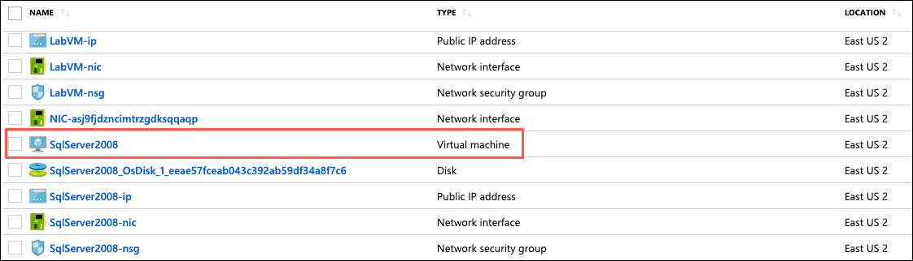

2. On the SqlServer2008 Virtual Machine's **Overview** blade, select **Connect** on the top menu.

   

3. On the Connect to virtual machine blade, select **Download RDP File**, then open the downloaded RDP file.

4. Select **Connect** on the Remote Desktop Connection dialog.

   

5. Enter the following credentials when prompted, and then select **OK**:

   - **Username**: demouser
   - **Password**: Password.1!!

   

6. Select **Yes** to connect, if prompted that the identity of the remote computer cannot be verified.

   

7. Once logged into the SqlServer2008 VM, open **Microsoft SQL Server Management Studio** (SSMS) by entering "sql server" into the search bar in the Windows Start menu and selecting **Microsoft SQL Server Management Studio 17** from the results.

   

8. In the SSMS **Connect to Server** dialog, enter **SQLSERVER2008** into the Server name box, ensure **Windows Authentication** is selected, and then select **Connect**.

   

9. Once connected, expand **Databases** under SQLSERVER2008 in the Object Explorer, and then select **ContosoInsurance** from the list of databases.

    

10. Next, you execute a script in SSMS, which resets the `sa` password, enable mixed mode authentication, create the `WorkshopUser` account, and change the database recovery model to FULL. To create the script, open a new query window in SSMS by selecting **New Query** in the SSMS toolbar.

    

11. Copy and paste the SQL script below into the new query window:

    ```sql
    USE master;
    GO

    -- SET the sa password
    ALTER LOGIN [sa] WITH PASSWORD=N'Password.1!!';
    GO

    -- Enable Mixed Mode Authentication
    EXEC xp_instance_regwrite N'HKEY_LOCAL_MACHINE',
    N'Software\Microsoft\MSSQLServer\MSSQLServer', N'LoginMode', REG_DWORD, 2;
    GO

    -- Create a login and user named WorkshopUser
    CREATE LOGIN WorkshopUser WITH PASSWORD = N'Password.1!!';
    GO

    EXEC sp_addsrvrolemember
        @loginame = N'WorkshopUser',
        @rolename = N'sysadmin';
    GO

    USE ContosoInsurance;
    GO

    IF NOT EXISTS (SELECT * FROM sys.database_principals WHERE name = N'WorkshopUser')
    BEGIN
        CREATE USER [WorkshopUser] FOR LOGIN [WorkshopUser]
        EXEC sp_addrolemember N'db_datareader', N'WorkshopUser'
    END;
    GO

    -- Update the recovery model of the database to FULL
    ALTER DATABASE ContosoInsurance SET RECOVERY FULL;
    GO
    ```

12. To run the script, select **Execute** from the SSMS toolbar.

    

13. For Mixed Mode Authentication and the new `sa` password to take effect, you must restart the SQL Server (MSSQLSERVER) Service on the SqlServer2008 VM. To do this, you can use SSMS. Right-click the SQLSERVER2008 instance in the SSMS Object Explorer, and then select **Restart** from the context menu.

    

14. When prompted about restarting the MSSQLSERVER service, select **Yes**. The service takes a few seconds to restart.

    

### Task 2: Perform assessment for migration to Azure SQL Database

Contoso would like an assessment to see what potential issues they might need to address in moving their database to Azure SQL Database. In this task, you use the [Microsoft Data Migration Assistant](https://docs.microsoft.com/sql/dma/dma-overview?view=sql-server-2017) (DMA) to perform an assessment of the `ContosoInsurance` database against Azure SQL Database (Azure SQL DB). Data Migration Assistant (DMA) enables you to upgrade to a modern data platform by detecting compatibility issues that can impact database functionality on your new version of SQL Server or Azure SQL Database. It recommends performance and reliability improvements for your target environment. The assessment generates a report detailing any feature parity and compatibility issues between the on-premises database and the Azure SQL DB service.

> **Note**: The Database Migration Assistant has already been installed on your SqlServer2008 VM. It can also be downloaded from the [Microsoft Download Center](https://www.microsoft.com/download/details.aspx?id=53595).

1. On the SqlServer2008 VM, launch DMA from the Windows Start menu by typing "data migration" into the search bar, and then selecting **Microsoft Data Migration Assistant** in the search results.

   

2. In the DMA dialog, select **+** from the left-hand menu to create a new project.

   

3. In the New project pane, set the following:

   - **Project type**: Select Assessment.
   - **Project name**: Enter Assessment.
   - **Assessment type**: Select Database Engine.
   - **Source server type**: Select SQL Server.
   - **Target server type**: Select Azure SQL Database.

   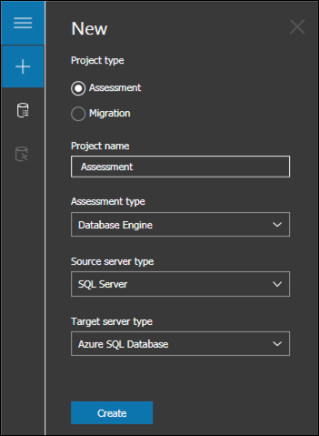

4. Select **Create**.

5. On the **Options** screen, ensure **Check database compatibility** and **Check feature parity** are both checked, and then select **Next**.

    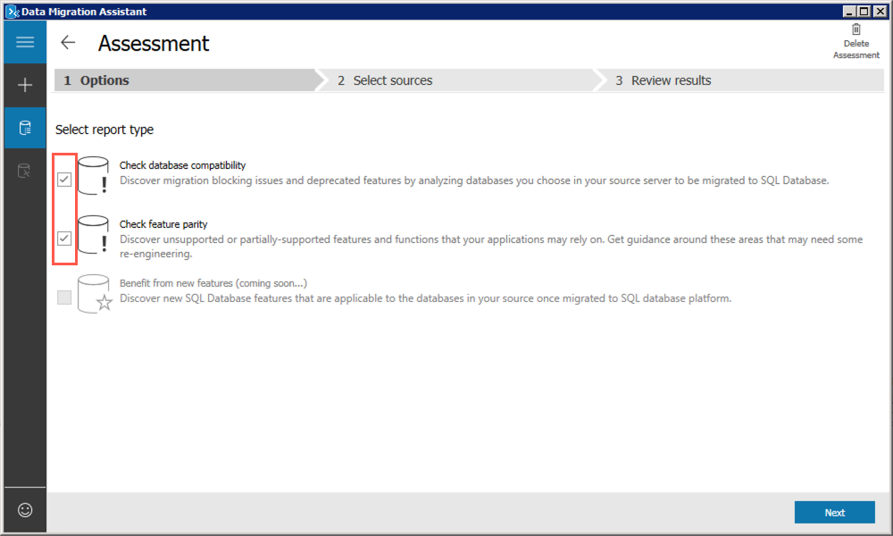

6. On the **Sources** screen, enter the following into the **Connect to a server** dialog that appears on the right-hand side:

   - **Server name**: Enter **SQLSERVER2008**.
   - **Authentication type**: Select **SQL Server Authentication**.
   - **Username**: Enter **WorkshopUser**
   - **Password**: Enter **Password.1!!**
   - **Encrypt connection**: Check this box.
   - **Trust server certificate**: Check this box.

   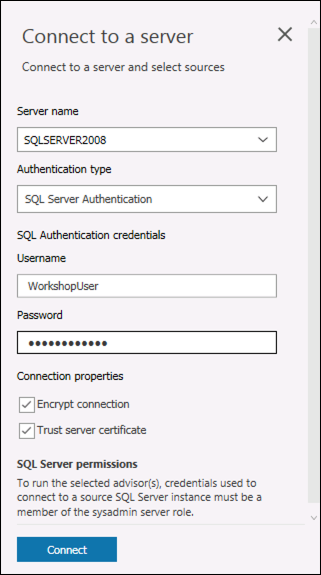

7. Select **Connect**.

8. On the **Add sources** dialog that appears next, check the box for `ContosoInsurance` and select **Add**.

   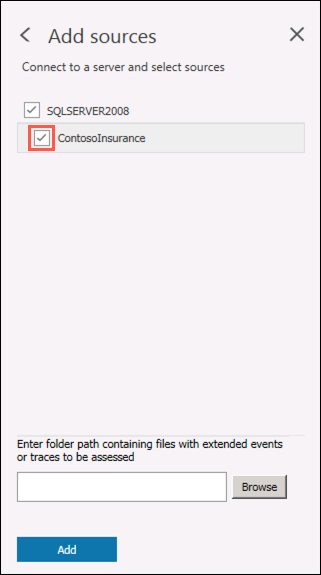

9. Select **Start Assessment**.

   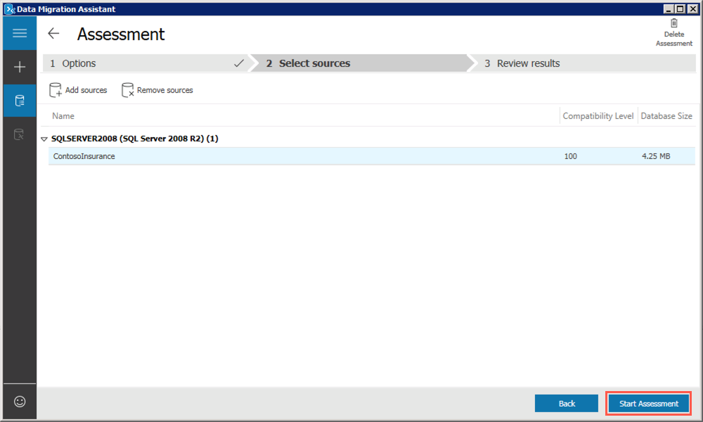

10. Take a moment to review the assessment for migrating to Azure SQL DB. The SQL Server feature parity report shows that Analysis Services and SQL Server Reporting Services are unsupported, but these do not affect any objects in the `ContosoInsurance` database, so won't block a migration.

    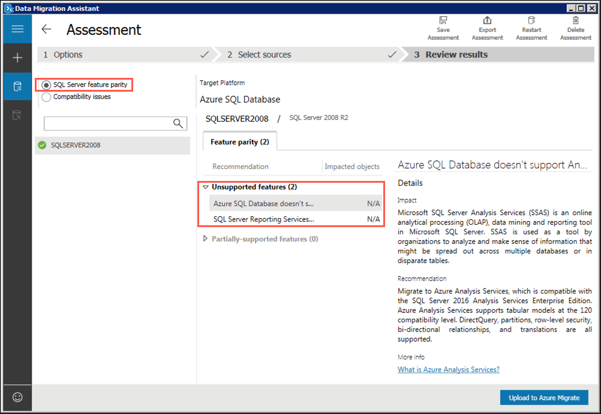

11. Now, select **Compatibility issues** so you can review that report as well.

    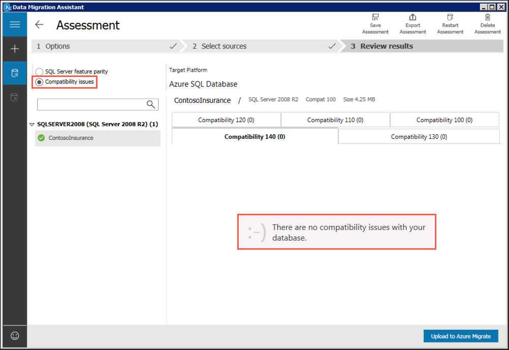

> The DMA assessment for a migrating the `ContosoInsurance` database to a target platform of Azure SQL DB reveals that there are no issues or features preventing Contoso from migrating their database to Azure SQL DB. You can select **Export Assessment** at the top right to save the report as a JSON file, if desired.

### Task 3: Migrate the database schema using the Data Migration Assistant

After you have reviewed the assessment results and you have ensured the database is a candidate for migration to Azure SQL Database, use the Data Migration Assistant to migrate the schema to Azure SQL Database.

1. On the SqlServer2008 VM, return to the Data Migration Assistant, and select the New **(+)** icon in the left-hand menu.

2. In the New project dialog, enter the following:

   - **Project type**: Select Migration.
   - **Project name**: Enter Migration.
   - **Source server type**: Select SQL Server.
   - **Target server type**: Select Azure SQL Database.
   - **Migration scope**: Select Schema only.

   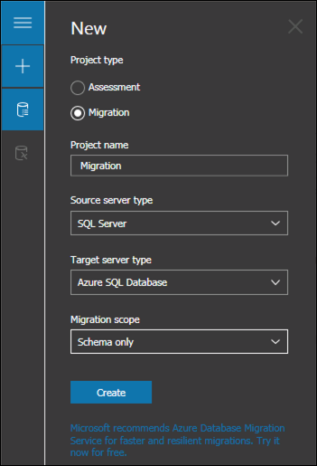

3. Select **Create**.

4. On the **Select source** tab, enter the following:

   - **Server name**: Enter **SQLSERVER2008**.
   - **Authentication type**: Select **SQL Server Authentication**.
   - **Username**: Enter **WorkshopUser**
   - **Password**: Enter **Password.1!!**
   - **Encrypt connection**: Check this box.
   - **Trust server certificate**: Check this box.
   - Select **Connect**, and then ensure the `ContosoInsurance` database is selected from the list of databases.

   

5. Select **Next**.

6. For the **Select target** tab, retrieve the server name associated with your Azure SQL Database. In the [Azure portal](https://portal.azure.com), navigate to your **SQL database** resource by selecting **Resource groups** from Azure services list, selecting the **hands-on-lab-SUFFIX** resource group, and then selecting the **ContosoInsurance** SQL database resource from the list of resources.

   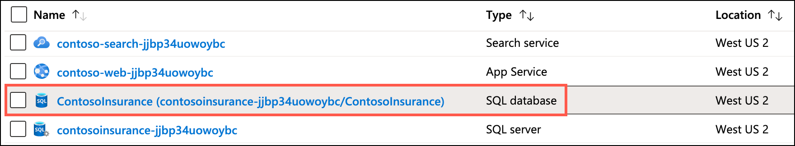

7. On the Overview blade of your SQL database, copy the **Server name**.

   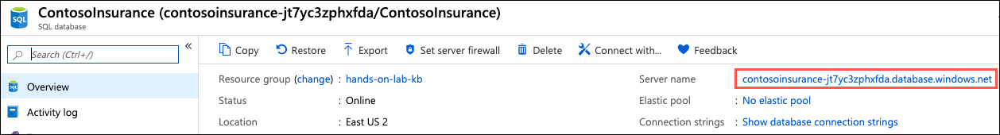

8. Return to DMA, and on the **Select target** tab, enter the following:

   - **Server name**: Paste the server name of your Azure SQL Database you copied above.
   - **Authentication type**: Select SQL Server Authentication.
   - **Username**: Enter **demouser**
   - **Password**: Enter **Password.1!!**
   - **Encrypt connection**: Check this box.
   - **Trust server certificate**: Check this box.
   - Select **Connect**, and then ensure the `ContosoInsurance` database is selected from the list of databases.

   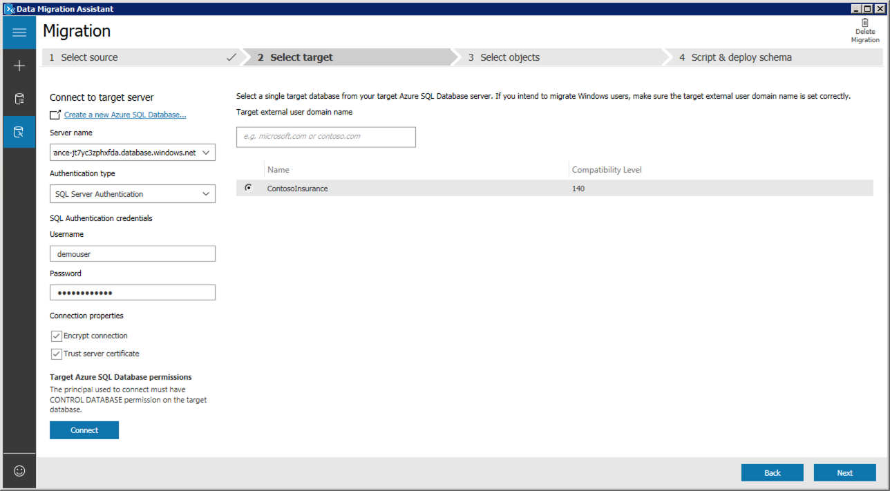

9. Select **Next**.

10. On the **Select objects** tab, leave all the objects checked, and select **Generate SQL script**.

    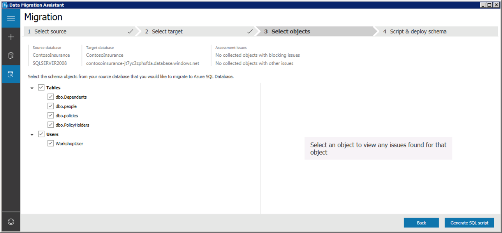

11. On the **Script & deploy schema** tab, review the script. Notice the view also provides a note that there are not blocking issues.

    

12. Select **Deploy schema**.

13. After the schema is deployed, review the deployment results, and ensure there were no errors.

    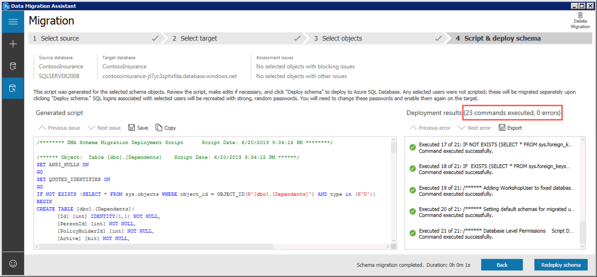

14. Next, open SSMS on the SqlServer2008 VM, and connect to your Azure SQL Database, by selecting **Connect->Database Engine** in the Object Explorer, and then entering the following into the Connect to server dialog:

    - **Server name**: Paste the server name of your Azure SQL Database you copied above.
    - **Authentication type**: Select SQL Server Authentication.
    - **Username**: Enter **demouser**
    - **Password**: Enter **Password.1!!**
    - **Remember password**: Check this box.

    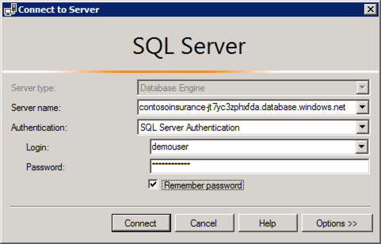

15. Select **Connect**.

16. Once connected, expand **Databases**, and expand **ContosoInsurance**, then expand **Tables**, and observe the schema has been created.

    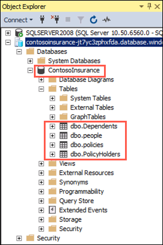

### Task 4: Retrieve connection information for SQL databases

In this task, you use the Azure Cloud shell to retrieve the IP address of the SqlServer2008 VM, which is needed to connect to your SqlServer2008 VM from DMS.

1. In the [Azure portal](https://portal.azure.com), select the Azure Cloud Shell icon from the top menu.

    

2. In the Cloud Shell window that opens at the bottom of your browser window, select **PowerShell**.

    

3. If prompted that you have no storage mounted, select the subscription you are using for this hands-on lab and select **Create storage**.

    

    > **Note**: If creation fails, you may need to select **Advanced settings** and specify the subscription, region and resource group for the new storage account.

4. After a moment, a message that you have successfully requested a Cloud Shell appears, and a PS Azure prompt is displayed.

    

5. At the prompt, enter the following command, **replacing `<your-resource-group-name>`** with the name resource group:

    ```powershell
    $resourceGroup = "<your-resource-group-name>"
    ```

6. Next, retrieve the public IP address of the SqlServer2008 VM, which is used to connect to the database on that server. Enter and run the following PowerShell command:

    ```powershell
    az vm list-ip-addresses -g $resourceGroup -n SqlServer2008 --output table
    ```

    > **Note**: If you have multiple Azure subscriptions, and the account you are using for this hands-on lab is not your default account, you may need to run `az account list --output table` at the Azure Cloud Shell prompt to output a list of your subscriptions, then copy the Subscription Id of the account you are using for this lab, and then run `az account set --subscription <your-subscription-id>` to set the appropriate account for the Azure CLI commands.

7. Within the output of the command above, locate and copy the value of the `ipAddress` property within the `publicIPAddresses` object. Paste the value into a text editor, such as Notepad.exe, for later reference.

    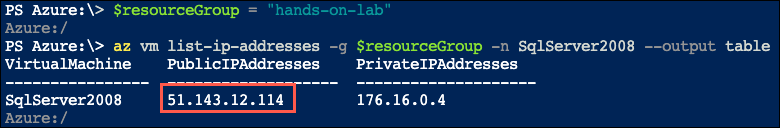

8. Next, run a second command to retrieve the server name of your Azure SQL Database:

    ```powershell
    az sql server list -g $resourceGroup
    ```

    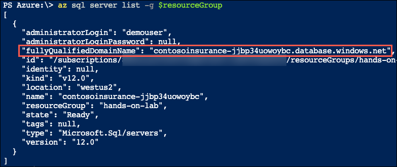

9. Copy the **fullyQualifiedDomainName** value into a text editor for use below.

### Task 5: Migrate the database using the Azure Database Migration Service

At this point, you have migrated the database schema using DMA. In this task, you migrate the data from the `ContosoInsurance` database into the new Azure SQL Database using the Azure Database Migration Service.

> The [Azure Database Migration Service](https://docs.microsoft.com/azure/dms/dms-overview) integrates some of the functionality of Microsoft existing tools and services to provide customers with a comprehensive, highly available database migration solution. The service uses the Data Migration Assistant to generate assessment reports that provide recommendations to guide you through the changes required prior to performing a migration. When you're ready to begin the migration process, Azure Database Migration Service performs all of the required steps.

1. In the [Azure portal](https://portal.azure.com), navigate to your Azure Database Migration Service by selecting **Resource groups** from Azure services list, selecting the **hands-on-lab-SUFFIX** resource group, and then selecting the **contoso-dms-UniqueId** Azure Database Migration Service in the list of resources.

   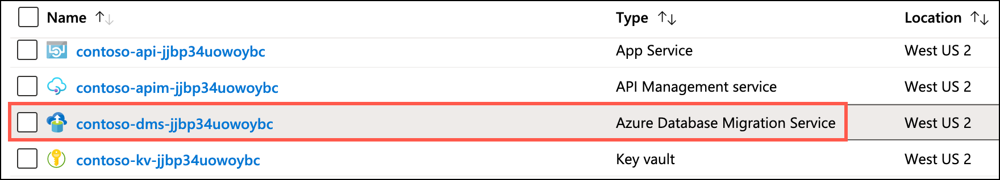

2. On the Azure Database Migration Service blade, select **+New Migration Project**.

   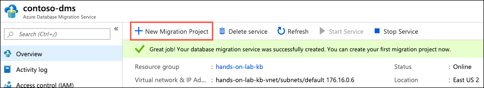

3. On the New migration project blade, enter the following:

    - **Project name**: Enter DataMigration.
    - **Source server type**: Select SQL Server.
    - **Target server type**: Select Azure SQL Database.
    - **Choose type of activity**: Select **Offline data migration** and select **Save**.

    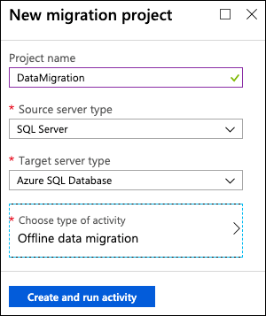

4. Select **Create and run activity**.

5. On the Migration Wizard **Select source** blade, enter the following:

    - **Source SQL Server instance name**: Enter the IP address of your SqlServer2008 VM that you copied into a text editor in the previous task. For example, `51.143.12.114`.
    - **Authentication type**: Select SQL Authentication.
    - **Username**: Enter **WorkshopUser**
    - **Password**: Enter **Password.1!!**
    - **Connection properties**: Check both Encrypt connection and Trust server certificate.

    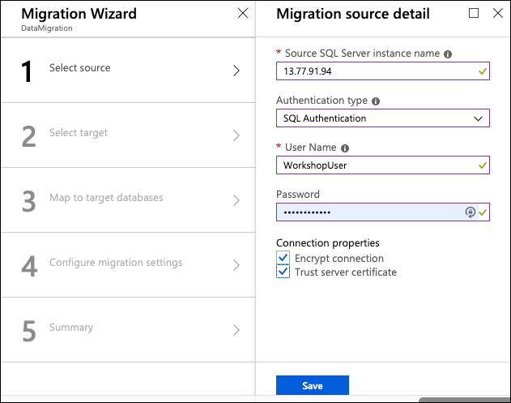

6. Select **Save**.

7. On the Migration Wizard **Select target** blade, enter the following:

    - **Target server name**: Enter the `fullyQualifiedDomainName` value of your Azure SQL Database (e.g., contosoinsurance-jt7yc3zphxfda.database.windows.net), which you copied in the previous task.
    - **Authentication type**: Select SQL Authentication.
    - **Username**: Enter **demouser**
    - **Password**: Enter **Password.1!!**
    - **Connection properties**: Check Encrypt connection.

    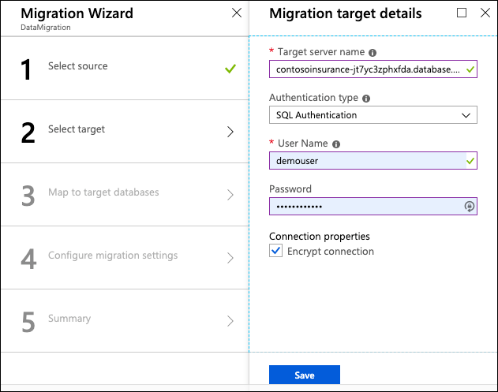

8. Select **Save**.

9. On the Migration Wizard **Map to target databases** blade, confirm that **ContosoInsurance** is checked as the source database, and that it is also the target database on the same line, then select **Save**.

    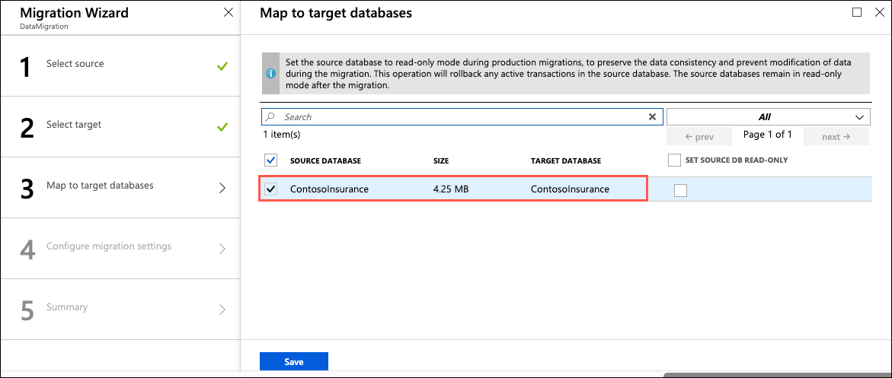

10. Select **Save**.

11. On the Migration Wizard **Configure migration settings** blade, expand the **ContosoInsurance** database and verify all the tables are selected.

    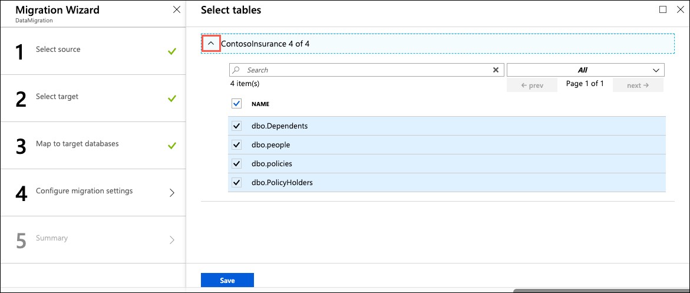

12. Select **Save**.

13. On the Migration Wizard **Summary** blade, enter the following:

    - **Activity name**: Enter ContosoDataMigration.
    - **Validation option**: Select Validate my database(s), check all three Validation options, and then select **Save**.

    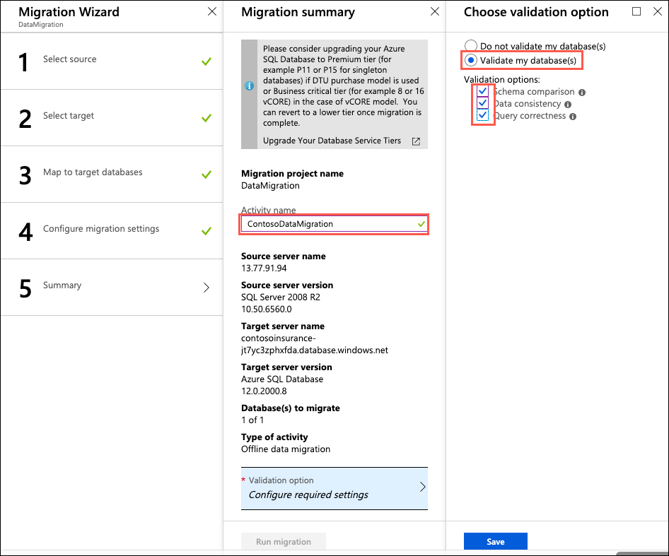

14. Select **Run migration**.

15. Monitor the migration on the status screen that appears. Select the refresh icon in the toolbar to retrieve the latest status.

    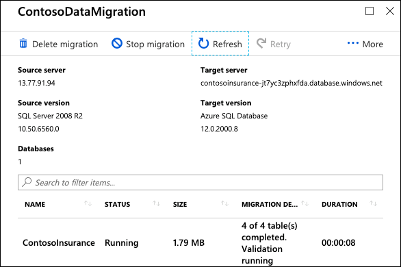

    > The migration takes approximately 2 - 3 minutes to complete.

16. When the migration is complete, you should see the status as **Completed**, but may also see a status of **Warning**.

    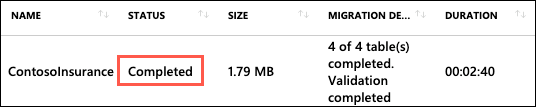

    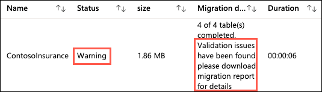

17. When the migration is complete, select the ellipsis button on the toolbar, and then select **Download report**.

    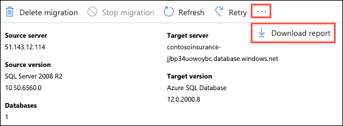

18. Review the database migration report. If you received a status of "Warning" for your migration, you can find the reason in the Validation Summary section. In the report below, you can see that a storage object schema difference triggered a warning. However, the report also reveals that everything was migrated successfully.

    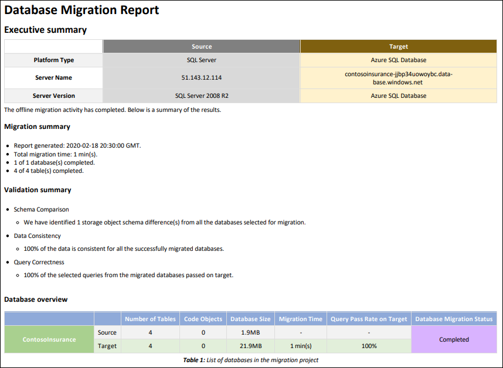

## Exercise 2: Post upgrade database enhancements

Duration: 30 minutes

In this exercise you explore some of the security features of Azure SQL Database, and review some of the security benefits that come with running your database in Azure. [SQL Database Advance Data Security](https://docs.microsoft.com/azure/sql-database/sql-database-advanced-data-security) (ADS) provides advanced SQL security capabilities, including functionality for discovering and classifying sensitive data, surfacing and mitigating potential database vulnerabilities, and detecting anomalous activities that could indicate a threat to your database.

> **Note**: Advanced Data Security was enabled on the database with the ARM template, so you do not need to do that here.

### Task 1: Configure SQL Data Discovery and Classification

In this task, you look at the [SQL Data Discovery and Classification](https://docs.microsoft.com/sql/relational-databases/security/sql-data-discovery-and-classification?view=sql-server-2017) feature of Advanced Data Security. Data Discovery & Classification introduces a new tool for discovering, classifying, labeling & reporting the sensitive data in your databases. It introduces a set of advanced services, forming a new SQL Information Protection paradigm aimed at protecting the data in your database, not just the database. Discovering and classifying your most sensitive data (business, financial, healthcare, etc.) can play a pivotal role in your organizational information protection stature.

1. In the [Azure portal](https://portal.azure.com), navigate to your **SQL database** resource by selecting **Resource groups** from Azure services list, selecting the **hands-on-lab-SUFFIX** resource group, and then selecting the **ContosoInsurance** SQL database resource from the list of resources.

   

2. On the SQL database blade, select **Advance Data Security** from the left-hand menu, and then select the **Data Discovery & Classification** tile.

    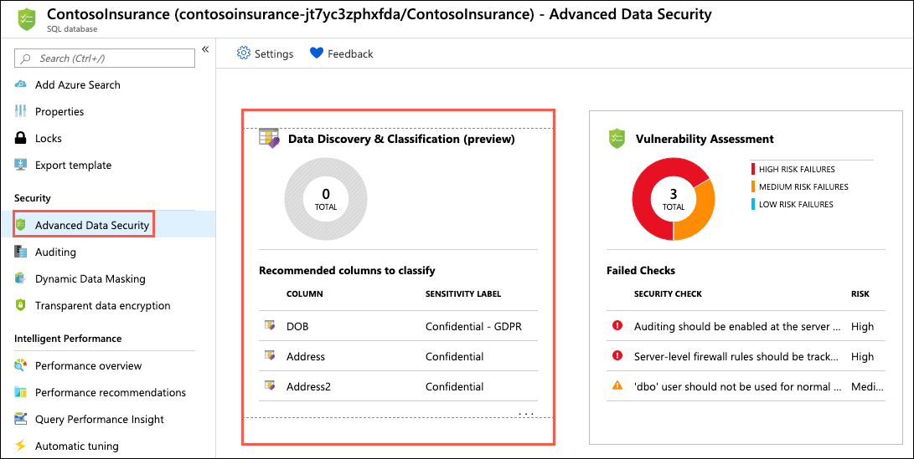

3. On the **Data Discovery & Classification** blade, select the info link with the message **We have found 7 columns with classification recommendations**.

    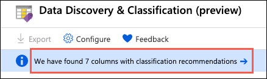

4. The classification engine scans the database and provides a list of recommended column classifications. Look over the list of recommendations to get a better understanding of the types of data and classifications are assigned, based on the built-in classification settings. In the list of classification recommendations, note the recommended classification for the **dbo - people - DOB** field (Confidential - GDPR).

    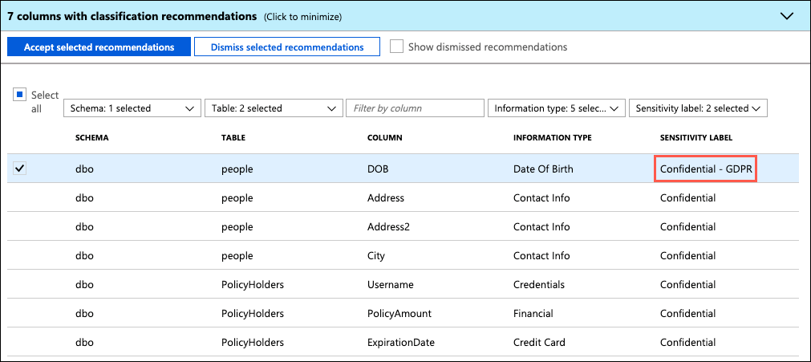

5. Contoso is very concerned about the potential cost of any GDPR violations, and would like to label any GDPR fields as _Highly Confidential - GDPR_. To update this, select **+ Add classification** in the Data Discovery & Classification toolbar.

   

6. In the Add classification dialog, quickly expand the **Sensitivity label** field, and review the various built-in labels you can choose from. You can also add your own labels, should you desire.

    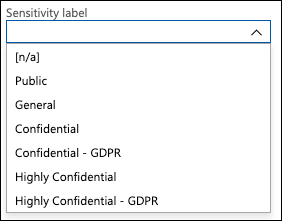

7. In the Add classification dialog, enter the following:

    - **Schema name**: Select dbo.
    - **Table name**: Select people.
    - **Column name**: Select DOB (date).
    - **Information type**: Select Date Of Birth.
    - **Sensitivity level**: Select Highly Confidential - GDPR.

    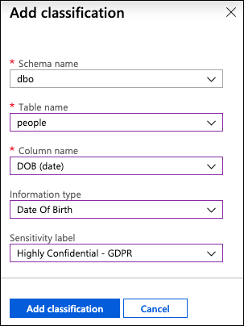

8. Select **Add classification**.

9. After adding the new classification, the **dbo - people - DOB** field disappears from the recommendations list, and the number of recommendations drop by 1.

10. Select **Save** on the toolbar to save the changes.

    

11. To accept the remaining recommendations, you can check the **Select all** option and then select **Accept selected recommendations**.

    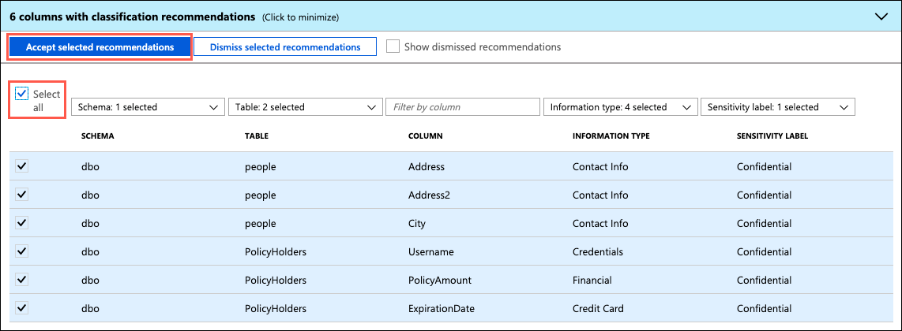

12. Select **Save** on the toolbar to save the changes.

    

13. When the save completes, select the **Overview** tab on the Data Discovery & Classification blade to view a report with a full summary of the database classification state.

    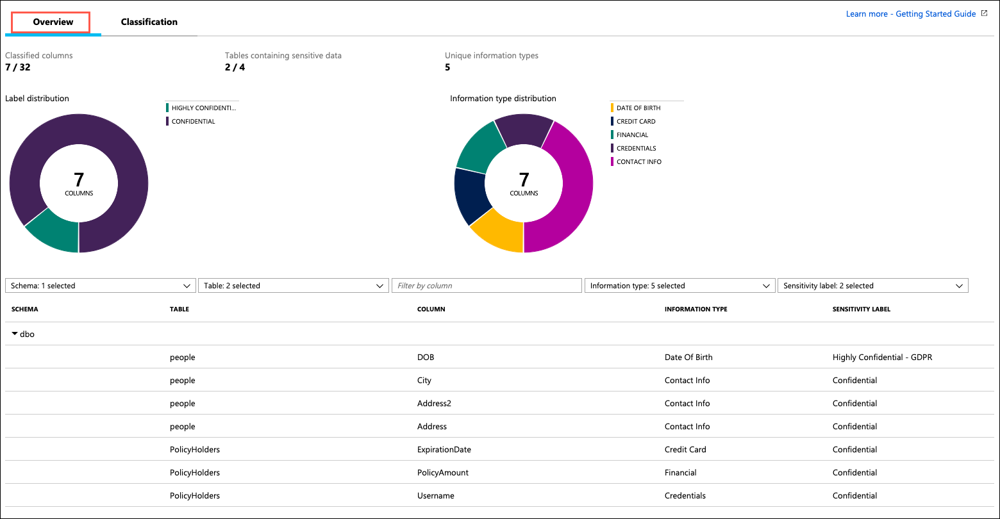

### Task 2: Review Advanced Data Security Vulnerability Assessment

In this task, you review an assessment report generated by ADS for the `ContosoInsurance` database. The [SQL Vulnerability Assessment service](https://docs.microsoft.com/azure/sql-database/sql-vulnerability-assessment) is a service that provides visibility into your security state, and includes actionable steps to resolve security issues, and enhance your database security.

1. Return to the **Advanced Data Security** blade for the `ContosoInsurance` SQL database and then select the **Vulnerability Assessment** tile.

2. Navigate to **Advance Data Security** on the **Security** section of your Azure SQL Database.

3. Select **Vulnerability Assessment**.

    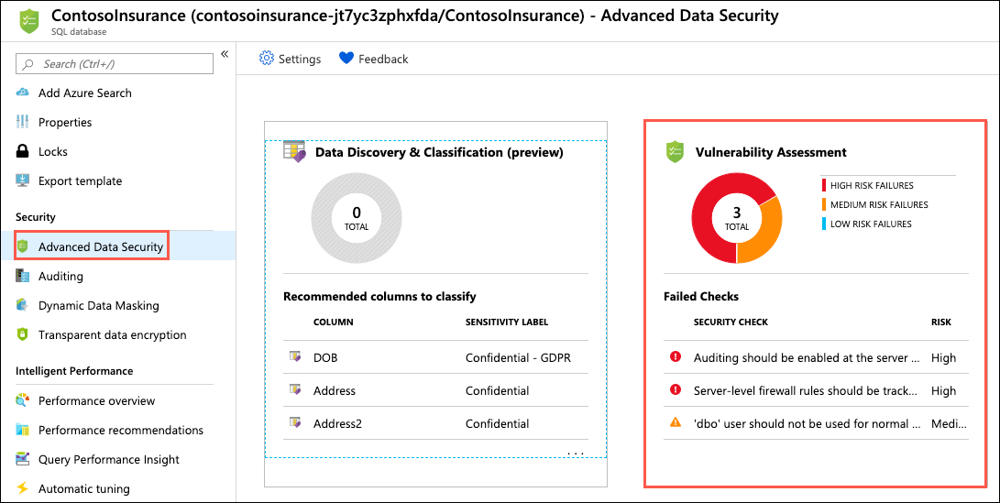

4. On the Vulnerability Assessment blade, select **Scan** on the toolbar.

    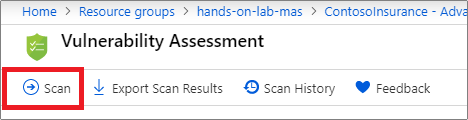

5. When the scan completes, select the **Overview** tab and observe the dashboard, which displays the number of failing checks, passing checks, and a breakdown of the risk summary by severity level.

    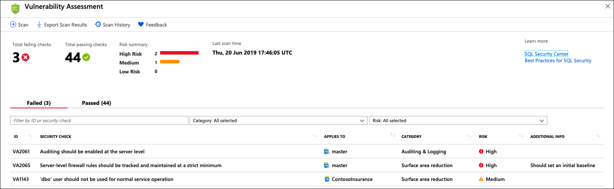

6. In the scan results, take a few minutes to browse both the Failed and Passed checks, and review the types of checks that are performed. In the **Failed** the list, select any of the failed checks to view the detailed description.

    

    > The details for each finding provide more insight into the reason for the finding. Of note are the fields describing the finding, the impact of the recommended settings, and details on how to remediate the finding.

### Task 3: Enable Dynamic Data Masking

In this task, you enable [Dynamic Data Masking](https://docs.microsoft.com/sql/relational-databases/security/dynamic-data-masking?view=sql-server-ver15) (DDM) into your Azure SQL Database to limit access to sensitive data in the database through query results. This feature helps prevent unauthorized access to sensitive data by enabling customers to designate how much of the sensitive data to reveal with minimal impact on the application layer. It’s a policy-based security feature that hides the sensitive data in the result set of a query over designated database fields, while the data in the database is not changed.

> For example, a service representative at a call center may identify callers by several digits of their credit card number, but those data items should not be fully exposed to the service representative. A masking rule can be defined that masks all but the last four digits of any credit card number in the result set of any query. As another example, an appropriate data mask can be defined to protect personally identifiable information (PII) data, so that a developer can query production environments for troubleshooting purposes without violating compliance regulations.

1. Return to the Overview blade of your SQL database in the [Azure portal](https://portal.azure.com), and select **Dynamic Data Masking** from the left-hand menu.

    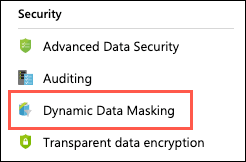

2. On the Dynamic Data Masking blade, you may see a few recommended fields to mask that have been flagged as they may contain sensitive data. For our case, we want to apply a mask to the `DOB` field on the `people` table to provide more protection to GDPR data. To do this, select **+ Add mask** in the Dynamic Data Masking toolbar.

    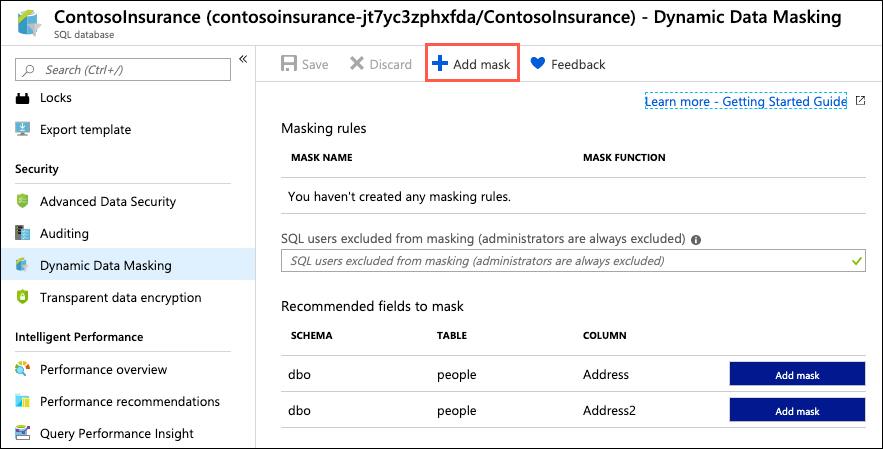

3. On the Add masking rule blade, enter the following:

   - **Schema**: Select dbo.
   - **Table**: Select people.
   - **Column**: Select DOB (date).
   - **Masking field format**: Select Default value (0, xxx, 01-01-1900).
   - Select **Add**.

   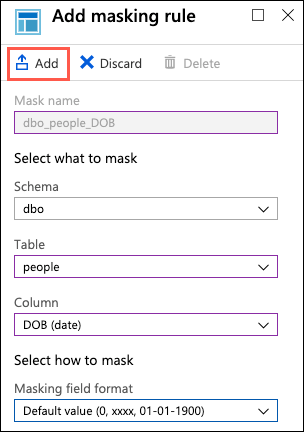

4. Select **Save**.

   

5. To view the impact of the Dynamic Data Masking, return to SSMS on your SqlServer2008 VM and run a few queries against the `people` table. On your SqlServer2008 VM, open SSMS and connect to the Azure SQL Database, by selecting **Connect->Database Engine** in the Object Explorer, and then entering the following into the Connect to server dialog:

    - **Server name**: Paste the server name of your Azure SQL Database, as you've done previously.
    - **Authentication type**: Select SQL Server Authentication.
    - **Username**: Enter **demouser**
    - **Password**: Enter **Password.1!!**
    - **Remember password**: Check this box.

    

6. Select **Connect**.

7. Once connected, expand Databases, right-click the `ContosoInsurance` database and select **New Query**.

   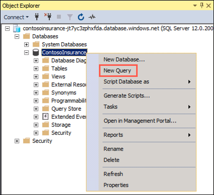

8. To be able to test the mask applied to the `people.DOB` field, you need to create a user in the database that can be used for testing the masked field. This is because the `demouser` account you used to log in is a privileged user, so the mask is not be applied. In the new query window, paste the following SQL script into the new query window:

   ```sql
   USE [ContosoInsurance];
   GO

   CREATE USER DDMUser WITHOUT LOGIN;
   GRANT SELECT ON [dbo].[people] TO DDMUser;
   ```

   > The SQL script above creates a new user in the database named `DDMUser`, and grants that user `SELECT` rights on the `dbo.people` table.

9. Select **Execute** from the SSMS toolbar to run the query. A message that the commands completed successfully should appear in the Messages pane.

   

10. With the new user created, run a quick query to observe the results. Select **New Query** again, and paste the following into the new query window.

    ```sql
    USE [ContosoInsurance];
    GO

    EXECUTE AS USER = 'DDMUser';
    SELECT * FROM [dbo].[people];
    REVERT;
    ```

11. Select **Execute** from the toolbar, and examine the Results pane. Notice the `DOB` field is masked as `1900-01-01`, as defined by the mask format applied in the Azure portal.

    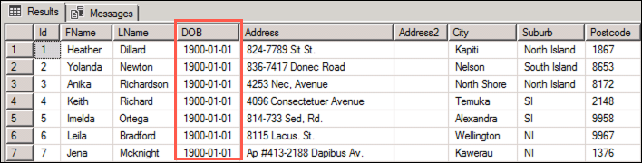

12. For comparison, run the following query in a new query window to see how the data looks when running as a privileged user.

    ```sql
    SELECT TOP 100 * FROM [dbo].[people]
    ```

    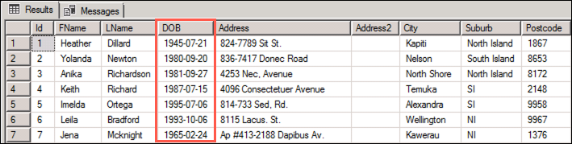

> **Note**: The SqlServer2008 VM is not needed for the remaining exercises of this hands-on lab. You can log off of that VM.

## Exercise 3: Configure Key Vault

Duration: 15 minutes

As part of their efforts to put tighter security controls in place, Contoso has requested that application secrets to be stored in a secure manner, so they aren't visible in plain text in application configuration files. In this exercise, you configure Azure Key Vault, which securely stores application secrets for the Contoso web and API applications, once migrated to Azure.

### Task 1: Add Key Vault access policy

In this task, you add an access policy to Key Vault to allow secrets to be created with your account.

1. In the [Azure portal](https://portal.azure.com), navigate to your **Key Vault** resource by selecting **Resource groups** from Azure services list, selecting the **hands-on-lab-SUFFIX** resource group, and then selecting the **contoso-kv-UniqueId** Key vault resource from the list of resources.

   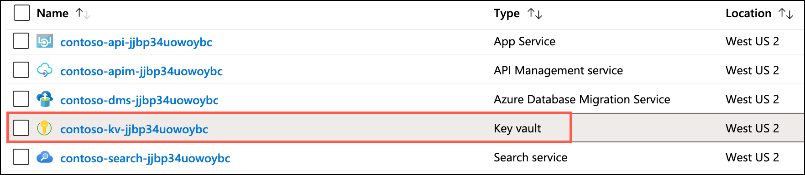

2. On the Key Vault blade, select **Access policies** under Settings in the left-hand menu, and then select **+ Add Access Policy**.

    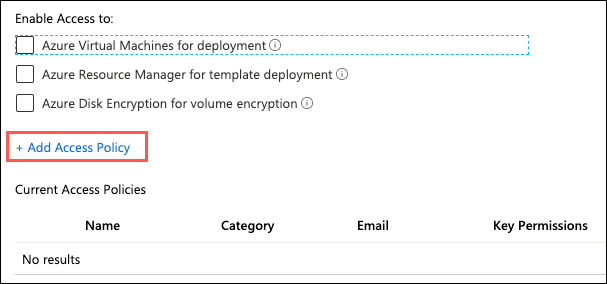

3. In the Add access policy dialog, enter the following:

   - **Configure from template (optional)**: Leave blank.
   - **Key permissions**: Leave set to 0 selected.
   - **Secret permissions**: Select this, and then choose **Select All**, to give yourself full rights to manage secrets.
   - **Certificate permissions**: Leave set to 0 selected.
   - **Select principal**: Enter the email address of the account you are logged into the Azure portal with, select the user object that appears, and then choose **Select**.
   - **Authorized application**: Leave set to None selected.

   

4. Select **Add**.

5. Select **Save** on the Access policies toolbar.

   

### Task 2: Create a new secret to store the SQL connection string

In this task, you add a secret to Key Vault containing the connection string for the `ContosoInsurance` Azure SQL database.

1. First, you need to retrieve the connection string to your Azure SQL Database. In the [Azure portal](https://portal.azure.com), navigate to your **SQL database** resource by selecting **Resource groups** from Azure services list, selecting the **hands-on-lab-SUFFIX** resource group, and then selecting the **ContosoInsurance** SQL database resource from the list of resources.

   

2. On the SQL database blade, select **Connection strings** from the left-hand menu, and then copy the ADO.NET connection string.

   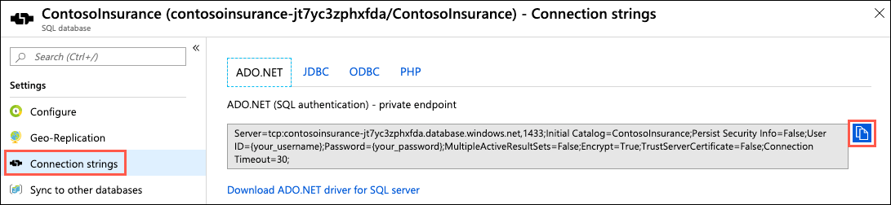

3. Paste the copied connection string into a text editor, such as Notepad.exe. This is necessary because you need to replace the tokenized password value before adding the connection string as a Secret in Key Vault.

4. In the text editor, find and replace the tokenized `{your_password}` value with `Password.1!!`.

5. Your connection string should now resemble the following:

    ```csharp
    Server=tcp:contosoinsurance-jt7yc3zphxfda.database.windows.net,1433;Initial Catalog=ContosoInsurance;Persist Security Info=False;User ID=demouser;Password=Password.1!!;MultipleActiveResultSets=False;Encrypt=True;TrustServerCertificate=False;Connection Timeout=30;
    ```

6. Copy your updated connection string from the text editor.

7. In the [Azure portal](https://portal.azure.com), navigate back to your **Key Vault** resource by selecting **Resource groups** from Azure services list, selecting the **hands-on-lab-SUFFIX** resource group, and then selecting the **contoso-kv-UniqueId** Key vault resource from the list of resources.

   

8. On the Key Vault blade, select **Secrets** under Settings in the left-hand menu, and then select **+ Generate/Import**.

    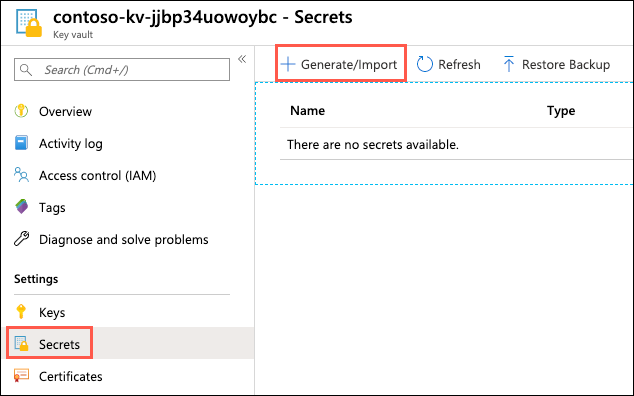

9. On the Create a secret blade, enter the following:

    - **Upload options**: Select Manual.
    - **Name**: Enter **SqlConnectionString**
    - **Value**: Paste the updated SQL connection string you copied from the text editor.

    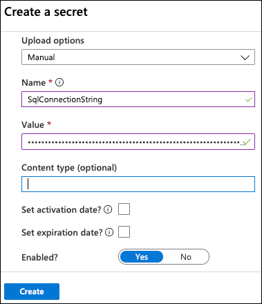

10. Select **Create**.

### Task 3: Create a service principal

In this task, you use the Azure Cloud Shell and Azure Command Line Interface (CLI) to create an Azure Active Directory (Azure AD) application and service principal (SP) used to provide your web and API apps access to secrets stored in Azure Key Vault.

> **Important**: You must have rights within your Azure AD tenant to create applications and assign roles to complete this task.

1. In the [Azure portal](https://portal.azure.com), select the Azure Cloud Shell icon from the menu at the top right of the screen.

    

2. In the Cloud Shell window that opens at the bottom of your browser window, select **PowerShell**.

    

3. After a moment, you should receive a message that you have successfully requested a Cloud Shell, and be presented with a PS Azure prompt.

    

4. At the prompt, retrieve your subscription ID by running the following command at the Cloud Shell prompt:

    ```powershell
    az account list --output table
    ```

    > **Note**: If you have multiple Azure subscriptions, and the account you are using for this hands-on lab is not your default account, you may need to run `az account set --subscription <your-subscription-id>` after running the command above to set the appropriate account for the following Azure CLI commands, replacing `<your-subscription-id>` with the appropriate value from the output list above.

5. In the output table, locate the subscription you are using for this hands-on lab, and copy the SubscriptionId value into a text editor, such as Notepad, for use below.

6. Next, enter the following `az ad sp create-for-rbac` command at the Cloud Shell prompt, replacing `<your-subscription-id>` with the value you copied above and `<your-resource-group-name>` with the name of your **hands-on-lab-SUFFIX** resource group, and then press `Enter` to run the command.

    ```powershell
    $subscriptionId = "<your-subscription-id>"
    $resourceGroup = "<your-resource-group-name>"
    az ad sp create-for-rbac -n "contoso-apps" --role reader --scopes subscriptions/$subscriptionId/resourceGroups/$resourceGroup
    ```

    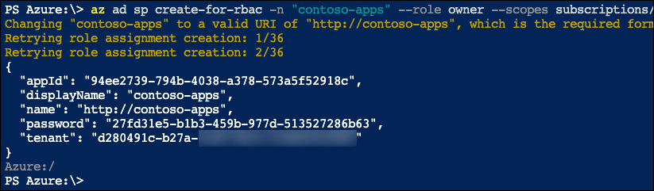

7. Copy the entire output from the command above into a text editor, as you need the `appId`, `name` and `password` values in upcoming tasks. The output should be similar to:

    ```json
    {
        "appId": "94ee2739-794b-4038-a378-573a5f52918c",
        "displayName": "contoso-apps",
        "name": "http://contoso-apps",
        "password": "b9a3a8b7-574d-467f-8cae-d30d1d1c1ac4",
        "tenant": "d280491c-b27a-XXXX-XXXX-XXXXXXXXXXXX"
    }
    ```

    > **Important**: Make sure you copy the output into a text editor, as the Azure Cloud Shell session eventually times out, and you won't have access to the output. The `appId` is used in the steps below to assign an access policy to Key Vault, and both the `appId` and `password` are used in the next exercise to add the configuration values to the web and API apps to allow them to read secrets from Key Vault.

### Task 4: Assign the service principal access to Key Vault

In this task, you assign the service principal you created above to a reader role on your resource group and add an access policy to Key Vault to allow it to view secrets stored there.

1. Next, run the following command to get the name of your Key Vault:

    ```powershell
    az keyvault list -g $resourceGroup --output table
    ```

2. In the output from the previous command, copy the value from the `name` field into a text editor. You use it in the next step and also for configuration of your web and API apps.

    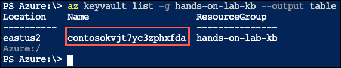

3. To assign permissions to your service principal to read Secrets from Key Vault, run the following command, replacing `<your-key-vault-name>` with the name of your Key Vault that you copied in the previous step and pasted into a text editor.

    ```powershell
    az keyvault set-policy -n <your-key-vault-name> --spn http://contoso-apps --secret-permissions get list
    ```

4. In the output, you should see your service principal appId listed with "get" and "list" permissions for secrets.

    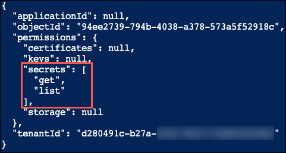

## Exercise 4: Deploy Web API into Azure App Services

Duration: 45 minutes

The developers at Contoso have been working toward migrating their apps to the cloud, and they have provided you with a starter solution developed using ASP.NET Core 2.2. As such, most of the pieces are already in place to deploy the apps to Azure, as well as configure them to communicate with the new app services. Since the required services have already been provisioned, what remains is to integrate Azure Key Vault into the API, apply application-level configuration settings, and then deploy the apps from the Visual Studio starter solution. In this task, you apply application settings to the Web API using the Azure Portal. Once the application settings have been set, you deploy the Web App and API App into Azure from Visual Studio.

### Task 1: Connect to the LabVM

In this task, you open an RDP connection to the LabVM, and downloading a copy of the starter solution provided by Contoso. The application deployments are handled using Visual Studio 2019, installed on the LabVM.

1. In the [Azure portal](https://portal.azure.com), navigate to your **LabVM** virtual machine by selecting **Resource groups** from Azure services list, selecting the **hands-on-lab-SUFFIX** resource group, and selecting the **LabVM** virtual machine from the list of resources.

   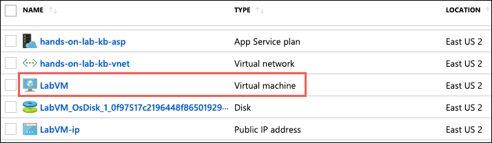

2. On the LabVM's **Overview** blade, select **Connect** on the top menu.

   

3. On the Connect to virtual machine blade, select **Download RDP File**, then open the downloaded RDP file.

4. Select **Connect** on the Remote Desktop Connection dialog.

5. Enter the following credentials when prompted, and then select **OK**:

   - **Username**: demouser
   - **Password**: Password.1!!

   

6. Select **Yes** to connect, if prompted that the identity of the remote computer cannot be verified.

   

### Task 2: Open starter solution with Visual Studio

In this task, you open the `Contoso` starter solution in Visual Studio. The Visual Studio solution contains the following projects:

- **Contoso.Azure**: Common library containing helper classes used by other projects within the solution to communicate with Azure services.
- **Contoso.Data**: Library containing data access objects.
- **Contoso.FunctionApp**: Contains an Azure Function that is used to retrieve policy documents from Blob storage.
- **Contoso.Web**: ASP.NET Core 2.2 PolicyConnect web application.
- **Contoso.WebApi**: ASP.NET Core 2.2 Web API used by the web application to communicate with the database.

1. In File Explorer, navigate to `C:\MCW\MCW-App-modernization-master\Hands-on lab\lab-files\src` and double-click the `Contoso.sln` file to open the solution in Visual Studio.

   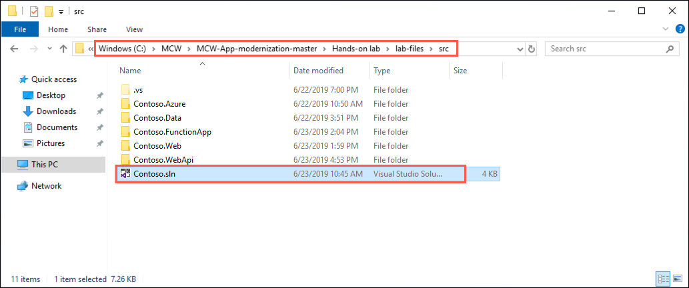

2. If prompted about how to open the file, select **Visual Studio 2019** and then select **OK**.

    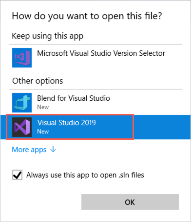

3. Sign in to Visual Studio using your Azure account credentials.

    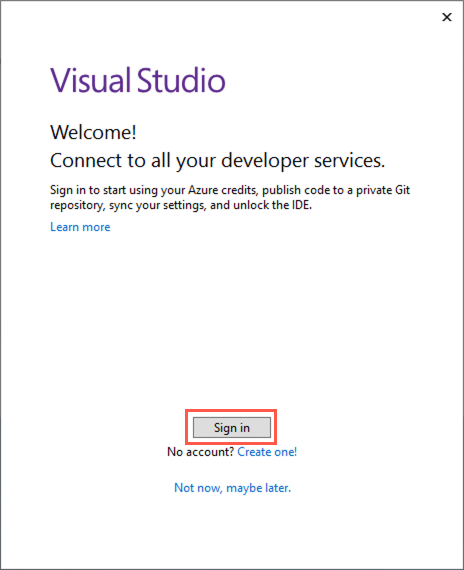

4. When prompted with a security warning, uncheck **Ask me for every project in this solution**, and then select **OK**.

    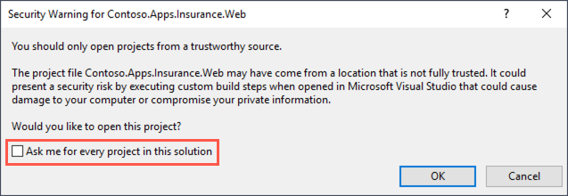

### Task 3: Update Web API to use Key Vault

In this task, you update the `Contoso.WebApi` project to use Azure Key Vault for storing and retrieving application secrets. You start by adding the connection information to the `appsettings.json` file in the `Contoso.WebApi` project, and then add some code to enable the use of Azure Key Vault.

> The required NuGet package to enable interaction with Key Vault has already been referenced in the project to save time. The package added to facilitate this is: `Microsoft.Extensions.Configuration.AzureKeyVault`.

1. In Visual Studio, expand the `Contoso.WebApi` project in the Solution Explorer, locate the `Program.cs` file and open it by double-clicking on it.

    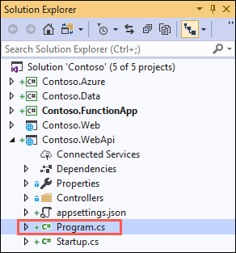

2. In the `Program.cs` file, locate the `TODO #1` block (line 23) within the `CreateWebHostBuilder` method.

    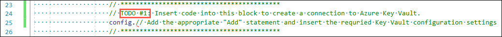

3. Complete the code within the block, using the following code, to add Key Vault to the configuration, and provide Key Vault with the appropriate connection information.

    ```csharp
    config.AddAzureKeyVault(
        KeyVaultConfig.GetKeyVaultEndpoint(buildConfig["KeyVaultName"]),
        buildConfig["KeyVaultClientId"],
        buildConfig["KeyVaultClientSecret"]
    );
    ```

4. Save `Program.cs`. The updated `CreateWebHostBuilder` method should now look like the following:

    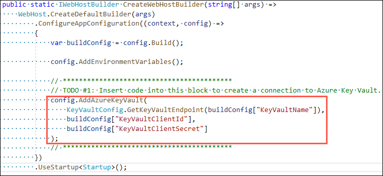

5. Next, you update the `Startup.cs` file in the `Contoso.WebApi` project. Locate the file in the Solution Explorer and double-click it.

6. In the previous exercise, you added the connection string for your Azure SQL Database to Key Vault, and assigned the secret a name of `SqlConnectionString`. Using the code below, update the `TODO #2` block (line 38), within the `Startup.cs` file's `Configuration` property. This allows your application to retrieve the connection string from Key Vault using the secret name.

    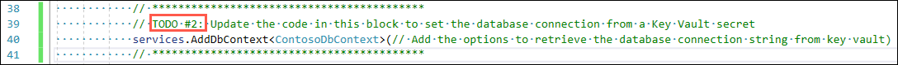

    ```csharp
    services.AddDbContext<ContosoDbContext>(options =>
        options.UseSqlServer(Configuration["SqlConnectionString"]));
    ```

7. Save `Startup.cs`. The updated `Configuration` property now looks like the following:

    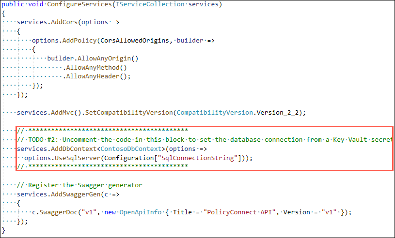

8. Your Web API is now fully configured to retrieve secrets from Azure Key Vault.

### Task 4: Copy KeyVault configuration section to API App in Azure

Before deploying the Web API to Azure, you need to add the required application settings into the configuration for the Azure API App. In this task, you use the advanced configuration editor in your API App to add in the configuration settings required to connect to and retrieve secrets from Key Vault.

1. In the [Azure portal](https://portal.azure.com), navigate to your **API App** by selecting **Resource groups** from Azure services list, selecting the **hands-on-lab-SUFFIX** resource group, and selecting the **contoso-api-UniqueId** App service from the list of resources.

   

2. On the API App blade, select **Configuration** on the left-hand menu.

    

3. On the Application settings tab of the Configuration blade, select **Advanced edit** under Application settings. The Advanced edit screen allows you to paste JSON directly into the configuration.

    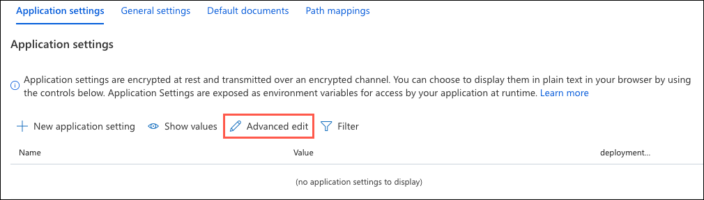

4. We are going to use the Advanced editor to add all three of the Key Vault settings at once. To do this, we are going to replace the content of the Advanced editor with the following, which you need to update as follows:

    - `<your-key-vault-name>`: Replace this with the name of your Key Vault, which you copied into a text editor in in the previous exercise.
    - `<your-service-principal-application-id>`: Replace this with the `appId` value you received as output when you created the service principal.
    - `<your-service-principal-password>`: Replace this with the `password` value you received as output when you created the service principal.

    ```json
    [
        {
            "name": "KeyVaultName",
            "value": "<your-key-vault-name>"
        },
        {
            "name": "KeyVaultClientId",
            "value": "<your-service-principal-application-id>"
        },
        {
            "name": "KeyVaultClientSecret",
            "value": "<your-service-principal-password>"
        }
    ]
    ```

5. The final contents of the editor should look similar to the following:

    ```json
    [
        {
            "name": "KeyVaultName",
            "value": "contosokvjt7yc3zphxfda"
        },
        {
            "name": "KeyVaultClientId",
            "value": "94ee2739-794b-4038-a378-573a5f52918c"
        },
        {
            "name": "KeyVaultClientSecret",
            "value": "b9a3a8b7-574d-467f-8cae-d30d1d1c1ac4"
        }
    ]
    ```

6. Select **OK**.

    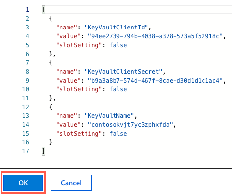

7. Select **Save** on the Configuration blade.

    

### Task 5: Deploy the API to Azure

In this task, you use Visual Studio to deploy the API project into an API App in Azure.

1. In Visual Studio, right-click on the **Contoso.WebApi** project in the Solution Explorer and select **Publish** from the context menu.

    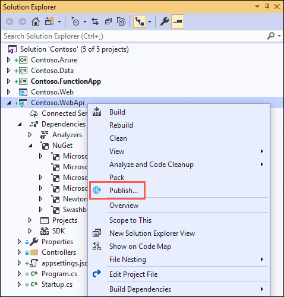

2. On the **Pick a publish target** dialog, select **App Service** and choose **Select Existing**, and then select **Create Profile**.

    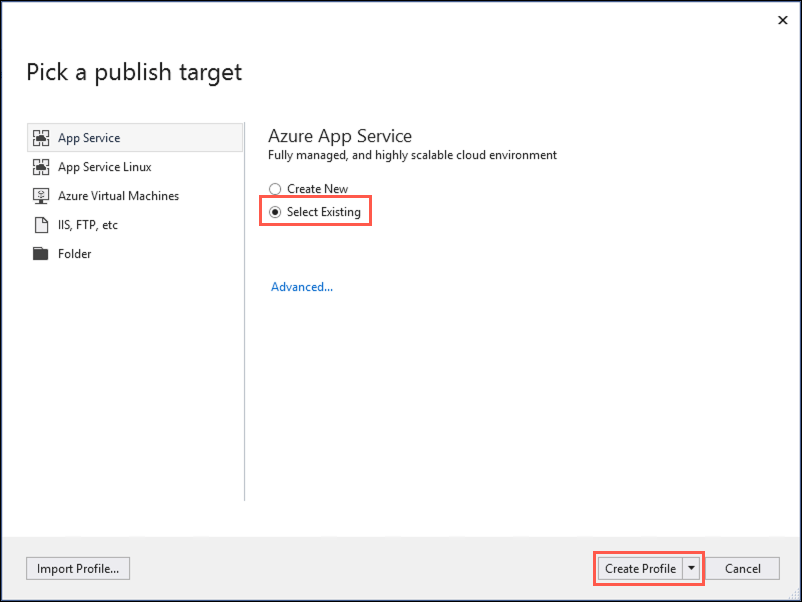

3. On the App Service dialog, select your Azure subscription, logging in if necessary on with your credentials and ensure the subscription you published earlier is selected, then select your API App (resource starting with "contoso-**api**") under your hands-on-lab-SUFFIX resource group.

    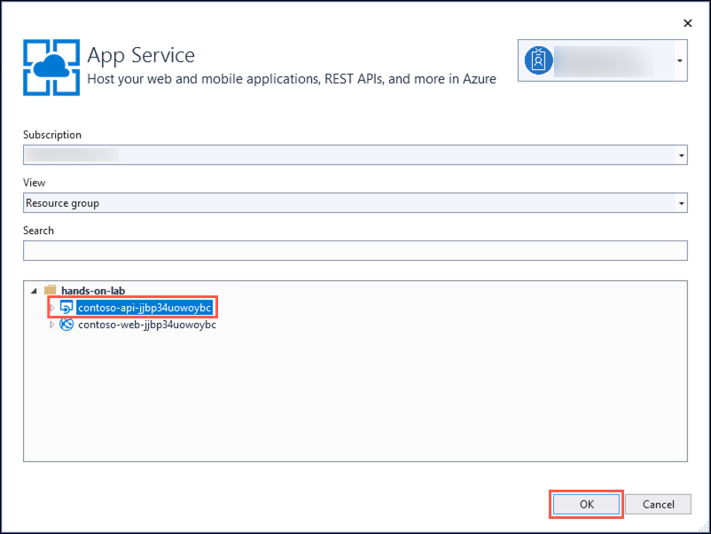

4. Select **OK**.

5. Back on the Visual Studio Publish page for the `Contoso.WebApi` project, select **Publish** to start the process of publishing your Web API to your Azure API App.

    

6. In the Visual Studio **Web Publish Activity** view, you should see a status that indicates the Web API was published successfully, along with the URL to the site.

    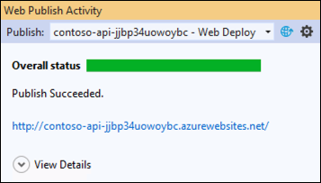

    > If you don't see the **Web Publish Activity** view, you can find it on View menu-> Other Windows -> Microsoft Azure Activity Log.

7. A web browser should open to the published site. If not, open the URL of the published Web API in a browser window. Initially, you should see a message that the page cannot be found.

    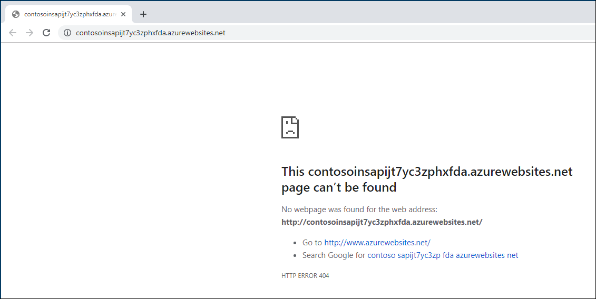

8. To validate the API App is function property, add `/swagger` to the end of the URL in your browser's address bar (e.g., <https://contoso-api-jjbp34uowoybc.azurewebsites.net/swagger/>). This brings up the Swagger UI page of your API, which displays a list of the available API endpoints.

    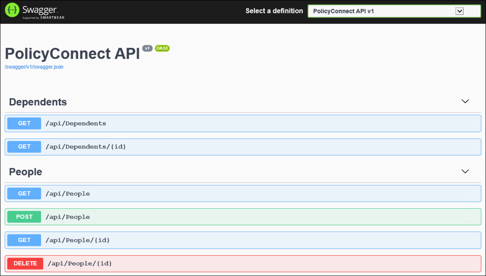

    > **Note**: [Swagger UI](https://swagger.io/tools/swagger-ui/) automatically generates visual documentation for REST APIs following the OpenAPI Specification. It makes it easy for developers to visualize and interact with the API's endpoints without having any of the implementation logic in place.

9. You can test the functionality of the API by selecting one of the `GET` endpoints, and selecting **Try it out**.

    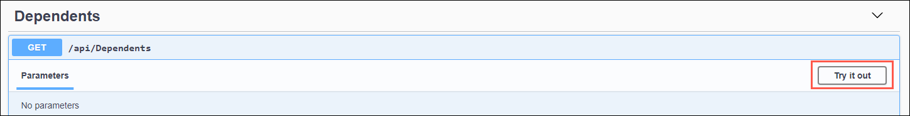

10. Select **Execute**.

    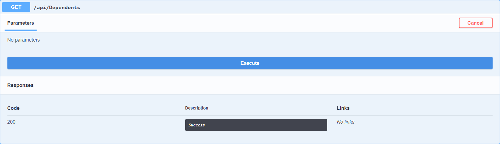

11. In the Response, you should see a Response Code of 200, and JSON objects in the Response body.

    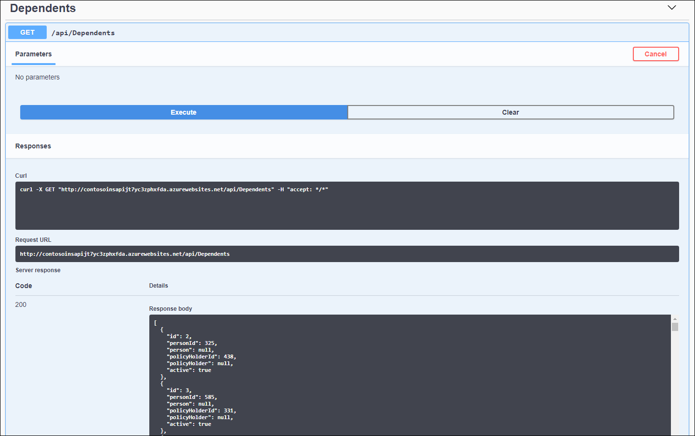

## Exercise 5: Deploy web application into Azure App Services

Duration: 10 minutes

In this exercise, you update the `Contoso.Web` web application to connect to your newly deployed API App and then deploy the web app into Azure App Services.

### Task 1: Add API App URL to Web App Application settings

In this task, you prepare your Web App to work with the API App by adding the URL of your published API App to the Application Settings of your Web App, using the Azure Cloud Shell and Azure CLI.

1. In the [Azure portal](https://portal.azure.com), select the Azure Cloud Shell icon from the menu at the top right of the screen.

    

2. In the Cloud Shell window that opens at the bottom of your browser window, select **PowerShell**.

    

3. After a moment, you are presented with a PS Azure prompt.

    

4. At the Cloud Shell prompt, run the following command to retrieve both your API App URL and your Web App, making sure to replace `<your-resource-group-name>` with your resource group name:

    ```powershell
    $resourceGroup = "<your-resource-group-name>"
    az webapp list -g $resourceGroup --output table
    ```

    > **Note**: If you have multiple Azure subscriptions, and the account you are using for this hands-on lab is not your default account, you may need to run `az account list --output table` at the Azure Cloud Shell prompt to output a list of your subscriptions, then copy the Subscription Id of the account you are using for this lab, and then run `az account set --subscription <your-subscription-id>` to set the appropriate account for the Azure CLI commands.

5. In the output, copy two values for use in the next step. Copy the **DefaultHostName** value for your API App (the resource name starts with contoso-**api**) and also copy the Web App **Name** value.

    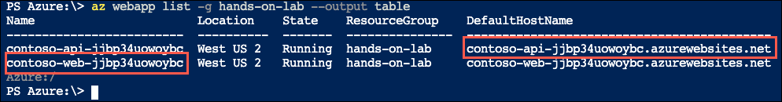

6. Next replace the tokenized values in the following command as specified below, and then run it from the Azure Cloud Shell command prompt.

    - `<your-web-app-name>`: Replace with your Function App name, which you copied in the previous step.
    - `<your-storage-account-sas-token>`: Replace with the `policies` container URL you copied into a text editor previously.

    ```powershell
    $webAppName = "<your-web-app-name>"
    $defaultHostName = "<your-api-default-host-name>"
    az webapp config appsettings set -n $webAppName -g $resourceGroup --settings "ApiUrl=https://$defaultHostName"
    ```

7. In the output, you should see the newly added setting in your Web App's application settings.

    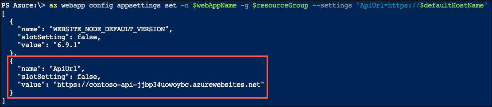

### Task 2: Deploy web application to Azure

In this task, you publish the `Contoso.Web` application into an Azure Web App.

1. In Visual Studio on your LabVM, right-click the `Contoso.Web` project in the Solution Explorer, and then select **Publish** from the context menu.

    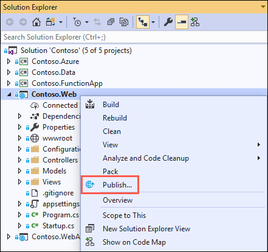

2. On the **Pick a publish target** dialog, select **App Service** and choose **Select Existing**, and then select **Create Profile**.

    

3. On the App Service dialog, select your Azure subscription, logging in if necessary on with your credentials and ensure the subscription you published earlier is selected, then select your Web App (resource starting with "contoso-**web**") under your hands-on-lab-SUFFIX resource group.

    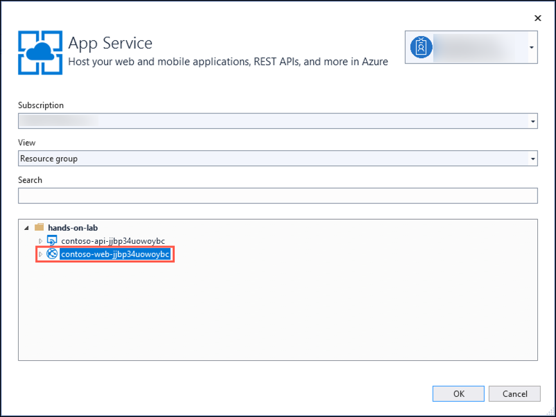

4. Select **OK**.

5. Back on the Visual Studio Publish page for the `Contoso.Web` project, select **Publish** to start the process of publishing your Web API to your Azure API App.

    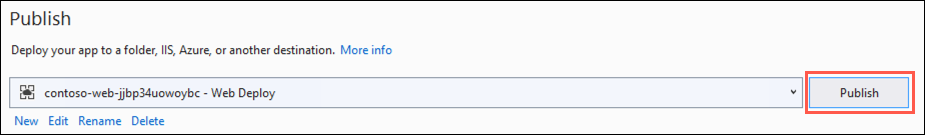

6. In the Visual Studio **Web Publish Activity** view, observe the Publish Succeeded message, along with the URL to the site.

    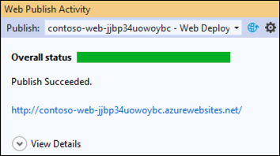

7. A web browser should open to the published site. If not, open the URL of the published Web App in a browser window.

8. In the PolicyConnect web page, enter the following credentials to log in, and then select **Log in**:

    - **Username**: demouser
    - **Password**: Password.1!!

    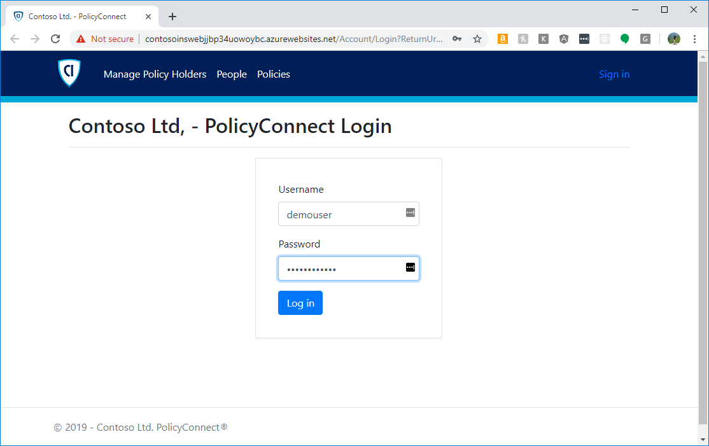

9. Once logged in, select **Managed Policy Holders** from the top menu.

    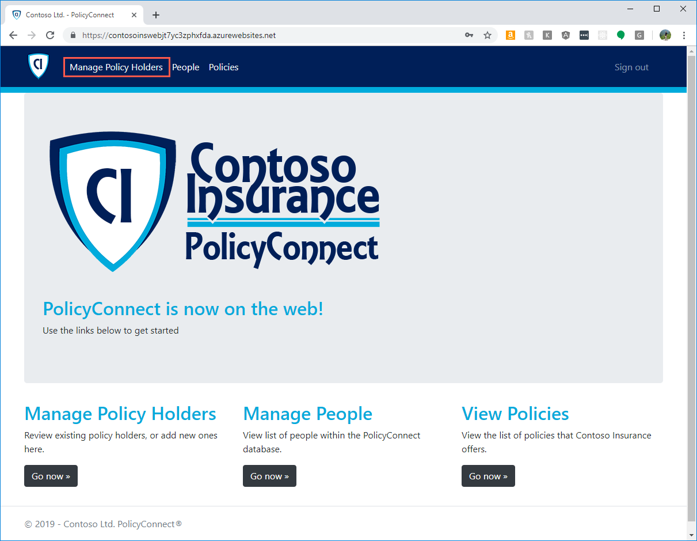

10. On the Policy Holders page, review the list of policy holder, and information about their policies. This information was pulled from your Azure SQL Database using the connection string stored in Azure Key Vault. Select the **Details** link next to one of the records.

    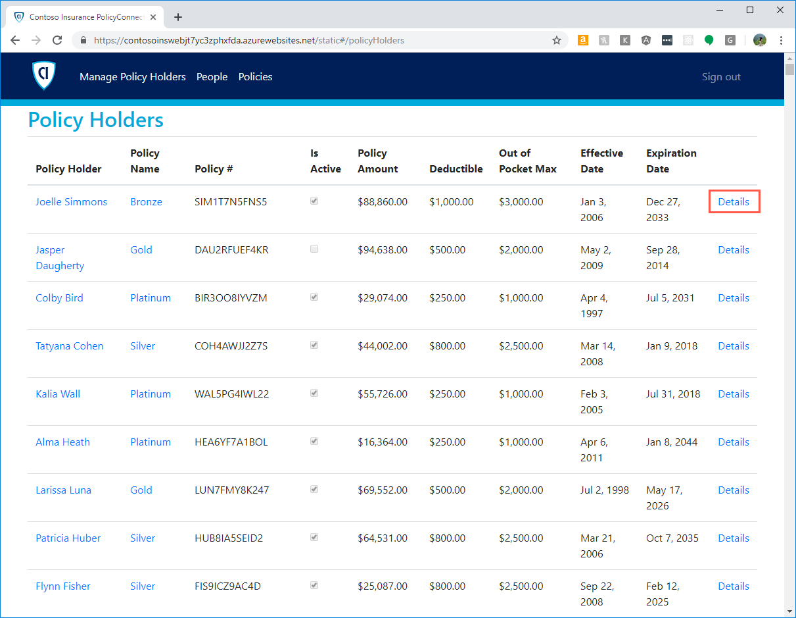

11. On the Policy Holder Details page, select the link under **File Path**, and notice that the result is a page not found error.

    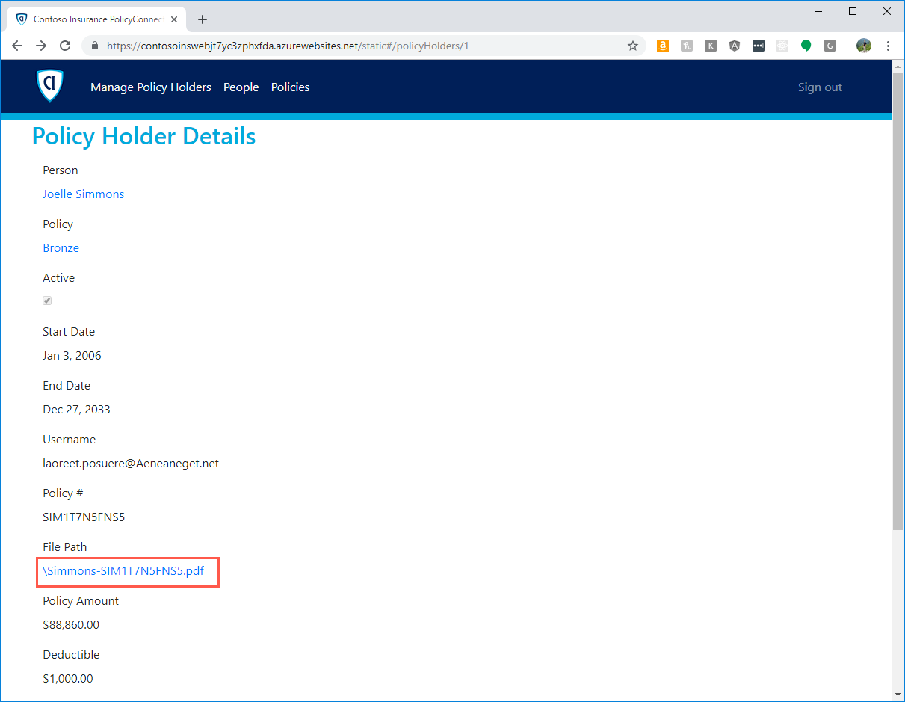

12. Contoso is storing their policy documents on a network file share, so these are not accessible to the deployed web app. In the next exercises, you address that issue.

## Exercise 6: Upload policy documents into blob storage

Duration: 10 minutes.

Contoso is currently storing all of their scanned PDF documents on a shared local network. They have asked to be able to store them in the cloud automatically from a workflow. In this exercise, you provide a storage account to store the files in a blob container. Then, you provide a way to bulk upload their existing PDFs.

### Task 1: Create container for storing PDFs in Azure storage

In this task, you create a new blob container in your storage account for the scanned PDF policy documents.

1. In the [Azure portal](https://portal.azure.com), navigate to your **Storage account** resource by selecting **Resource groups** from Azure services list, selecting the **hands-on-lab-SUFFIX** resource group, and then selecting the **contosoUniqueId** Storage account resource from the list of resources.

    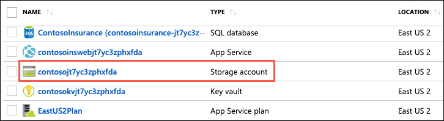

2. From the Storage account Overview blade, select **Containers** under services.

    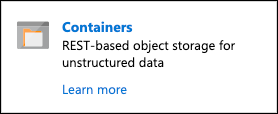

3. On the Container blade, select **+ Container** to create a new container, and in the New container dialog, enter "policies" as the container name. Leave the Public access level set to **Private (no anonymous access)**, and then select **OK**.

    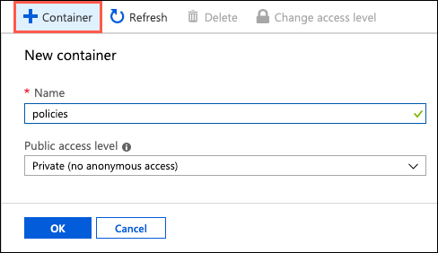

4. After the container has been created, select it on the Container blade, then select **Properties** from the left-hand menu, and copy the URL from the policies - Properties blade. Paste the copied URL into a text editor for later reference.

    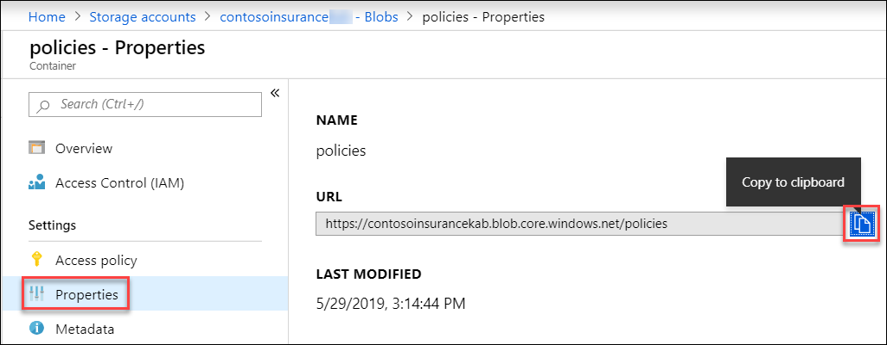

5. Next retrieve the access key for your storage account, which you need to provide to AzCopy below to connect to your storage container. On your Storage account blade in the Azure portal, select **Access keys** from the left-hand menu, and copy the **key1 Key** value to a text editor for use below.

    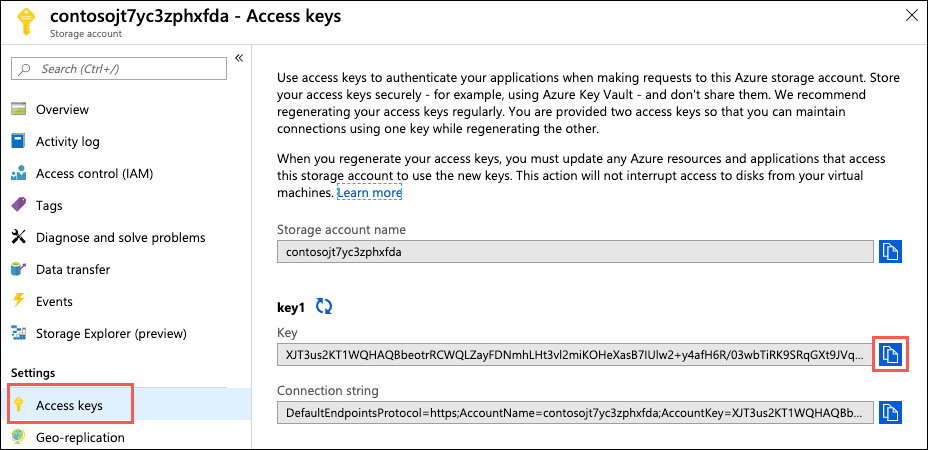

### Task 2: Create a SAS token

In this task, you generate a shared access signature (SAS) token for your storage account. This is used later in the lab to allow your Azure Function to retrieve files from the `policies` storage account container.

1. On your Storage account blade in the Azure portal, and select **Shared access signature** from the left-hand menu.

    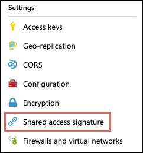

2. On the Shared access signature blade, select **Generate SAS and connection string**, and then copy the SAS token value by selecting the Copy to clipboard button to the right of the value.

    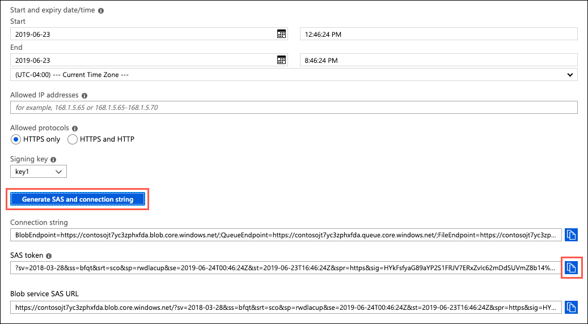

3. Paste the SAS token into a text editor for later use.

### Task 3: Bulk upload PDFs to blob storage using AzCopy

In this task, you download and install [AzCopy](https://docs.microsoft.com/en-us/azure/storage/common/storage-use-azcopy). You then use AzCopy to copy the PDF files from the "on-premises" location into the policies container in Azure storage.

1. On your LabVM, open a web browser and download the latest version of AzCopy from <https://aka.ms/downloadazcopy>.

2. Run the downloaded installer, accepting the license agreement and all the defaults, to complete the AzCopy install.

3. Launch a Command Prompt window (Select search on the task bar, type **cmd**, and select Enter) on your LabVM.

4. At the Command prompt, change the directory to the AzCopy directory. By default, it is installed to `C:\Program Files (x86)\Microsoft SDKs\Azure\AzCopy` (On a 32-bit machine, change `Program Files (x86)` to `Program Files` ). You can do this by running the command:

   ```bash
   cd C:\Program Files (x86)\Microsoft SDKs\Azure\AzCopy
   ```

5. Enter the following command at the command prompt. The tokenized values should be replaced as follows:

   - `[FILE-SOURCE]`: This is the path to the `policy-documents` folder your downloaded copy of the GitHub repo. If you used the extraction path of `C:\MCW`, the path is `C:\MCW\MCW-App-modernization-master\Hands-on lab\lab-files\policy-documents`.
   - `[STORAGE-CONTAINER-URL]`: This is the URL to your storage account's policies container, which you copied in the last step of the previous task. (e.g., <https://contosojt7yc3zphxfda.blob.core.windows.net/policies>)
   - `[STORAGE-ACCOUNT-KEY]`: This is the blob storage account key you copied previously in this task. (e.g., `eqgxGSnCiConfgshXQ1rFwBO+TtCH6sduekk6s8PxPBxHWOmFumycTeOlL3myb8eg4Ba2dn7rtdHnk/1pi6P/w==`)

   ```bash
   AzCopy /Source:"[FILE-SOURCE]" /Dest:"[STORAGE-CONTAINER-URL]" /DestKey:"[STORAGE-ACCOUNT-KEY]" /S
   ```

6. The final command should resemble the following:

    ```bash
    AzCopy /Source:"C:\MCW\MCW-App-modernization-master\Hands-on lab\lab-files\policy-documents" /Dest:"https://contosojt7yc3zphxfda.blob.core.windows.net/policies" /DestKey:"XJT3us2KT1WQHAQBbeotrRCWQLZayFDNmhLHt3vl2miKOHeXasB7IUlw2+y4afH6R/03wbTiRK9SRqGXt9JVqQ==" /S
    ```

7. In the output of the command, you should see that 650 files were transferred successfully.

    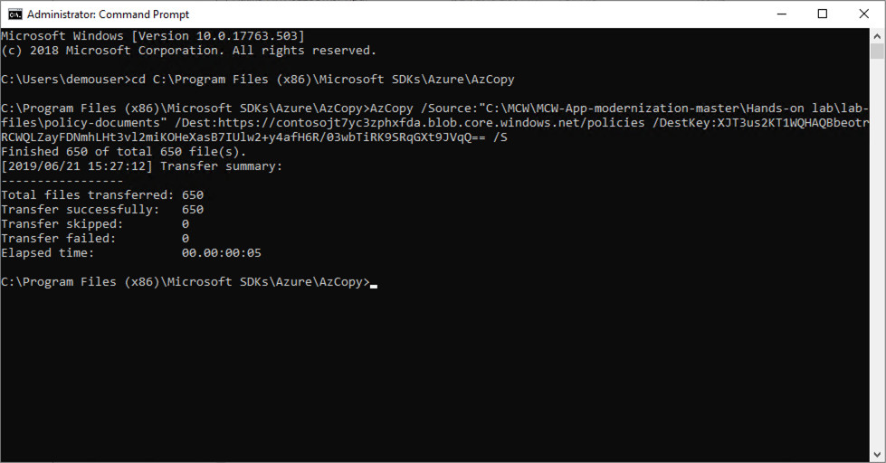

8. You can verify the upload by navigating to the policies container in your Azure Storage account.

    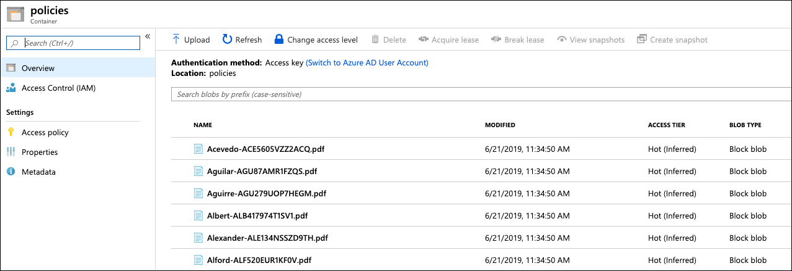

## Exercise 7: Create serverless API for accessing PDFs

Duration: 30 minutes

Contoso has made some updates to prepare their applications, but there are some features that they have not been able to build into the API yet. They have requested that you assist them in setting up a proof-of-concept (POC) API solution to enable users of their application to retrieve their policy documents directly from their Azure Storage account. In this exercise, you create an Azure Function to enable this functionality using serverless technologies.

### Task 1: Add application settings to your Function App

In this task, you prepare your Azure Function App to work with your new Function by adding your storage account policies container URL and SAS token values to the Application Settings of your Function App, using the Azure Cloud Shell and Azure CLI.

1. In the [Azure portal](https://portal.azure.com), select the Azure Cloud Shell icon from the menu at the top right of the screen.

    

2. In the Cloud Shell window that opens at the bottom of your browser window, select **PowerShell**.

    

3. After a moment, you should receive a message that you have successfully requested a Cloud Shell, and be presented with a PS Azure prompt.

    

4. At the prompt, retrieve your Function App name by running the following command at the Cloud Shell prompt, replacing `<your-resource-group-name>` with your resource group name:

    ```powershell
    $resourceGroup = "<your-resource-group-name>"
    az functionapp list -g $resourceGroup --output table
    ```

    > **Note**: If you have multiple Azure subscriptions, and the account you are using for this hands-on lab is not your default account, you may need to run `az account list --output table` at the Azure Cloud Shell prompt to output a list of your subscriptions, then copy the Subscription Id of the account you are using for this lab, and then run `az account set --subscription <your-subscription-id>` to set the appropriate account for the Azure CLI commands.

5. In the output, copy the **Name** value for use in the next step.

    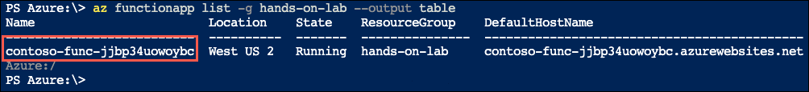

6. For the next command, you need the URL of your `policies` container and the `SAS token` values you added to your text editor previously. Replace the tokenized values in the following command, and then run it from the Azure Cloud Shell command prompt.

    - `<your-function-app-name>`: Replace with your Function App name, which you copied in the previous step.
    - `<your-policies-container-url>`: Replace with the `policies` container URL you copied into a text editor previously.
    - `<your-storage-account-sas-token>`: Replace with the `SAS Token` of your Storage account, which you copied into a text editor previously.

    ```powershell
    $functionAppName = "<your-function-app-name>"
    $storageUrl = "<your-policies-container-url>"
    $storageSas = "<your-storage-account-sas-token>"
    az functionapp config appsettings set -n $functionAppName -g $resourceGroup --settings "PolicyStorageUrl=$storageUrl" "PolicyStorageSas=$storageSas"
    ```

### Task 2: Add project environment variables

Functions can use environment variables to retrieve configuration settings. To test your functions locally using environment variables, you must add these settings as user environment variables on your development machine or to the project settings.

In this task, you create some environment variables on your LabVM, which allows for debugging your Function App locally on the LabVM.

1. In Solution Explorer, right-click the **Contoso-FunctionApp** project, then select **Properties**

2. Select the **Debug** tab.

3. In the **Environment Variables** section, choose **Add**, then enter the following:

    - **Name**: Enter **PolicyStorageSas**
    - **Value**: Paste in the **SAS token** you created and copied into a text editor in the previous exercise.

4. Select **OK**.

5. Select **Add** again, and in the New User Variable dialog, enter the following:

    - **Name**: Enter **PolicyStorageUrl**
    - **Value**: Paste in the **URL** of the policies container you copied into a text editor in the previous exercise.

    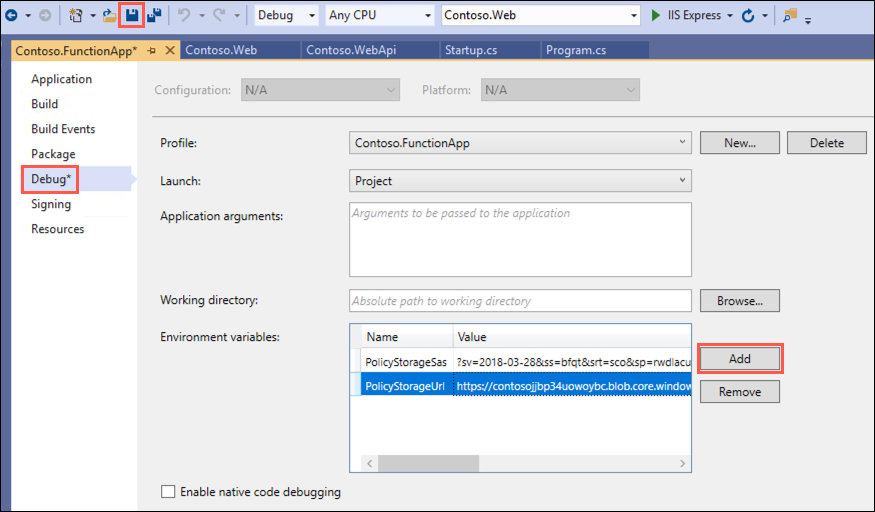

6. Save the project.

### Task 3: Create an Azure Function in Visual Studio

In this task, you use Visual Studio to create an Azure Function. This Function serves as a serverless API for retrieving policy documents from Blob storage.

1. On your LabVM, return to Visual Studio and in the Solution explorer expand the `Contoso.FunctionApp` and then double-click `PolicyDocsFunction.cs` to open it.

    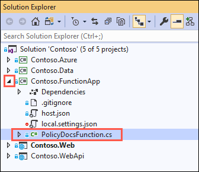

2. In the `PolicyDocsFunction.cs` file, locate the `TODO #3` block (begins on line 14).

    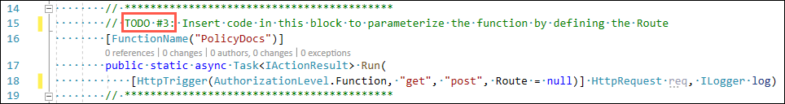

3. Update the code within the block to allow passing in the policy holder last and policy number. Also, update it to only allow "get" requests. The updated code should look like the below when completed.

    ```csharp
    [FunctionName("PolicyDocs")]
        public static async Task<IActionResult> Run(
                [HttpTrigger(AuthorizationLevel.Function, "get", Route = "policies/{policyHolder}/{policyNumber}")] HttpRequest req, string policyHolder, string policyNumber, ILogger log)
    ```

    > **Note**: Notice that in the code you removed `"post"` from the list of acceptable verbs, and then updated the Route of the HttpTrigger from `null` to `policies/{policyHolder}/{policyNumber}`. This allows for the function to be parameterized. You then added `string` parameters to the Run method to allow those parameters to be received and used within the function.

4. Next, locate `TODO #4` within the `GetDocumentsFromStorage` method in the `PolicyDocsFunction.cs` file.

    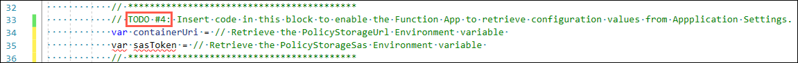

5. Update the code in the block to retrieve the `PolicyStorageUrl` and `PolicyStorageSas` values from the environment variables you added above. The completed code should look like the following:

    ```csharp
    var containerUri = Environment.GetEnvironmentVariable("PolicyStorageUrl");
    var sasToken = Environment.GetEnvironmentVariable("PolicyStorageSas");
    ```

    > **Note**: When the API is deployed to an Azure API App, `Environment.GetEnvironmentVariables()` looks for the specified values in the configured application settings.

6. Save `PolicyDocsFunction.cs`.

7. Take a moment to review the code in the Function, and understand how it functions. It uses an `HttpTrigger`, which means the function executes whenever it receives an Http request. You added configuration to restrict the Http requests to only `GET` requests, and the requests must be in format `https://<function-name>.azurewebsites.net/policies/{policyHolder}/{policyName}` for the Function App to route the request to the `PolicyDocs` function. Within the function, an Http request is being made to your Storage account `policy` container URL to retrieve the PDF document for the specified policy holder and policy number. That is then returned to the browser as a PDF attachment.

8. Your Function App is now fully configured to retrieve parameterized values and then retrieve documents from the `policies` container in your Storage account.

### Task 4: Test the function locally

In this task, you run your Function locally through the Visual Studio debugger, to verify that it is properly configured and able to retrieve documents from the `policy` container in your Storage account.

> **IMPORTANT**: Internet Explorer on Windows Server 2019 does not include functionality to open PDF documents. To view the downloaded policy documents in this task, you need to [download and install the Chrome browser](https://www.google.com/chrome/) on your LabVM.

1. In the Visual Studio Solution Explorer, right-click the `Contoso.FunctionApp` project, and then select **Debug** and **Start new instance**.

    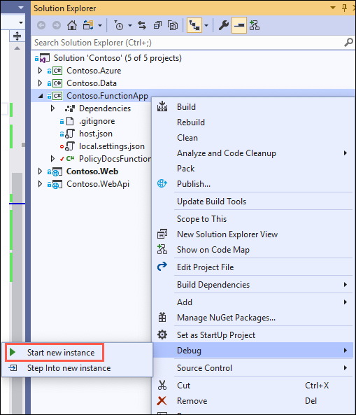

2. If prompted, allow the function app to access your local machine resources.

3. A new console dialog appears, and the function app is loaded. At the of the console, note the output, which provides the local URL of the Function.

    

4. Copy the URL that appears after `PolicyDocs`, and paste it into a text editor. The copied value should look like:

    ```http
    http://localhost:7071/api/policies/{policyHolder}/{policyNumber}
    ```

5. In the text editor, you need to replace the tokenized values as follows:

   - `{policyHolder}`: Acevedo
   - `{policyNumber}`: ACE5605VZZ2ACQ

    The updated URL should now look like:

    ```http
    http://localhost:7071/api/policies/Acevedo/ACE5605VZZ2ACQ
    ```

6. Paste the updated into the address bar of a new Chrome web browser window and press Enter.

7. In the browser, the policy document opens in a new window.

    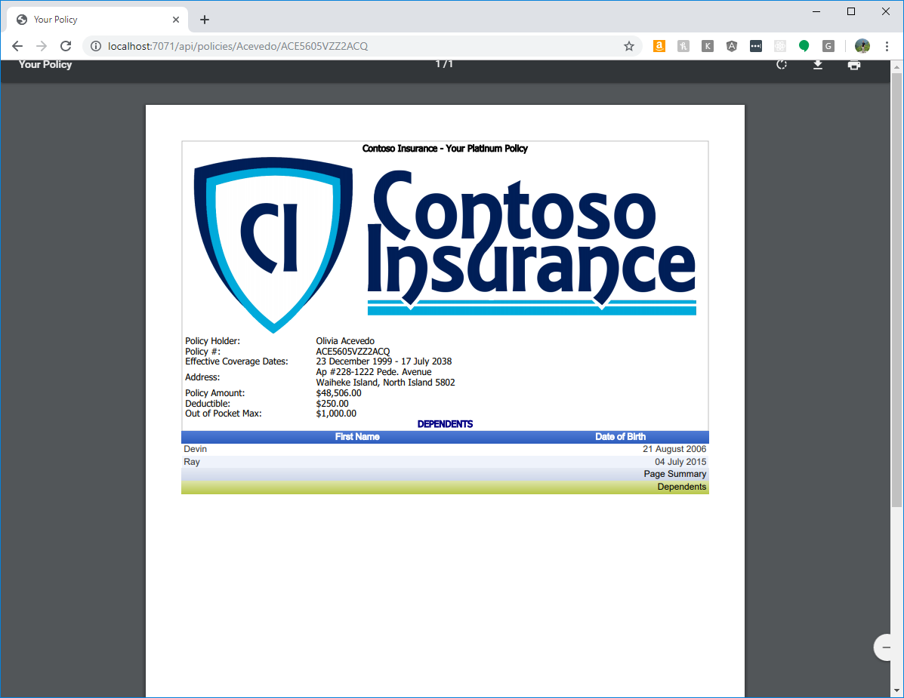

8. You've confirmed the function is working properly. Stop your Visual Studio debugging session by closing the console window or selecting the stop button on the Visual Studio toolbar. In the next task, you deploy the function to Azure.

### Task 5: Deploy the function to your Azure Function App

In this task, you deploy your function into an Azure Function App, where the web application uses it to retrieve policy documents.

1. In Visual Studio on your LabVM, right-click on the `Contoso.FunctionApp` project in the Solution Explorer, and then select **Publish** from the context menu.

    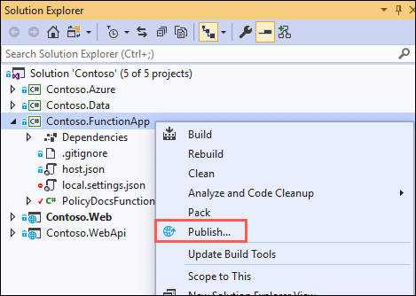

2. On the **Pick a publish target** dialog, select **Azure Functions Consumption Plan**, choose **Select Existing**, leave Run from package file checked, and then select **Create Profile**.

    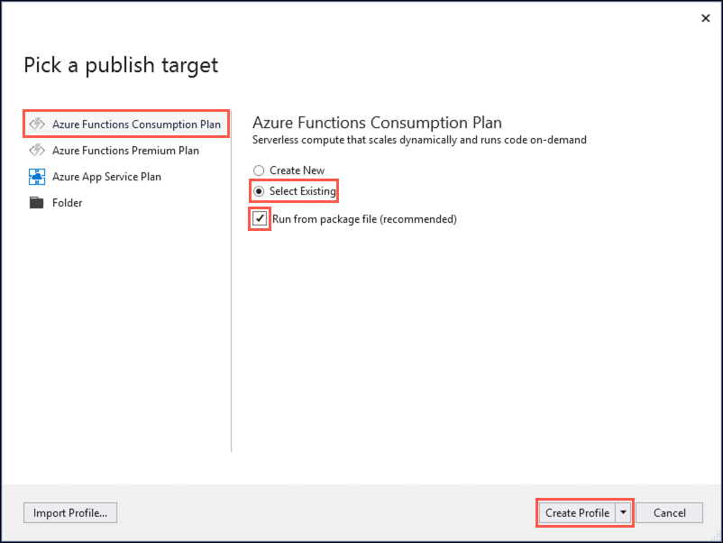

3. On the App Service dialog, select your Azure subscription, logging in if necessary on with your credentials and ensure the subscription you published earlier is selected, then select your Function App (resource starting with "contoso-**func**") under your hands-on-lab-SUFFIX resource group.

    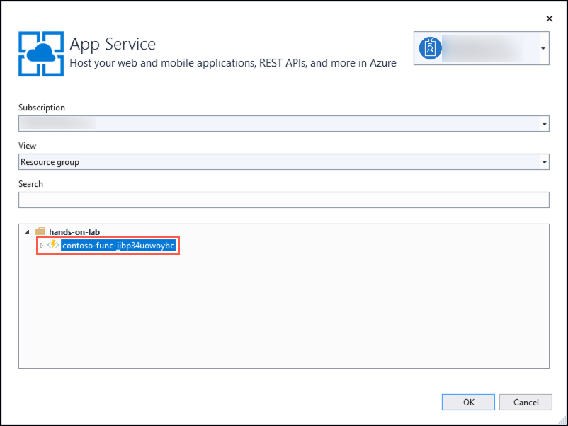

4. Select **OK**.

5. Back on the Visual Studio Publish page for the `Contoso.FunctionApp` project, select **Publish** to start the process of publishing your Web API to your Azure API App.

    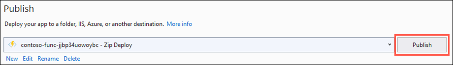

6. Ensure you see a publish succeeded message in the Visual Studio Output panel.

7. The Azure Function App is now ready for use within the PolicyConnect web application.

### Task 6: Enable Application Insights on the Function App

In this task, you add Application Insights to your Function App in the Azure Portal, to be able to collect insights into requests against the Function.

1. In the [Azure portal](https://portal.azure.com), navigate to your **Function App** by selecting **Resource groups** from Azure services list, selecting the **hands-on-lab-SUFFIX** resource group, and selecting the **contoso-func-UniqueId** App service from the list of resources.

   

2. On the Function App blade, select **Configure Application Insights to capture function logs.** at the top of the blade.

    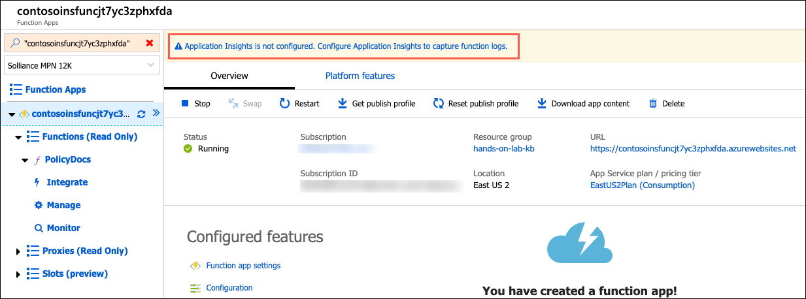

3. On the Application Insights blade, select **Create new resource** and enter a globally unique name, such as contoso-ai-SUFFIX, and then select **OK**.

    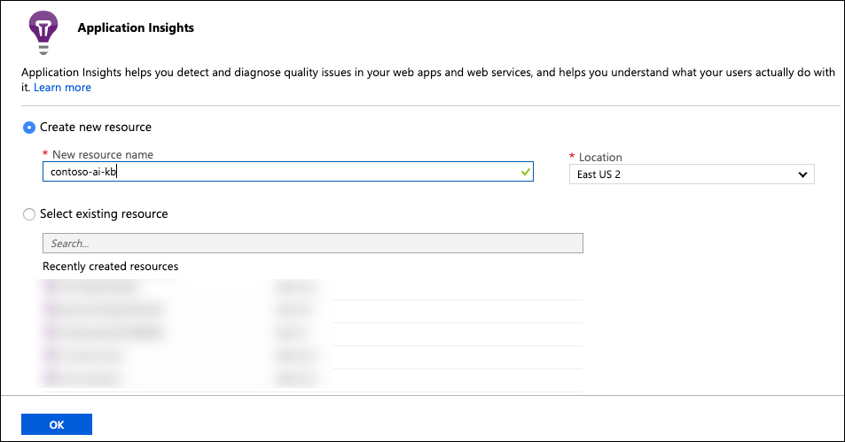

4. Once the Application Insights resource is created, return to the Overview blade of your Function App, and select **Application Insights** under Configured Features.

    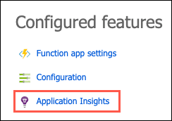

5. On the Application Insights blade, select **Live Metrics Stream** from the left-hand menu.

    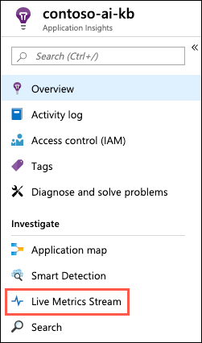

    > **Note**: You may see a message that your app is offline. You handle this below.

6. Leave the Live Metrics Stream window open for reference in the next task.

### Task 7: Add Function App URL to your Web App Application settings

In this task, you add the URL of your Azure Function App to the Application settings configuration of your Web App.

1. In the [Azure portal](https://portal.azure.com), select the Azure Cloud Shell icon from the menu at the top right of the screen.

    

2. In the Cloud Shell window that opens at the bottom of your browser window, select **PowerShell**.

    

3. After a moment, you receive a message that you have successfully requested a Cloud Shell, and be presented with a PS Azure prompt.

    

4. At the prompt, retrieve your Function App URL by running the following command at the Cloud Shell prompt, replacing `<your-resource-group-name>` with your resource group name:

    ```powershell
    $resourceGroup = "<your-resource-group-name>"
    az functionapp list -g $resourceGroup --output table
    ```

    > **Note**: If you have multiple Azure subscriptions, and the account you are using for this hands-on lab is not your default account, you may need to run `az account list --output table` at the Azure Cloud Shell prompt to output a list of your subscriptions, then copy the Subscription Id of the account you are using for this lab, and then run `az account set --subscription <your-subscription-id>` to set the appropriate account for the Azure CLI commands.

5. In the output, copy the **DefaultHostName** value into a text editor for use below.

    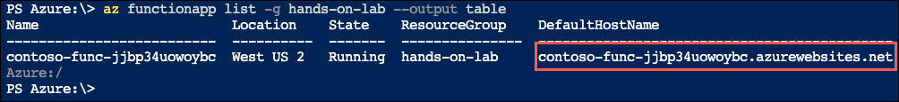

6. At the Cloud Shell prompt, run the following command to retrieve both your Web App name:

    ```powershell
    az webapp list -g $resourceGroup --output table
    ```

7. In the output, copy the name of Web App (the resource name starts with contoso-**web**) into a text editor for use below.

    

8. The last setting you need is the Default Host Key for your Function App. To get this, navigate to your Function App resource in the Azure portal, and on the overview blade, select **Function app settings**.

    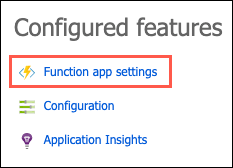

9. On the Function app settings tab, locate the **Host Keys** section, and copy the **default** key by selecting the **Copy** Action link to the right of the key. Paste the value into a text editor for reference below.

    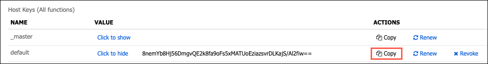

10. Next replace the tokenized values in the following command as specified below, and then run it from the Azure Cloud Shell command prompt.

    - `<your-web-app-name>`: Replace with your Web App name, which you copied in above.
    - `<your-function-app-default-host-name>`: Replace with the `DefaultHostName` of your Function App, which you copied into a text editor above.
    - `<your-function-app-default-host-key>`: Replace with the default host key of your Function App, which you copied into a text editor above.

    ```powershell
    $webAppName = "<your-web-app-name>"
    $defaultHostName = "<your-function-app-default-host-name>"
    $defaultHostKey = "<your-function-app-default-host-key>"
    az webapp config appsettings set -n $webAppName -g $resourceGroup --settings "PolicyDocumentsPath=https://$defaultHostName/api/policies/{policyHolder}/{policyNumber}?code=$defaultHostKey"
    ```

11. In the output, the newly added `PolicyDocumentsPath` setting in your Web App's application settings is visible.

    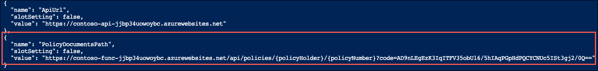

### Task 8: Test document retrieval from web app

In this task, you open the PolicyConnect web app and download a policy document. Recall from above that this resulted in a page not found error when you tried it previously.

1. Open a web browser and navigate to the URL for your published Web App.

    > **Note**: You can retrieve the URL from the Overview blade of your Web App resource in the Azure portal if you aren't sure what it is.

    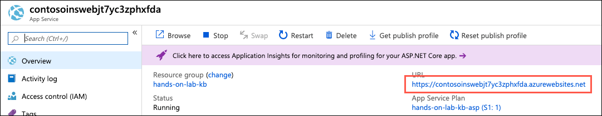

2. In the PolicyConnect web page, enter the following credentials to log in, and then select **Log in**:

    - **Username**: demouser
    - **Password**: Password.1!!

    

3. Once logged in, select **Managed Policy Holders** from the top menu.

    

4. On the Policy Holders page, you see a list of policy holders, and information about their policies. This information was pulled from your Azure SQL Database using the connection string stored in Azure Key Vault. Select the **Details** link next to one of the records.

    

5. On the Policy Holder Details page, hover your mouse cursor over the document link under **File Path**, and notice that the path that is displayed at the bottom now points to your Function App, and that the policy holder's last name and policy number are inserted into the path.

    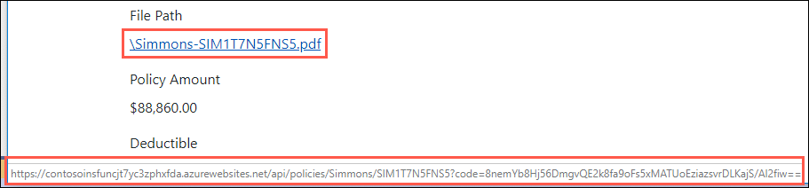

6. Now, select the link under **File Path**, and download the policy document.

    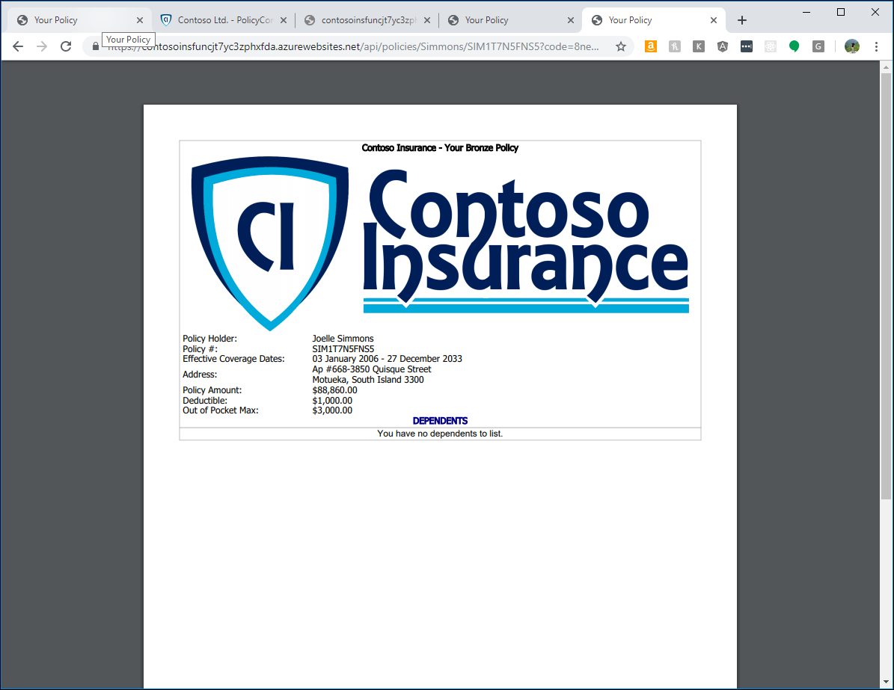

### Task 9: View Live Metrics Stream

1. Return to the Application Insights Live Metrics Stream in the Azure portal.

2. The page should now display a dashboard featuring telemetry for requests hitting your Function App. Look under the Sample Telemetry section on the right, and you locate the document request you just made. Select the Trace whose message begins with "PolicyDocs function received a request...", and observe the details in the panel below it.

    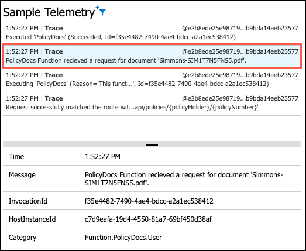

## Exercise 8: Add Cognitive Search for policy documents

Duration: 15 minutes

Contoso has requested the ability to perform full-text searching on policy documents. Previously, they have not been able to extract information from the documents in a usable way, but they have read about [cognitive search with the Azure Cognitive Search Service](https://docs.microsoft.com/azure/search/cognitive-search-concept-intro), and are interested to learn if it could be used to make the data in their search index more useful. In this exercise, you configure cognitive search for the policies blob storage container.

### Task 1: Add Azure Cognitive Search to Storage account

1. In the [Azure portal](https://portal.azure.com), navigate to your **Storage account** resource by selecting **Resource groups** from Azure services list, selecting the **hands-on-lab-SUFFIX** resource group, and then selecting the **contoso-UniqueId** Storage account resource from the list of resources.

   

2. On the Storage account blade, select **Add Azure Search** from the left-hand menu, and then on the **Select a search service** tab, select your search service.

   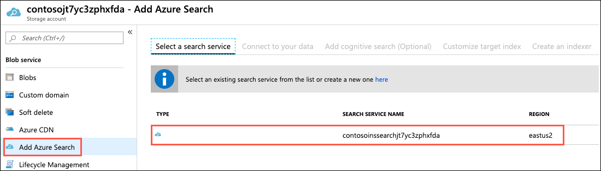

3. Select **Next: Connect to your data**.

4. On the **Connect to your data** tab, enter the following:

   - **Data Source**: Leave the value of **Azure Blob Storage** selected.
   - **Name**: Enter **policy-docs**.
   - **Data to extract**: Select **Content and metadata**.
   - **Parsing mode**: Leave set to **Default**.
   - **Connection string**: Leave this set to the pre-populated connection string for your Storage account.
   - **Container name**: Enter **policies**.

   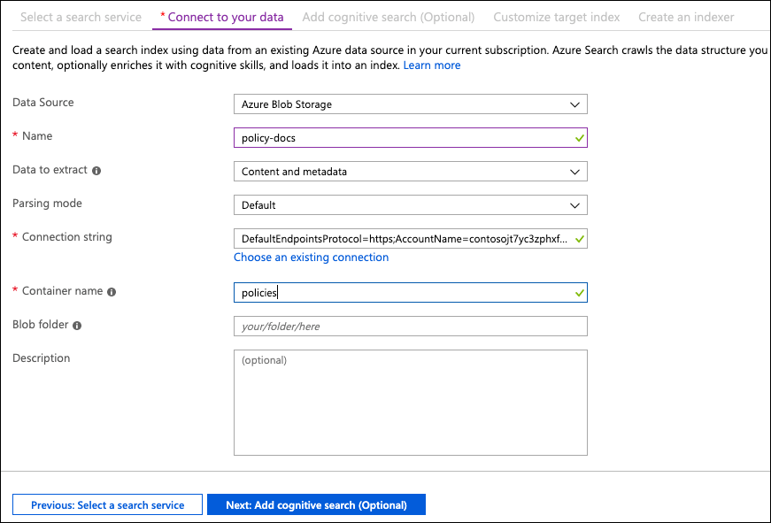

5. Select **Next: Add cognitive search (Optional)**.

6. On the **Add cognitive search** tab, set the following configuration:

   - Expand Attach Cognitive Services, and select your Cognitive Services account.
   - Expand Add enrichments:
     - **Skillset name**: Enter **policy-docs-skillset**.
     - **Text cognitive skills**: Check this box to select all the skills.

   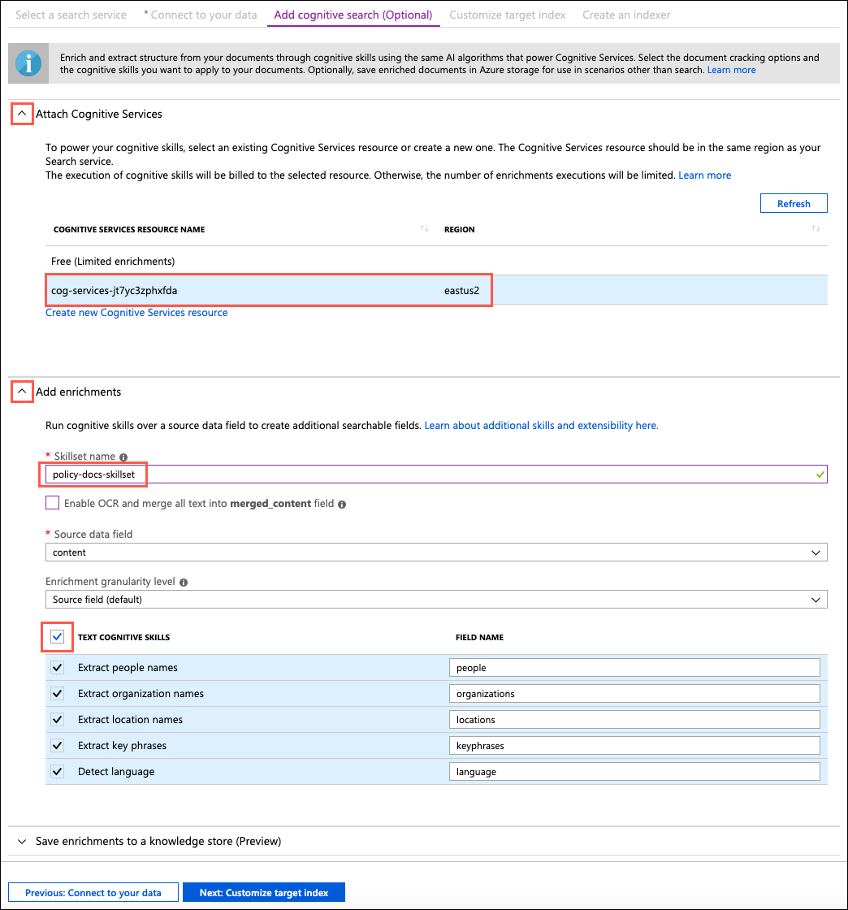

7. Select **Next: Customize target index**.

8. On the **Customize target index tab**, do the following:

   - **Index name**: Enter **policy-docs-index**.
   - Check the top Retrievable box, to check all items underneath it.
   - Check the top Searchable box, to check all items underneath it.

   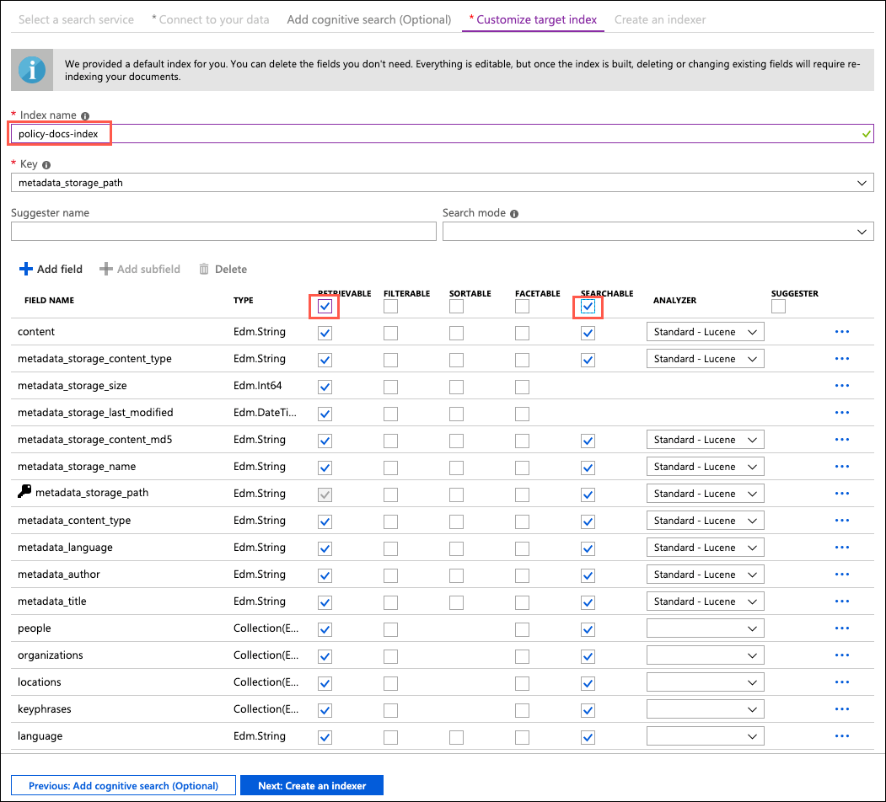

9. Select **Next: Create an indexer**.

10. On the **Create an indexer** tab, enter **policy-docs-indexer** as the name, select **Once** for the schedule, and then select **Submit**.

    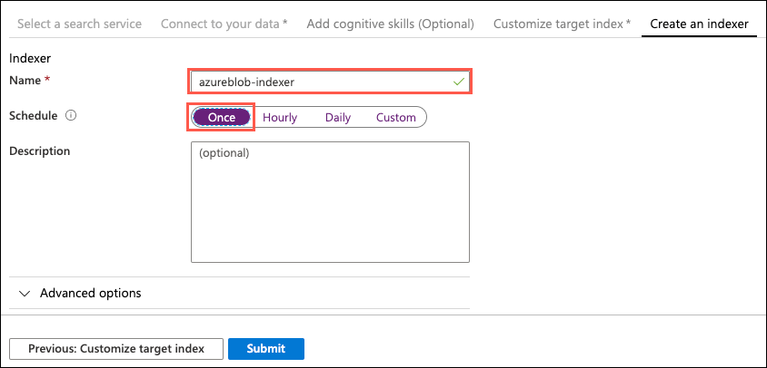

    > **Note**: For this hands-on lab, we are only running the indexer once, at the time of creation. In a production application, you would probably choose a schedule such as hourly or daily to run the indexer. This would allow you to bring in any new data that arrives in the target blob storage account.

11. Within a few seconds, you receive a notification in the Azure portal that the import was successfully configured.

### Task 2: Review search results

In this task, you run a query against your search index to review the enrichments added by cognitive search to policy documents.

1. In the [Azure portal](https://portal.azure.com), navigate to your **Search service** resource by selecting **Resource groups** from Azure services list, selecting the **hands-on-lab-SUFFIX** resource group, and then selecting the **contoso-search-UniqueId** Search service resource from the list of resources.

   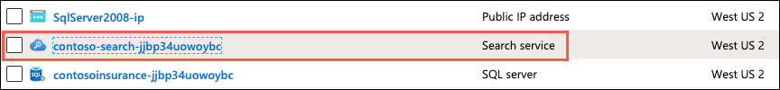

2. On the Search service blade, select **Indexers**.

    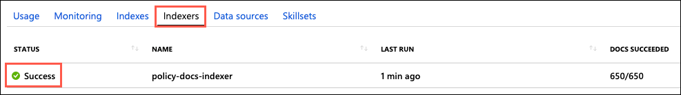

3. Note the status of the policy-docs-indexer. Once the indexer has run, it should display a status of **Success**. If the status is **In progress**, select **Refresh** every 20-30 seconds until it changes to **Success**.

   > If you see a status of **No history**, select the policy-docs-indexer, and select **Run** on the Indexer blade.

4. Now select **Search explorer** in the Search service blade toolbar.

   

5. On the **Search explorer** blade, select **Search**.

6. In the search results, inspect the returned documents, paying special attention to the fields added by the cognitive skills you added when creating the search index. These fields are `People`, `Organizations`, `Locations`, `Keyphrases`, `Language`, and `Translated_Text`.

   ```json
   {
        "@search.score": 1,
        "content": "\nContoso Insurance - Your Platinum Policy\n\nPolicy Holder: Igor Cooke\nPolicy #: COO13CE2ZLOKD\nEffective Coverage Dates: 22 July 2008 - 13 August 2041\nAddress: P.O. Box 442, 802 Pellentesque AveTaupo, NI 240\nPolicy Amount: $48,247.00\nDeductible: $250.00\nOut of Pocket Max: $1,000.00\n\nDEPENDENTS\nFirst Name Date of Birth\n\nIma 21 January 2002\nEcho 12 August 2003\n\nPage Summary\nDependents\n\n1 / 0 22 July 2008\n\n\nworksheet1\n\n\t\tFirst Name\t\tDate of Birth\n\n\t\tIma\t\t21 January 2002\n\n\t\tEcho\t\t12 August 2003\n\n\n\n\n\n\n",
        "metadata_storage_content_type": "application/octet-stream",
        "metadata_storage_size": 142754,
        "metadata_storage_last_modified": "2019-10-23T21:42:23Z",
        "metadata_storage_content_md5": "ksk3JZT5QPkHfAR0F17ZEw==",
        "metadata_storage_name": "Cooke-COO13CE2ZLOKD.pdf",
        "metadata_storage_path": "aHR0cHM6Ly9ob2xzdG9yYWdlYWNjb3VudC5ibG9iLmNvcmUud2luZG93cy5uZXQvcG9saWNpZXMvQ29va2UtQ09PMTNDRTJaTE9LRC5wZGY1",
        "metadata_content_type": "application/pdf",
        "metadata_language": "en",
        "metadata_author": "Contoso Insurance",
        "metadata_title": "Your Policy",
        "People": [
            "Igor Cooke",
            "Cooke",
            "Max"
        ],
        "Organizations": [
            "Contoso Insurance - Your Platinum Policy",
            "NI",
            "DEPENDENTS\nFirst",
            "Ima",
            "Page Summary\nDependents",
            "Echo"
        ],
        "Locations": [],
        "Keyphrases": [
            "Platinum Policy",
            "Policy Holder",
            "Date of Birth",
            "Echo",
            "DEPENDENTS",
            "Ima",
            "Box",
            "Pellentesque AveTaupo",
            "Address",
            "NI",
            "Contoso Insurance",
            "Igor Cooke",
            "Effective Coverage Dates",
            "Pocket Max",
            "Page Summary",
            "COO13CE2ZLOKD",
            "worksheet1"
        ],
        "Language": "en",
        "Translated_Text": "\nContoso Insurance - Your Platinum Policy\n\nPolicy Holder: Igor Cooke\nPolicy #: COO13CE2ZLOKD\nEffective Coverage Dates: 22 July 2008 - 13 August 2041\nAddress: P.O. Box 442, 802 Pellentesque AveTaupo, NI 240\nPolicy Amount: $48,247.00\nDeductible: $250.00\nOut of Pocket Max: $1,000.00\n\nDEPENDENTS\nFirst Name Date of Birth\n\nIma 21 January 2002\nEcho 12 August 2003\n\nPage Summary\nDependents\n\n1 / 0 22 July 2008\n\nworksheet1\n\nFirst Name\t\tDate of Birth\n\nIma\t\t21 January 2002\n\nEcho\t\t12 August 2003\n\n"
   }
   ```

7. For comparison, the same document without cognitive search skills enabled would look similar to the following:

   ```json
   {
        "@search.score": 1,
        "content": "\nContoso Insurance - Your Platinum Policy\n\nPolicy Holder: Igor Cooke\nPolicy #: COO13CE2ZLOKD\nEffective Coverage Dates: 22 July 2008 - 13 August 2041\nAddress: P.O. Box 442, 802 Pellentesque AveTaupo, NI 240\nPolicy Amount: $48,247.00\nDeductible: $250.00\nOut of Pocket Max: $1,000.00\n\nDEPENDENTS\nFirst Name Date of Birth\n\nIma 21 January 2002\nEcho 12 August 2003\n\nPage Summary\nDependents\n\n1 / 0 22 July 2008\n\n\nworksheet1\n\n\t\tFirst Name\t\tDate of Birth\n\n\t\tIma\t\t21 January 2002\n\n\t\tEcho\t\t12 August 2003\n\n\n\n\n\n\n",
        "metadata_storage_content_type": "application/octet-stream",
        "metadata_storage_size": 142754,
        "metadata_storage_last_modified": "2019-10-23T21:42:23Z",
        "metadata_storage_content_md5": "ksk3JZT5QPkHfAR0F17ZEw==",
        "metadata_storage_name": "Cooke-COO13CE2ZLOKD.pdf",
        "metadata_storage_path": "aHR0cHM6Ly9ob2xzdG9yYWdlYWNjb3VudC5ibG9iLmNvcmUud2luZG93cy5uZXQvcG9saWNpZXMvQ29va2UtQ09PMTNDRTJaTE9LRC5wZGY1",
        "metadata_content_type": "application/pdf",
        "metadata_language": "en",
        "metadata_author": "Contoso Insurance",
        "metadata_title": "Your Policy"
   }
   ```

8. As you can see from the search results, the addition of cognitive skills adds valuable metadata to your search index, and helps to make documents and their contents more usable by Contoso.

## Exercise 9: Import and publish APIs into APIM

Duration: 30 minutes

In this exercise, you publish your API App and Function App API endpoints through API Management.

### Task 1: Import API App

In this task, you import your API App into APIM, using the OpenAPI specification, which leverages the Swagger definition associated with your API app.

1. In the Azure portal, navigate to your **API Management Service** by selecting it from the list of resources under your hands-on-lab-SUFFIX resource group.

    

2. On the API Management service select the **APIs** blade, and then select **+ Add API** and select **OpenAPI**.

    

3. A dialog to Create from OpenAPI specification is displayed. Select **Full** to expand the options that need to be entered.

    

4. Retrieve the value for the OpenAPI specification field from the `swagger` page of your API APP. (This is the URL of your API app, which you can retrieve from its overview blade in the Azure portal) plus "/swagger". (e.g., <https://contoso-api-jt7yc3zphxfda.azurewebsites.net/swagger>).

5. On the Swagger page for your API App, right-click on the `swagger/v1/swagger.json` file link just below the PolicyConnect API title, and select **Copy link address**.

    

6. Return to the API Management Create from OpenAPI specification dialog, and enter the following:

    - **OpenAPI specification**: Paste the copied link address from your Swagger page.
    - **Display name**: This is automatically populated from the Swagger definition.
    - **Name**: This is automatically populated from the Swagger definition.
    - **URL scheme**: Choose **HTTPS**.
    - **Products**: Select the **Unlimited** tag by clicking the field and selecting it from the dropdown list.

    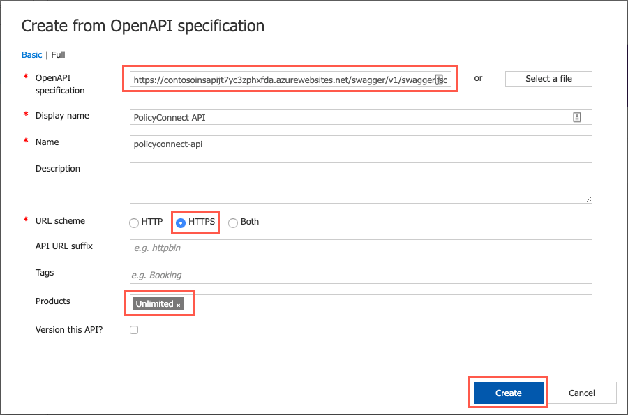

7. After creating the API, select the **PolicyConnect API** from the list of APIs on the left, and on the Design tab, with All operations selected, select the **Policies** icon in the Inbound process tile.

    

8. On the Policies screen, insert the code below between the `<inbound></inbound>` tags, and below the `<base />` tag. You need to **replace** `<your-web-app-url>` between the `<origin></origin>` tags with the URL for your Web App.

    ```xml
    <cors allow-credentials="true">
        <allowed-origins>
            <origin><your-web-app-url></origin>
        </allowed-origins>
        <allowed-methods>
            <method>*</method>
        </allowed-methods>
        <allowed-headers>
            <header>*</header>
        </allowed-headers>
        <expose-headers>
            <header>*</header>
        </expose-headers>
    </cors>
    ```

    Your updated policies value should look similar to the following:

    

    > **Note**: The policy added above is for handling cross-origin resource sharing (CORS). If you are testing the web app locally, you need to add another `<origin></origin>` tag within `<allowed-origins></allowed-origins>` that contains `https://localhost:<port-number>`, where `<port-number>` is the port assigned by your debugger (as is shown in the screenshot above).

9. Select **Save**.

10. Next, select the **Settings** tab. On the Settings tab, enter the URL of your API App, starting with `https://`. **Note**: You can copy this value from the text editor you have been using to store values throughout this lab.

    

11. Select **Save** on the Settings tab.

### Task 2: Import Function App

In this task, you import your Function App into APIM.

1. Select **+ Add API** again, and this time select **Function App** as the source of the API.

    

2. On the Create from Function App dialog, select the **Browse** button next to the Function App field.

3. In the Import Azure Functions blade, select **Function App** and then select your Function App from the list, and choose **Select**.

    

    >**Note**: You can filter using your resource group name, if needed.

4. Back on the Import Azure Functions blade, ensure the PolicyDocs function is checked, and choose **Select**.

    

5. Back on the Create from Function App dialog in APIM, all of the properties for the API are set from your Azure Function. Set the Products to Unlimited, as you did previously. Note, you may need to select **Full** at the top to see the Products box.

    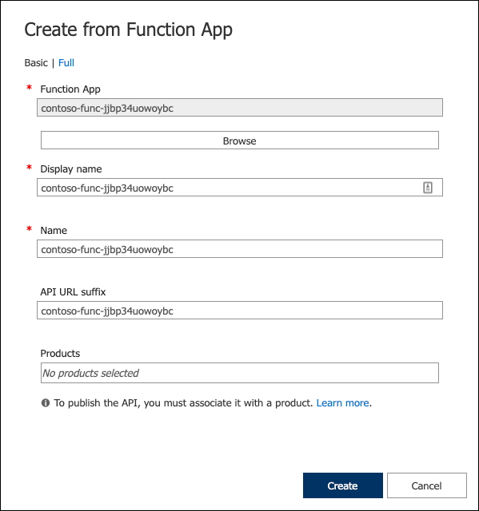

6. Select **Create**.

### Task 3: Open Developer Portal and retrieve you API key

In this task, you quickly look at the APIs in the Developer Portal, and retrieve your key. The Developer Portal allows you to check the list of APIs and endpoints as well as find useful information about them.

1. Open the APIM Developer Portal by selecting **Developer portal (legacy)** from the Overview blade of your API Management service in the Azure portal.

    

2. In the Azure API Management portal, select **APIs** from the top menu, and then select the API associated with your Function App.

    

3. The API page allows you to view and test your API endpoints directly in the Developer portal.

    

4. Copy the highlighted request URL. This is the new value you use for the `PolicyDocumentsPath` setting in the next task.

    > **Note**: We don't need to do this for the PolicyConnect API because the path is defined by the Swagger definition. The only thing that needs to change for that is the base URL, which points to APIM and not your API App.

5. Next, select the **Administrator** drop down located near the top right of the API page, and then select **Profile** from the fly-out menu. The **Profile** page allows you to retrieve your `Ocp-Apim-Subscription-Key` value, which you need to retrieve so the PolicyConnect web application can access the APIs through APIM.

6. On the Profile page, select **Show** next to the Primary Key for the **Unlimited** Product, copy the key value and paste it into a text editor for use below.

    

### Task 4: Update Web App to use API Management Endpoints

In this task, you use the Azure Cloud Shell and Azure CLI to update the `ApiUrl` and `PolicyDocumentsPath` settings for the PolicyConnect Web App. You also add a new setting for the APIM access key.

1. In the [Azure portal](https://portal.azure.com), select the Azure Cloud Shell icon from the menu at the top right of the screen.

    

2. In the Cloud Shell window that opens at the bottom of your browser window, select **PowerShell**.

    

3. After a moment, you receive a message that you have successfully requested a Cloud Shell, and be presented with a PS Azure prompt.

    

4. At the Cloud Shell prompt, run the following command to retrieve your Web App name, making sure to replace `<your-resource-group-name>` with your resource group name:

    ```powershell
    $resourceGroup = "<your-resource-group-name>"
    az webapp list -g $resourceGroup --output table
    ```

5. In the output, copy the name of Web App (the resource name starts with contoso-**web**) into a text editor for use below.

    

6. Next replace the tokenized values in the following command as specified below, and then run it from the Azure Cloud Shell command prompt.

    - `<your-web-app-name>`: Replace with your Web App name, which you copied in above.
    - `<your-apim-gateway-url>`: Replace with the Gateway URL of your API Management instance, which you can find on the Overview blade of the API Management Service in the Azure portal.
    - `<your-apim-subscription-key>`: Replace with the APIM `Ocp-Apim-Subscription-Key` value that you copied into a text editor above.
    - `<your-apim-function-app-path>`: Replace with path you copied for your Function App within API Management, that is to be used for the `PolicyDocumentsPath` setting.

    ```powershell
    $webAppName = "<your-web-app-name>"
    $apimUrl = "<your-apim-gateway-url>"
    $apimKey = "<your-apim-subscription-key>"
    $policyDocsPath = "<your-apim-function-app-path>"
    az webapp config appsettings set -n $webAppName -g $resourceGroup --settings "PolicyDocumentsPath=$policyDocsPath" "ApiUrl=$apimUrl" "ApimSubscriptionKey=$apimKey"
    ```

7. In the output, note the newly added and updated settings in your Web App's application settings. The settings were updated by the script above and triggered a restart of your web app.

8. In a web browser, navigate to the Web app URL, and verify you still see data when you select one of the tabs.

## Exercise 10: Create an app in PowerApps

Duration: 15 minutes

Since creating mobile apps is a long development cycle, Contoso is interested in using PowerApps to create mobile applications to add functionality not currently offered by their app rapidly. In this scenario, they want to be able to edit the Policy lookup values (Silver, Gold, Platinum, etc.), which they are unable to do in the current app. In this task, you get them up and running with a new app created in PowerApps, which connects to the `ContosoInsurance` database and performs basic CRUD (Create, Read, Update, and Delete) operations against the Policies table.

### Task 1: Sign up for a PowerApps account

1. Go to <https://web.powerapps.com> and sign up for a new account, using the same account you have been using in Azure.

2. You may receive an email asking you to verify your account request, with a link to continue the process.

3. Download and install **PowerApps Studio** from the Microsoft store: <https://www.microsoft.com/en-us/store/p/powerapps/9nblggh5z8f3>.

> **Note**: If you are unable to install PowerApps on the LabVM, you can run install it on your local machine and run the steps for this exercise there.

### Task 2: Create new SQL connection

1. From the PowerApps website, expand the **Data** option from the left-hand navigation menu, then select **Connections**.

2. Select the **+ New connection** button.

    

3. Type **SQL** into the search box, and then select the SQL Server item in the list below.

    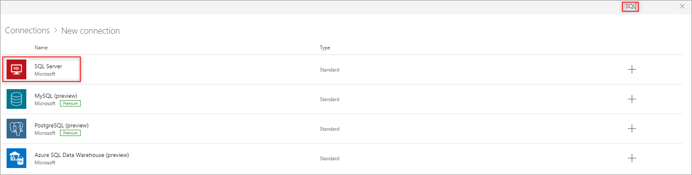

4. Within the SQL Server connection dialog, enter the following:

   - **Authentication Type**: Select **SQL Server Authentication**.
   - **SQL Server name**: Enter the server name of your Azure SQL database. For example, `contosoinsurance-jjbp34uowoybc.database.windows.net`.
   - **SQL Database name**: Enter **ContosoInsurance**
   - **Username**: Enter **demouser**
   - **Password**: Enter **Password.1!!**

    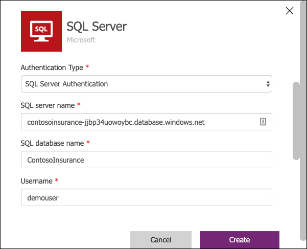

5. Select **Create**.

### Task 3: Create a new app

1. Open the PowerApps Studio application you downloaded previously and sign in with your PowerApps account.

2. Select **New** on the left-hand side and in the browser windows that opens confirm your country/region and select **Get started**.

3. Then **select the right arrow** next to the **Start with your data** list.

    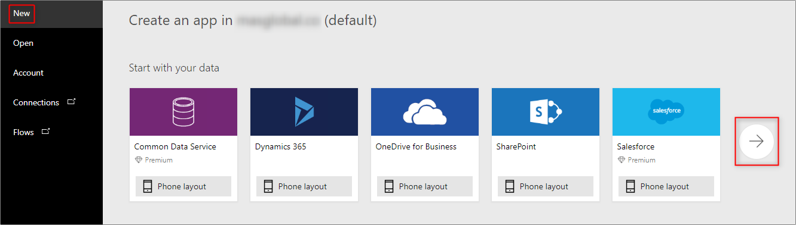

4. Select the **SQL Server connection** you created in the previous task.

    

5. Select the **policies** table from the Choose a table list.

    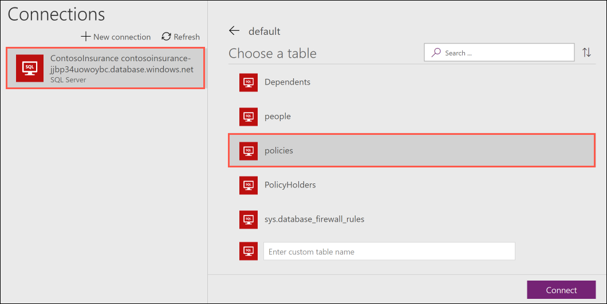

6. Select **Connect**.

### Task 4: Design app

1. The new app is automatically created and displayed within the designer. Select the title for the first page (currently named [dbo].[Policies]) and edit the text in the field to read **Policies**.

    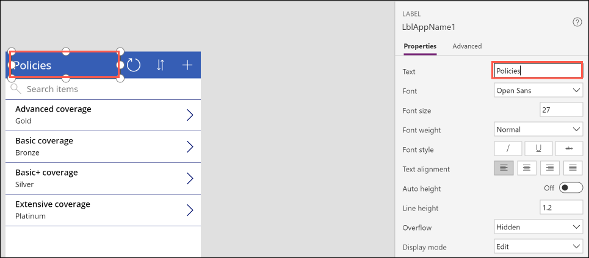

2. Select the **DetailScreen1** screen in the left-hand menu.

    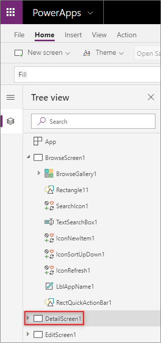

3. Reorder the fields on the form by selecting them, then dragging them by the **Card: <field_name>** tag to the desired location. The new order should be **Name**, **Description**, **DefaultDeductible**, then **DefaultOutOfPocketMax**.

    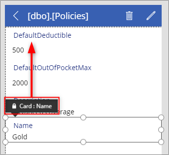

4. On the form, edit the **DefaultDeductible** and **DefaultOutOfPocketMax** labels to be **Default Deductible** and **Default Out of Pocket Max**, respectively. To do so, select the field and type the new title in quotes within the formula field.

    > **Hint**: You need to select **Unlock** in order to change fields.

5. Rename the screen title to Policy by typing "Policy" in quotation marks within the formula field.

    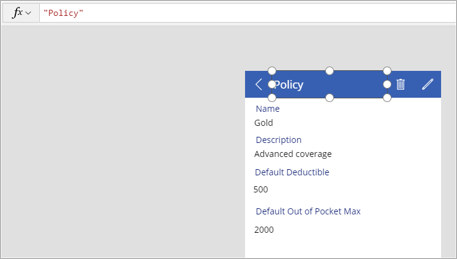

6. Select EditScreen on the left-hand menu.

7. Repeat steps 4-6 on the edit screen.

### Task 5: Edit the app settings and run the app

1. Select **File** on the top menu.

    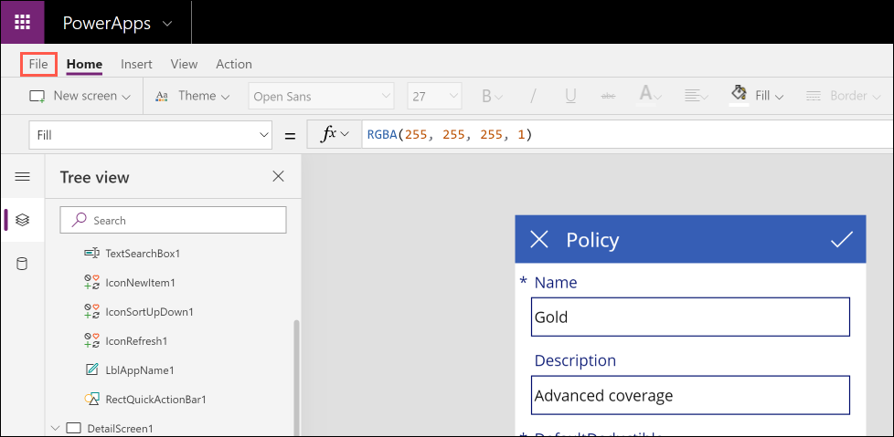

2. Select **Name + icon** under Settings and enter in a new **Name**, such as "PolicyConnect Plus".

    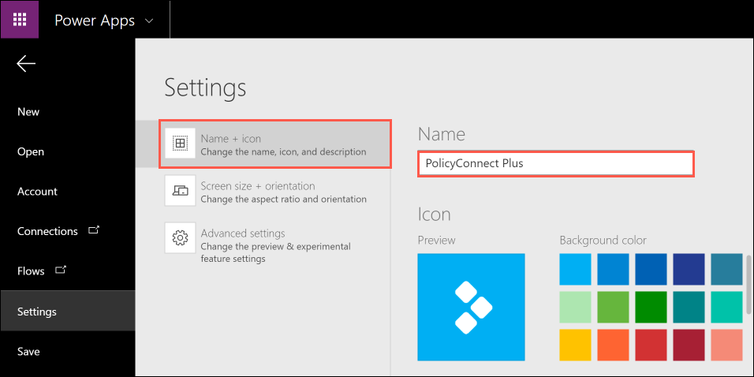

3. Select **Save** on the left-hand menu to save the app to the cloud, then select the **Save** button below.

    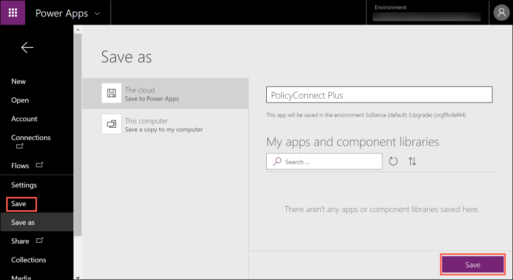

4. After saving, select the left arrow on top of the left-hand menu.

    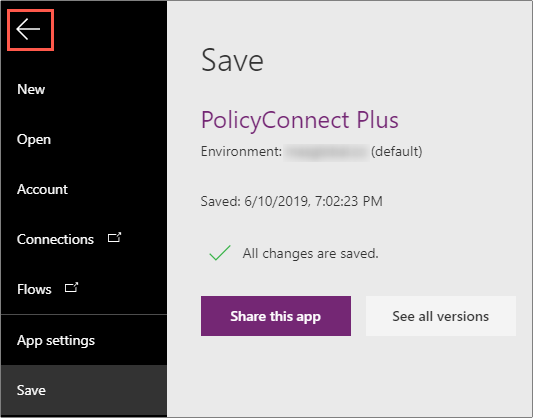

5. Select **BrowseScreen1** from the left-hand menu and then select the **Run** button on the top menu to preview the app. You should be able to view the current policies, edit their values, and create new policies.

    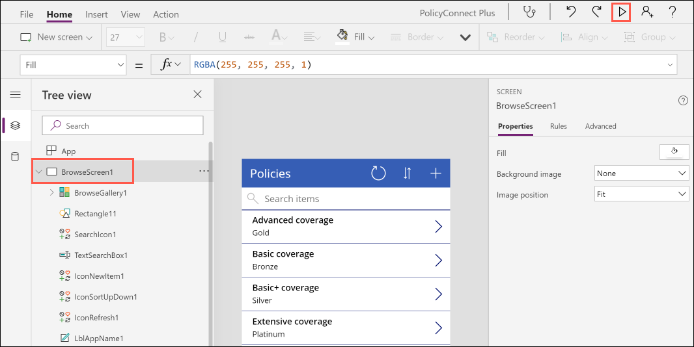

6. Browse through the various policies in the app to explore the functionality.

## After the hands-on lab

Duration: 10 minutes

In this exercise, you de-provision all Azure resources that were created in support of this hands-on lab.

### Task 1: Delete Azure resource groups

1. In the Azure portal, select **Resource groups** from the Azure services list, and locate and delete the **hands-on-lab-SUFFIX** following resource group.

### Task 2: Delete the contoso-apps service principal

1. In the Azure portal, select **Azure Active Directory** and then select **App registrations**.
2. Select the **contoso-apps** application, and select **Delete** on the application blade.

You should follow all steps provided *after* attending the Hands-on lab.
