# Manual resource setup guide

This guide provides step-by-step instructions to manually provision and configure the resources created by the ARM template used before the hands-on lab guide.

> **IMPORTANT**: Many Azure resources require globally unique names. Throughout these steps, the word "SUFFIX" appears as part of resource names. You should replace this with your Microsoft alias, initials, or another value to ensure resources are uniquely named.

February 2020

**Contents**:

- [Manual resource setup guide](#manual-resource-setup-guide)
  - [Task 1: Create an Azure Storage account](#task-1-create-an-azure-storage-account)
  - [Task 2: Create the LabVM](#task-2-create-the-labvm)
  - [Task 3: Create SQL Server 2008 R2 virtual machine](#task-3-create-sql-server-2008-r2-virtual-machine)
  - [Task 4: Provision an Azure SQL Database](#task-4-provision-an-azure-sql-database)
  - [Task 5: Create Azure Database Migration Service](#task-5-create-azure-database-migration-service)
  - [Task 6: Provision a Web App](#task-6-provision-a-web-app)
  - [Task 7: Provision an API App](#task-7-provision-an-api-app)
  - [Task 8: Provision a Function App](#task-8-provision-a-function-app)
  - [Task 9: Provision API Management](#task-9-provision-api-management)
  - [Task 10: Create Azure Cognitive Search service](#task-10-create-azure-cognitive-search-service)
  - [Task 11: Create Cognitive Services account](#task-11-create-cognitive-services-account)
  - [Task 12: Create an Azure Key Vault](#task-12-create-an-azure-key-vault)
  - [Task 13: Connect to the Lab VM](#task-13-connect-to-the-lab-vm)
  - [Task 14: Install required software on the LabVM](#task-14-install-required-software-on-the-labvm)
  - [Task 15: Connect to SqlServer2008 VM](#task-15-connect-to-sqlserver2008-vm)
  - [Task 16: Restore and configure the ContosoInsurance database on the SqlServer2008 VM](#task-16-restore-and-configure-the-contosoinsurance-database-on-the-sqlserver2008-vm)
  - [Task 17: Install the Microsoft Data Migration Assistant on the SqlServer2008 VM](#task-17-install-the-microsoft-data-migration-assistant-on-the-sqlserver2008-vm)

## Task 1: Create an Azure Storage account

In this task, you provision an Azure Storage account, which is used for storing policy documents, as well as vulnerability assessments performed using SQL Advanced Data Security.

1. In the [Azure portal](https://portal.azure.com/), select the **Show portal menu** icon and then select **+Create a resource** from the menu.

    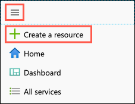

2. Enter "storage account" into the Search the Marketplace box, and select **Storage account** from the results, and then select **Create**.

    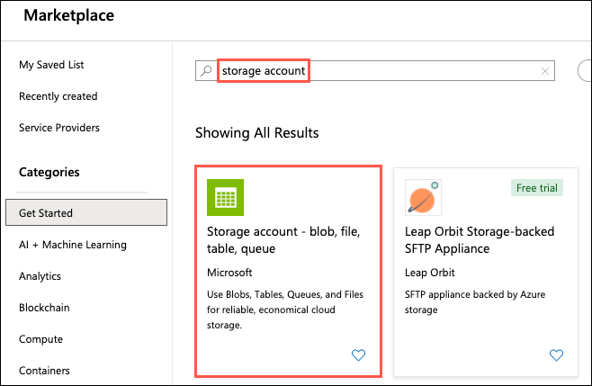

3. On the Create storage account **Basics** tab, enter the following:

    - Project Details:

        - **Subscription**: Select the subscription you are using for this hands-on lab.
        - **Resource Group**: Select the hands-on-lab-SUFFIX resource group from the list of existing resource groups.

    - Instance Details:

        - **Storage account name**: Enter contosostoreSUFFIX.
        - **Location**: Select the location you are using for resources in this hands-on lab.
        - **Performance**: Choose **Standard**.
        - **Account kind**: Select **StorageV2 (general purpose v2)**.
        - **Replication**: Select **Locally-redundant storage (LRS)**.
        - **Access tier**: Choose **Hot**.

    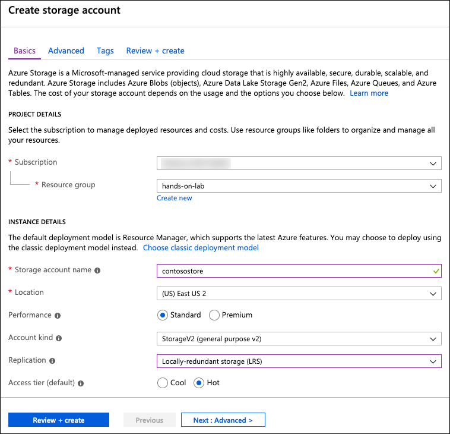

4. Select **Review + create**.

5. On the **Review + create** blade, ensure the Validation passed message is displayed and then select **Create**.

## Task 2: Create the LabVM

In this task, you provision a virtual machine (VM) in Azure. The VM image used has the latest version of Visual Studio Community 2019 installed.

1. In the [Azure portal](https://portal.azure.com/), select the **Show portal menu** icon and then select **+Create a resource** from the menu.

    

2. Enter "visual studio 2019" into the Search the Marketplace box and then select **Visual Studio 2019 Latest** from the results.

    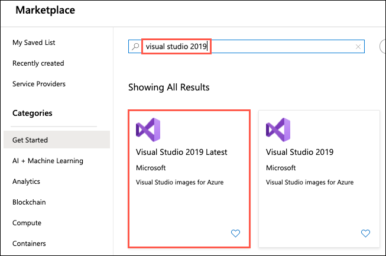

3. On the Visual Studio 2019 Latest blade, select **Visual Studio 2019 Community (latest release) on Windows Server 2019 (x64)** from the Select a software plan drop-down list, and then select **Create**.

    

4. On the Create a virtual machine **Basics** tab set the following configuration:

    - Project Details:

        - **Subscription**: Select the subscription you are using for this hands-on lab.
        - **Resource Group**: Select the **hands-on-lab-SUFFIX** resource group from the list of existing resource groups.

    - Instance Details:

        - **Virtual machine name**: Enter LabVM.
        - **Region**: Select the region you are using for resources in this hands-on lab.
        - **Availability options**: Select no infrastructure redundancy required.
        - **Image**: Leave Visual Studio 2019 Community (latest release) on Windows Server 2019 (x64) selected.
        - **Size**: Select **Change size**, and select Standard D2s v3 from the list and then select **Accept**.

    - Administrator Account:

        - **Username**: Enter **demouser**.
        - **Password**: Enter **Password.1!!**

    - Inbound Port Rules:

        - **Public inbound ports**: Choose Allow selected ports.
        - **Select inbound ports**: Select RDP (3389) in the list.

    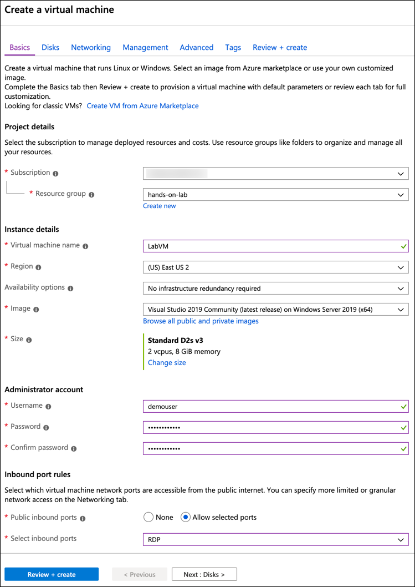

    > **Note**: Default settings are used for the remaining tabs so that they can be skipped.

5. Select **Review + create** to validate the configuration.

6. On the **Review + create** tab, ensure the Validation passed message is displayed, and then select **Create** to provision the virtual machine.

    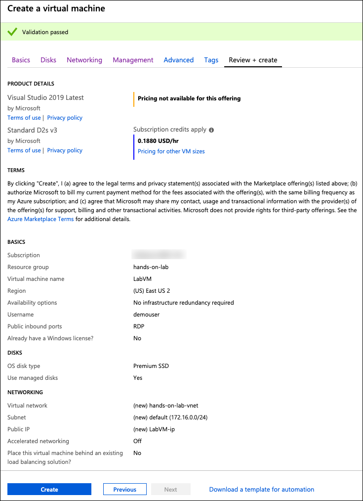

7. It takes approximately 10 minutes for the VM to finish provisioning. You can move on to the next task while you wait.

## Task 3: Create SQL Server 2008 R2 virtual machine

In this task, you provision another Azure virtual machine (VM) to host your "on-premises" instance of SQL Server 2008 R2. The VM uses the SQL Server 2008 R2 SP3 Standard on Windows Server 2008 R2 image.

> **Note**: An older version of Windows Server is being used because SQL Server 2008 R2 is not supported on Windows Server 2016.

1. In the [Azure portal](https://portal.azure.com/), select the **Show portal menu** icon and then select **+Create a resource** from the menu.

    

2. Enter "SQL Server 2008 R2 SP3 on Windows Server 2008 R2" into the Search the Marketplace box.

3. On the **SQL Server 2008 R2 SP3 Standard on Windows Server 2008 R2** blade, select **SQL Server R2 SP3 Standard on Windows Server 2008 R2** for the software plan and then select **Create**.

    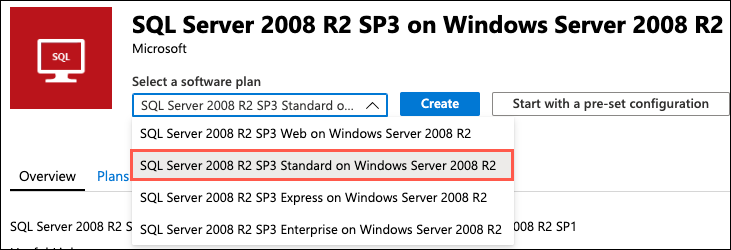

4. On the Create a virtual machine Basics tab set the following configuration:

   - Project Details:

     - **Subscription**: Select the subscription you are using for this hands-on lab.
     - **Resource Group**: Select the hands-on-lab-SUFFIX resource group from the list of existing resource groups.

   - Instance Details:

     - **Virtual machine name**: Enter SqlServer2008.
     - **Region**: Select the region you are using for resources in this hands-on lab.
     - **Availability options**: Select no infrastructure redundancy required.
     - **Image**: Leave SQL Server 2008 R2 SP3 Standard on Windows Server 2008 R2 selected.
     - **Size**: Accept the default size, Standard DS12 v2.

   - Administrator Account:

     - **Username**: Enter **demouser**.
     - **Password**: Enter **Password.1!!**

   - Inbound Port Rules:

     - **Public inbound ports**: Choose Allow selected ports.
     - **Select inbound ports**: Select RDP (3389) in the list.

    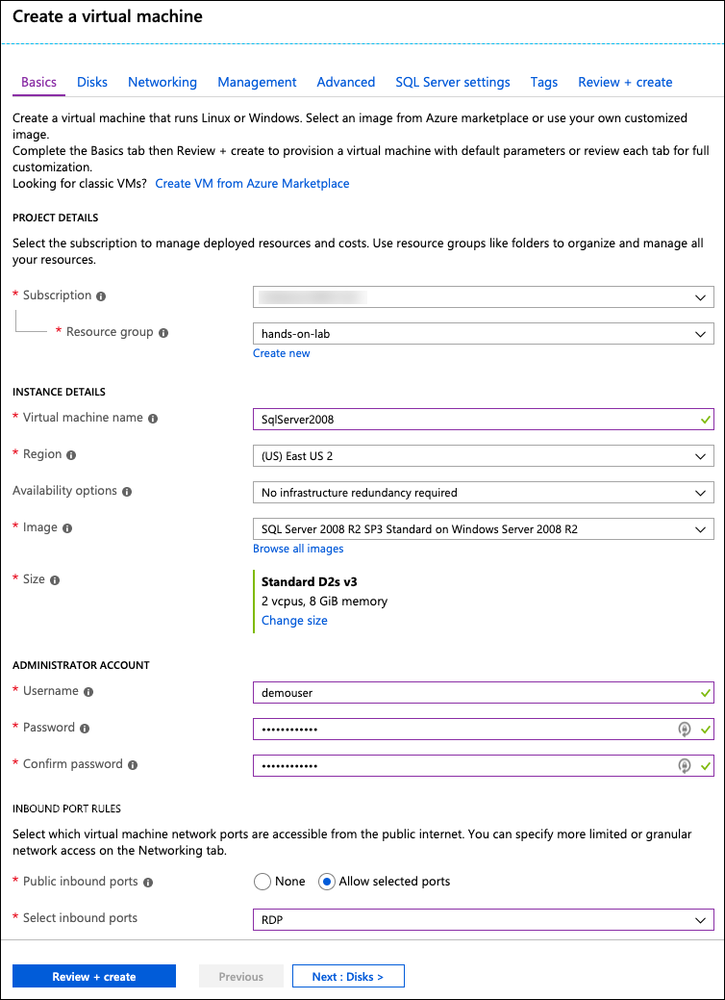

5. Select the **SQL Server settings** tab from the top menu. Default values are used for Disks, Networking, Management, and Advanced tabs, so you don't need to do anything on those tabs.

    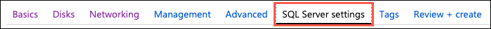

6. On the **SQL Server settings** tab, set the following properties:

   - Security & Networking:

     - **SQL connectivity**: Select Public (Internet).
     - **Port**: Leave set to 1433.

   - SQL Authentication:

     - **SQL Authentication**: Select Enable.
     - **Login name**: Enter demouser.
     - **Password**: Enter **Password.1!!**

     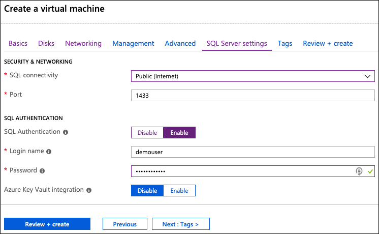

7. Select **Review + create** to review the VM configuration.

8. On the **Review + create** tab, ensure the Validation passed message is displayed, and then select **Create** to provision the virtual machine.

    

9. It may take 10+ minutes for the virtual machine to complete provisioning. You can move on to the next task while waiting for the SqlServer2008 VM to provision.

## Task 4: Provision an Azure SQL Database

In this task, you provision an Azure SQL Database (Azure SQL DB).

1. In the [Azure portal](https://portal.azure.com/), select the **Show portal menu** icon and then select **+Create a resource** from the menu.

    

2. Enter "sql database" into the Search the Marketplace box, select **SQL Database** from the results, and then select **Create**.

    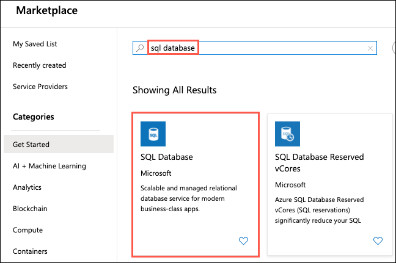

3. On the Create SQL Database **Basics** tab, enter the following:

    - Project Details:

        - **Subscription**: Select the subscription you are using for this hands-on lab.
        - **Resource Group**: Select the hands-on-lab-SUFFIX resource group from the list of existing resource groups.

    - Database Details:

        - **Database name**: Enter ContosoInsurance.
        - **Server**: Select **Create new**, and on the New server blade enter the following:
          - **Server name**: Enter contosoinsuranceSUFFIX.
          - **Server admin login**: Enter demouser.
          - **Password**: Enter Password.1!!
          - **Location**: Select the region you are using for resources in this hands-on lab.
          - **Allow Azure services to access server**: Check this box.
          - Select **OK**.
        - **Want to use SQL elastic pool**: Choose No.
        - **Compute + storage**: Accept the default, General Purpose, Gen5, 2 vCores, 32 GB storage.

    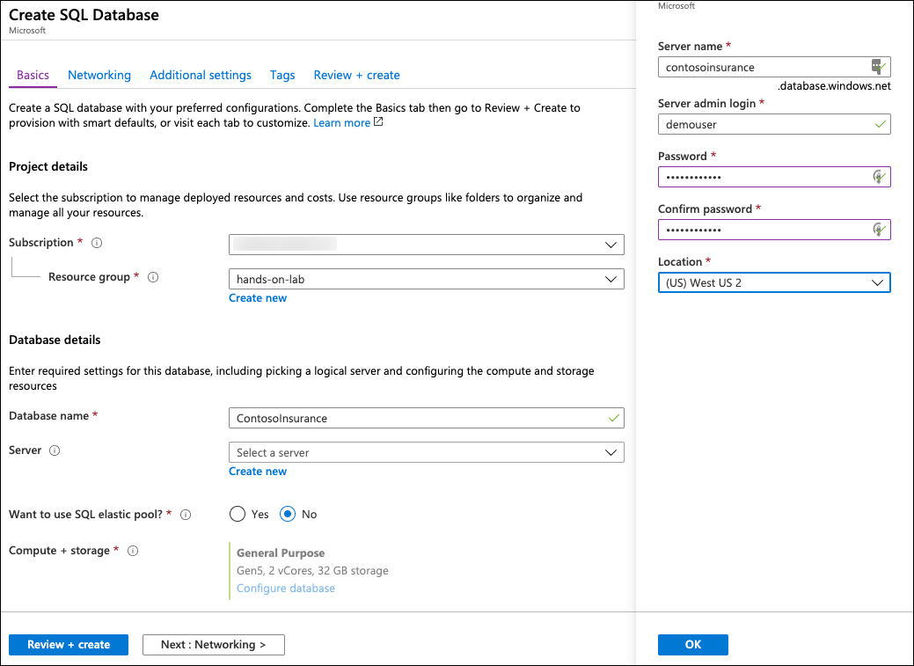

4. Select **Next: Networking**.

5. Ensure the Connectivity method option selected is **No access**.

6. Select **Next: Additional settings**.

7. On the **Additional settings** tab, **Enable Advanced Data Security** by selecting **Start free trial**.

    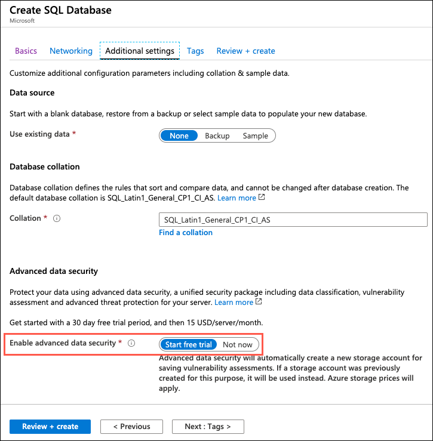

8. Select **Review + create**.

9. On the **Review + create** tab, select **Create** to provision the SQL Database.

## Task 5: Create Azure Database Migration Service

In this task, you provision an instance of the Azure Database Migration Service (DMS).

1. In the [Azure portal](https://portal.azure.com/), select the **Show portal menu** icon and then select **+Create a resource** from the menu.

    

2. Enter "database migration" into the Search the Marketplace box, select **Azure Database Migration Service** from the results, and select **Create**.

    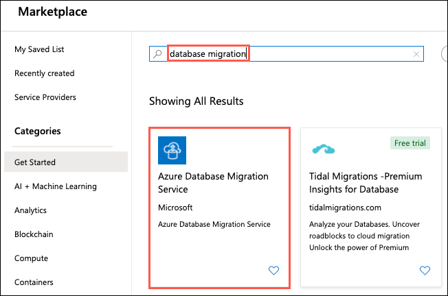

3. On the Create Migration Service **Basics** tab, enter the following:

    > **Note**: If you see the message, `Your subscription doesn't have proper access to Microsoft.DataMigration`, refresh the browser window before proceeding. If the message persists, verify you successfully registered the resource provider, and then you can safely ignore this message.

    - Project Details:

      - **Subscription**: Select the subscription you are using for this hands-on lab.
      - **Resource Group**: Select the hands-on-lab-SUFFIX resource group from the list of existing resource groups.

    - Instance Details:

      - **Migration service Name**: Enter contoso-dms-SUFFIX.
      - **Location**: Select the location you are using for resources in this hands-on lab.
      - **Service mode**: Select Azure.
      - **Pricing tier**: Select Configure tier and then select Premium: 4 vCores and select Apply.

    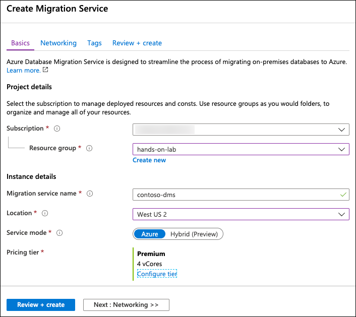

4. Select **Next: Networking**.

5. On the **Networking** tab, select the **hands-on-lab-SUFFIX-vnet/default** virtual network by checking the box next to it in the list of existing virtual networks. This places the DMS instance into the same VNet as your LabVM and SqlServer2008 virtual machines.

    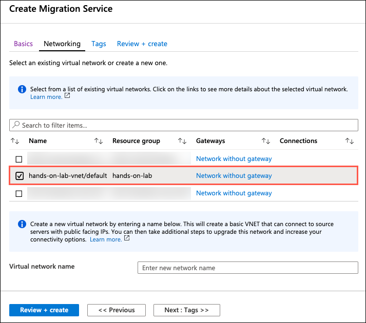

6. Select **Review + create**.

7. Select **Create**.

8. It can take 15 minutes to deploy the Azure Data Migration Service. You can move on to the next task while you wait.

## Task 6: Provision a Web App

In this task, you provision an App Service (Web App), which provides hosting for the Contoso Insurance web application.

1. In the [Azure portal](https://portal.azure.com/), select the **Show portal menu** icon and then select **+Create a resource** from the menu.

    

2. Enter "web app" into the Search the Marketplace box, select **Web App** from the results.

    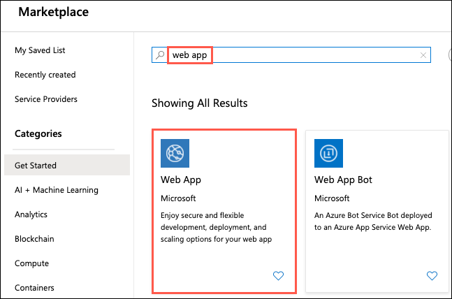

3. On the Web App blade, select **Create**.

    

4. On the Create Web App **Basics** tab, set the following configuration:

    - Project Details:

        - **Subscription**: Select the subscription you are using for this hands-on lab.
        - **Resource Group**: Select the hands-on-lab-SUFFIX resource group from the list of existing resource groups.

    - Instance Details:

        - **Name**: Enter contoso-web-SUFFIX.
        - **Publish**: Select Code.
        - **Runtime stack**: Select .NET Core 3.0 (Current).
        - **Operating System**: Select Windows.
        - **Region**: Select the region you are using for resources in this hands-on lab.

    - App Service Plan:

        - **Plan**: Select **Create new** and enter **hands-on-lab-asp** for the name.
        - **Sku and size**: Accept the default value of Standard S1.

    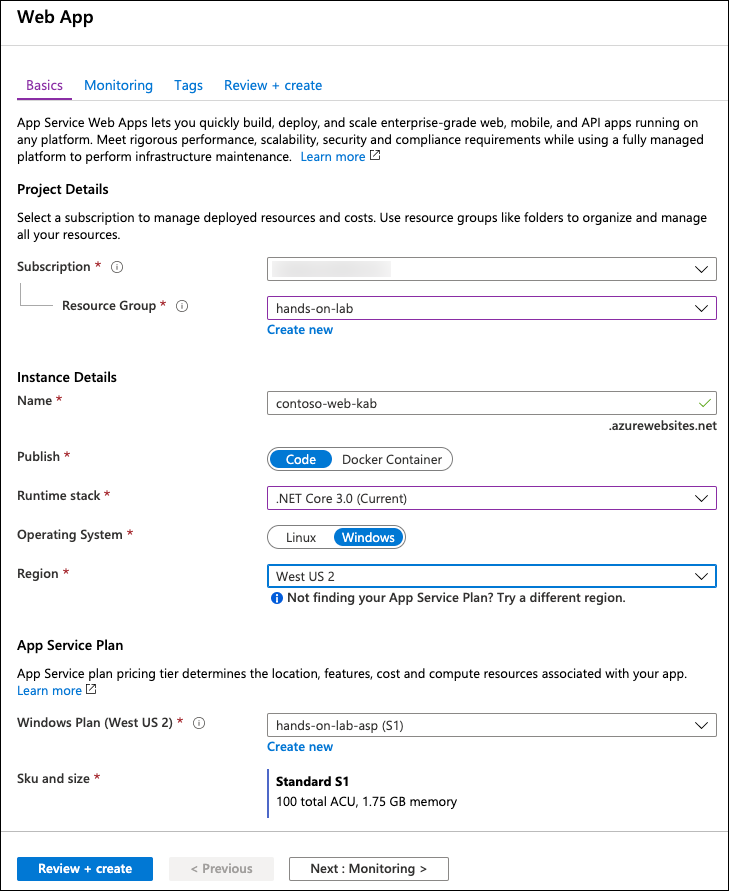

5. Select **Next: Monitoring**.

6. On the **Monitoring** tab, select **No** next to Enable Application Insights.

    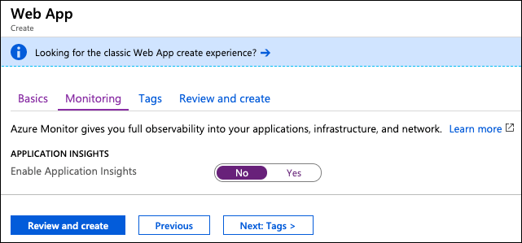

7. Select **Review and create**.

8. On the **Review and create** tab, select **Create**.

9. It takes a few minutes for the Web App creation to complete. You can move on to the next task while you wait.

## Task 7: Provision an API App

In this task, you provision an App Service (API App), which provides hosting for the Contoso Insurance APIs.

1. In the [Azure portal](https://portal.azure.com/), select the **Show portal menu** icon and then select **+Create a resource** from the menu.

    

2. Enter "api app" into the Search the Marketplace box, select **API App** from the results.

    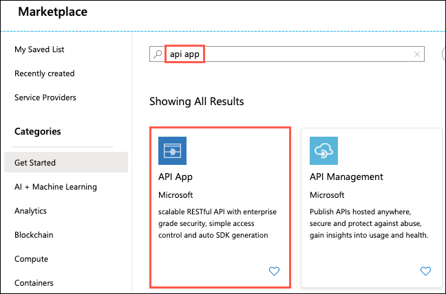

3. On the API App blade, select **Create**.

4. On the API App Create blade, enter the following:

    - **App name**: Enter contoso-api-SUFFIX.
    - **Subscription**: Select the subscription you are using for this hands-on lab.
    - **Resource Group**: Choose Use exiting and select the hands-on-lab-SUFFIX resource group from the list of existing resource groups.
    - **App Service plan/Location**: Select the hands-on-lab-asp App Service plan.
    - **Application Insights**: Select **Disabled**.

    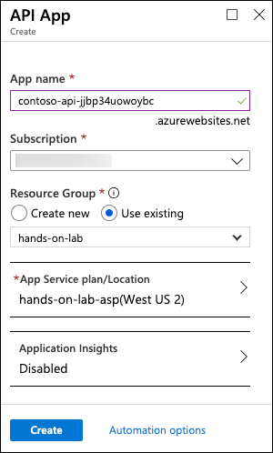

5. Select **Create**.

## Task 8: Provision a Function App

In this task, you provision a Function App, which is used for retrieving PDF documents from Azure Storage.

1. In the [Azure portal](https://portal.azure.com/), select the **Show portal menu** icon and then select **+Create a resource** from the menu.

    

2. Enter "function app" into the Search the Marketplace box, select **Function App** from the results.

    

3. On the Function App blade, select **Create**.

4. On the Function App Basics blade, enter the following:

    - Project Details:

      - **Subscription**: Select the subscription you are using for this hands-on lab.
      - **Resource Group**: Choose Use exiting and select the hands-on-lab-SUFFIX resource group from the list of existing resource groups.

    - Instance Details:

      - **Function App name**: Enter contoso-func-SUFFIX.
      - **Publish**: Select Code.
      - **Runtime Stack**: Select .NET Core.
      - **Region**: Select the region you are using for resources in this hands-on lab.

    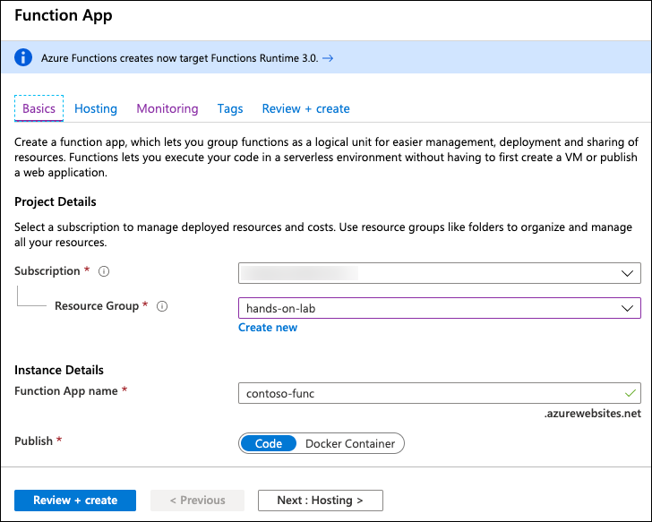

5. Select **Next: Hosting**.

    - **Storage Account**: Select the storage account you created in Task 1, above.
    - **Operating System**: Select Windows.
    - **Plan type**: Select Consumption.

    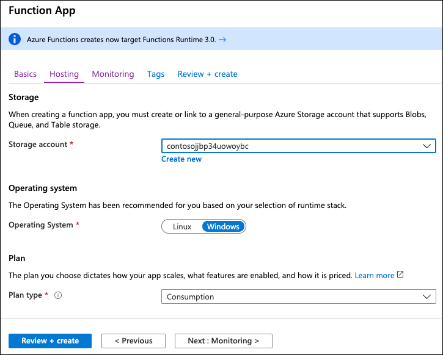

6. Select **Next: Monitoring**.

    - **Enable Application Insights**: Select **No**.

    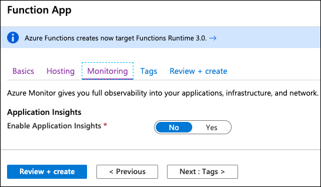

7. Select **Review + create**.

    

8. Select **Create**.

## Task 9: Provision API Management

In this task, you provision API Management (APIM). APIM provides the ability to manage the Contoso APIs.

1. In the [Azure portal](https://portal.azure.com/), select the **Show portal menu** icon and then select **+Create a resource** from the menu.

    

2. Enter "api management" into the Search the Marketplace box, select **API Management** from the results.

    

3. On the API Management blade, select **Create**.

4. On the API Management service blade, enter the following:

    - **Name**: Enter contoso-apim-SUFFIX.
    - **Subscription**: Select the subscription you are using for this hands-on lab.
    - **Resource Group**: Select the hands-on-lab-SUFFIX resource group from the list of existing resource groups.
    - **Location**: Select the location you are using for resources in this hands-on lab.
    - **Organization name**: Enter Contoso Insurance.
    - **Administrator email**: Enter an email add that can receive API Management admin notifications.
    - **Pricing tier**: Select Developer (No SLA).
    - **Enable Application Insights**: Uncheck this box.

    

5. Select **Create**.

6. It takes around 30 minutes for API Management to finish provisioning. You can move on to the next task while you wait.

## Task 10: Create Azure Cognitive Search service

In this task, you create an Azure Cognitive Search service.

1. In the [Azure portal](https://portal.azure.com/), select the **Show portal menu** icon and then select **+Create a resource** from the menu.

    

2. Enter "Azure Cognitive Search" into the Search the Marketplace box.

3. On the Azure Cognitive Search blade, select **Create**.

4. On the New Search Service **Basics** tab, enter the following:

    - Project Details:

        - **Subscription**: Select the subscription you are using for this hands-on-lab.
        - **Resource group**: Select the hands-on-lab-SUFFIX resource group from the list of existing resource groups.

    - Instance Details:

        - **URL**: Enter contoso-search-SUFFIX.
        - **Location**: Select the region you are using for resources in this hands-on-lab.
        - **Pricing tier**: Accept the default, Standard.

    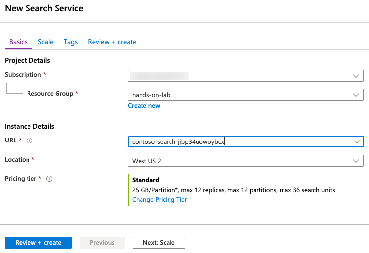

5. Select **Review + create**.

6. Select **Create** to provision the new search service.

7. It takes around 10 minutes for the new search service to finish provisioning. You can move on to the next task while you wait.

## Task 11: Create Cognitive Services account

In this task, you create a Cognitive Services account.

1. In the [Azure portal](https://portal.azure.com/), select the **Show portal menu** icon and then select **+Create a resource** from the menu.

    

2. Enter "cognitive services" into the Search the Marketplace box, select **Cognitive Services** from the results.

    

3. On the Cognitive Services blade, select **Create**.

4. On the Cognitive Services Create blade, enter the following:

    - **Name**: Enter contoso-cog-services.
    - **Subscription**: Select the subscription you are using for this hands-on lab.
    - **Location**: Select the region you are using for resources in this hands-on lab.
    - **Pricing tier**: Select S0.
    - **Resource Group**: Select the hands-on-lab-SUFFIX resource group from the list of existing resource groups.
    - Check the box to confirm you have read and understood the notice.

    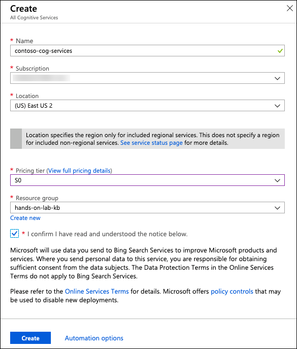

5. Select **Create**.

## Task 12: Create an Azure Key Vault

In this task, you provision an Azure Key Vault, which enables application secrets to be stored securely.

1. In the [Azure portal](https://portal.azure.com/), select the **Show portal menu** icon and then select **+Create a resource** from the menu.

    

2. Enter "key vault" into the Search the Marketplace box, select **Key Vault** from the results.

    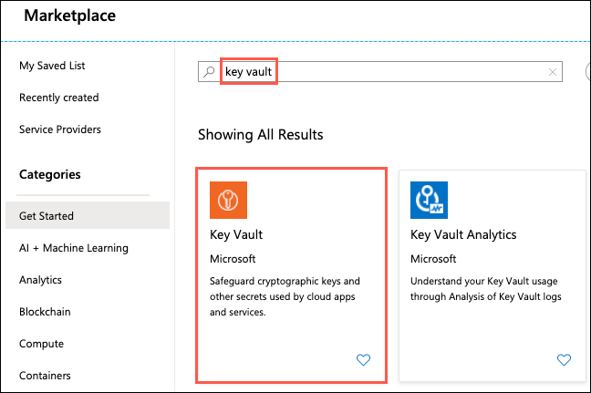

3. On the Key Vault blade, select **Create**.

4. On the Create Key Vault **Basics** tab, enter the following:

    - Project Details:

      - **Subscription**: Select the subscription you are using for this hands-on lab.
      - **Resource Group**: Select the hands-on-lab-SUFFIX resource group from the list of existing resource groups.

    - Instance Details:

      - **Key vault name**: Enter contoso-kv-SUFFIX.
      - **Region**: Select the region you are using for resources in this hands-on lab.
      - **Pricing tier**: Select Standard.
      - **Soft-delete**: Select Disable.

    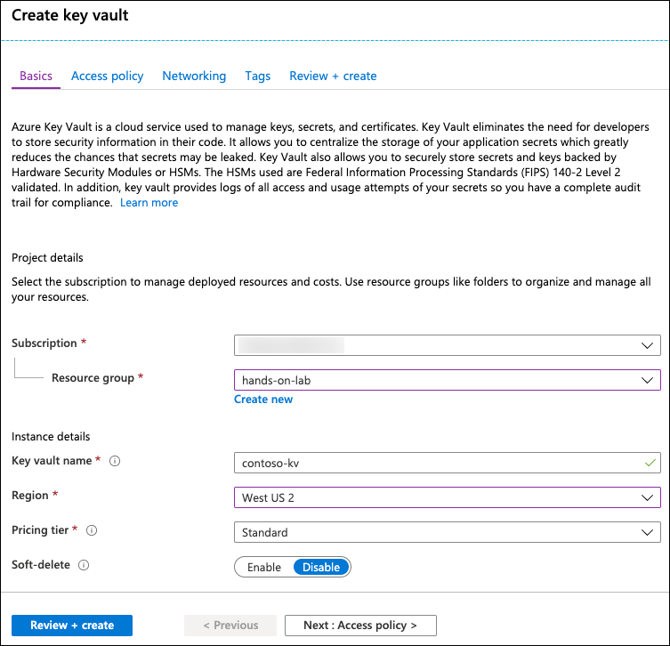

5. Select **Review + create**. The default values for Access policy and Virtual network are used so that these tabs can be skipped.

6. On the **Review + create** tab, select **Create**.

## Task 13: Connect to the Lab VM

In this task, you create an RDP connection to your Lab virtual machine (VM), and disable Internet Explorer Enhanced Security Configuration.

1. In the [Azure portal](https://portal.azure.com), select **Resource groups** from the Azure services list.

    

2. Select the hands-on-lab-SUFFIX resource group from the list.

    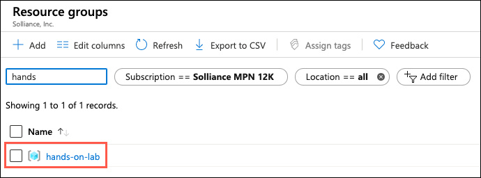

3. In the list of resources within your resource group, select the LabVM Virtual machine resource.

    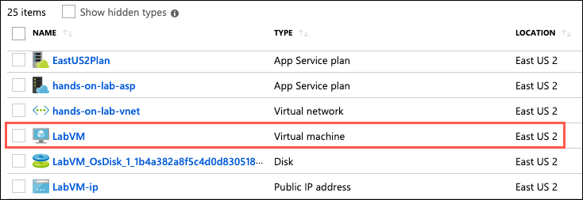

4. On your LabVM blade, select **Connect** from the top menu.

    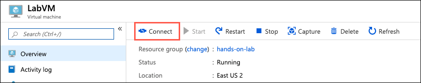

5. On the Connect to virtual machine blade, select **Download RDP File**, then open the downloaded RDP file.

    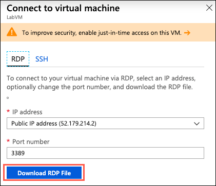

6. Select **Connect** on the Remote Desktop Connection dialog.

    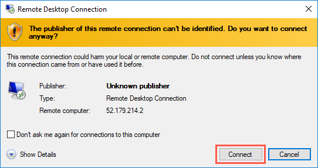

7. Enter the following credentials when prompted, and then select **OK**:

    - **User name**: demouser
    - **Password**: Password.1!!

    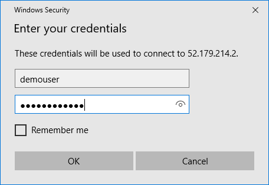

8. Select **Yes** to connect, if prompted that the identity of the remote computer cannot be verified.

    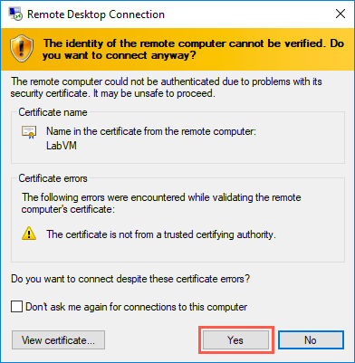

9. Once logged in, launch the **Server Manager**. This should start automatically, but you can access it via the Start menu if it does not.

10. Select **Local Server**, then select **On** next to **IE Enhanced Security Configuration**.

    

11. In the Internet Explorer Enhanced Security Configuration dialog, select **Off** under both Administrators and Users, and then select **OK**.

    

12. Close the Server Manager, but leave the connection to the LabVM open for the next task.

## Task 14: Install required software on the LabVM

In this task, you configure the LabVM with the required software and downloads. First, you download and install SQL Server Management Studio (SSMS). Next, you download and install .NET Core 2.2. You also download a copy of the Visual Studio starter solution and unzip it into a folder named `C:\MCW`.

1. First, install SSMS on the LabVM by opening a web browser on your LabVM and navigating to <https://aka.ms/ssmsfullsetup>. This link downloads the latest version of SSMS.

2. Run the downloaded installer.

3. On the Welcome screen, select **Install** to begin the installation.

    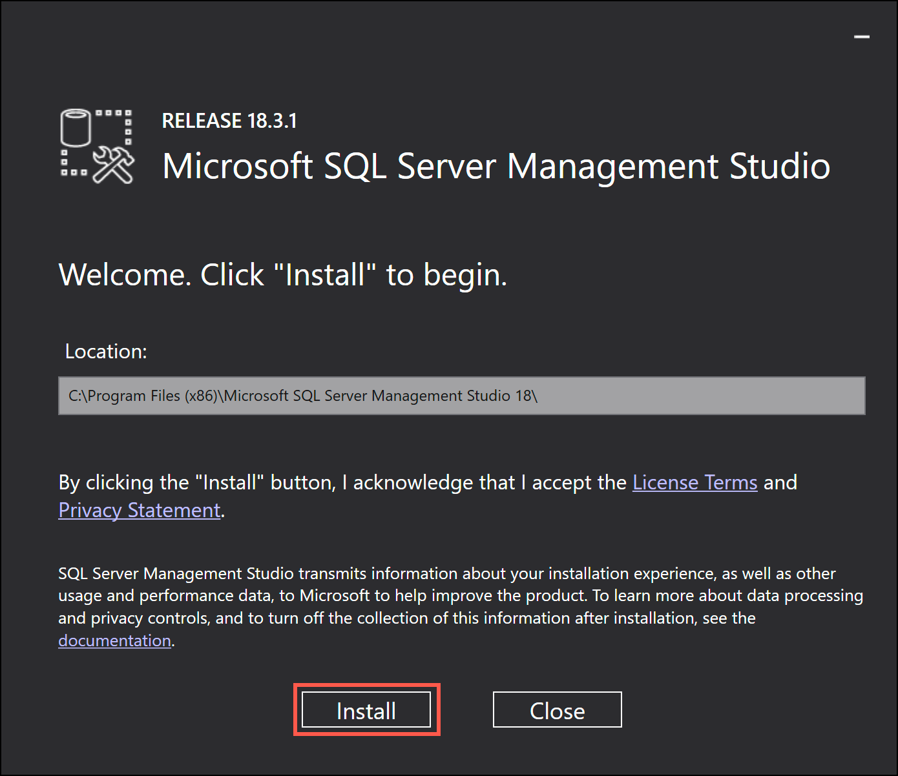

4. Select **Close** when the installation completes.

    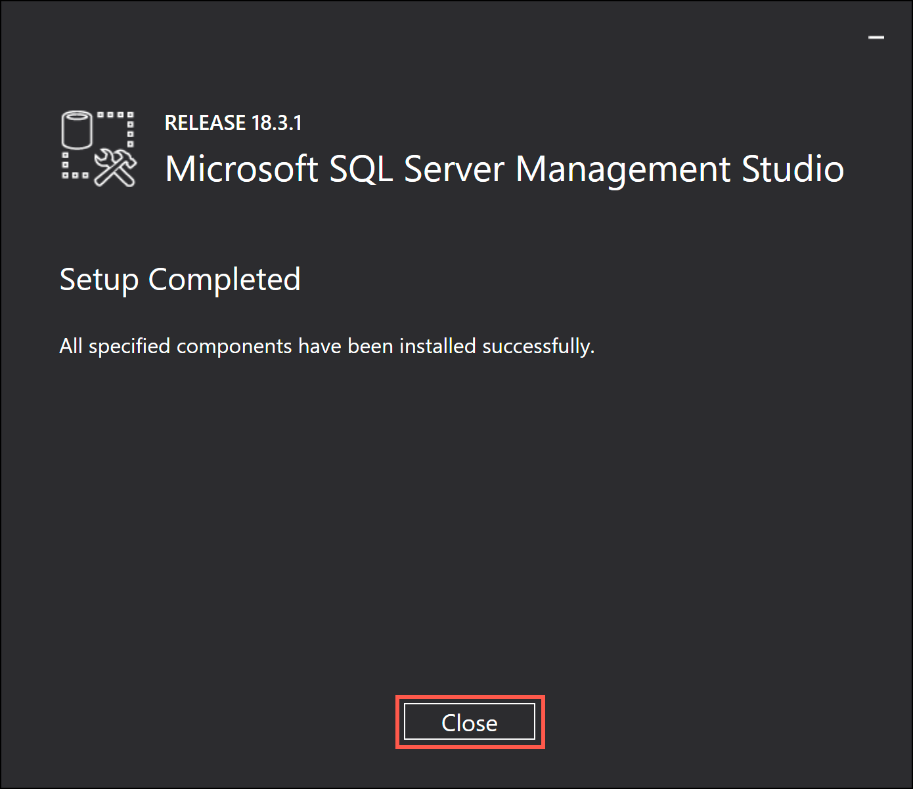

5. Next, [download the .NET Core 2.2 SDK](https://download.visualstudio.microsoft.com/download/pr/279de74e-f7e3-426b-94d8-7f31d32a129c/e83e8c4c49bcb720def67a5c8fe0d8df/dotnet-sdk-2.2.207-win-x64.exe).

6. Run the downloaded installer.

7. Next, [download a copy of the GitHub repo for the App modernization MCW](https://github.com/microsoft/MCW-App-modernization/archive/master.zip).

8. Extract the download ZIP file to `C:\MCW`.

   

## Task 15: Connect to SqlServer2008 VM

In this task, you open an RDP connection to the SqlServer2008 VM, disable Internet Explorer Enhanced Security Configuration, and add a firewall rule to open port 1433 to inbound TCP traffic.

> **Note**: There is a known issue with screen resolution when using an RDP connection to Windows Server 2008 R2, which may affect some users. This issue presents itself as very small, hard to read text on the screen. The workaround for this is to use a second monitor for the RDP display, which should allow you to scale up the resolution to make the text larger.

1. As you did for the LabVM, navigate to the SqlServer2008 VM blade in the Azure portal, select **Overview** from the left-hand menu, and then select **Connect** on the top menu.

    

2. On the Connect to virtual machine blade, select **Download RDP File**, then open the downloaded RDP file.

3. Select **Connect** on the Remote Desktop Connection dialog.

    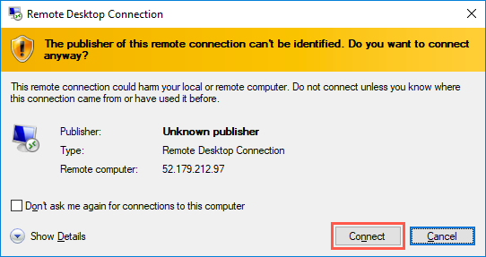

4. Enter the following credentials when prompted, and then select **OK**:

    - **User name**: demouser
    - **Password**: Password.1!!

    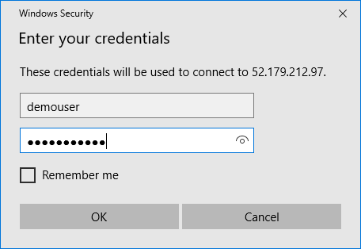

5. Select **Yes** to connect, if prompted that the identity of the remote computer cannot be verified.

    

6. Once logged in, launch the **Server Manager**. This should start automatically, but you can access it via the Start menu if it does not.

7. On the **Server Manager** view, select **Configure IE ESC** under Security Information.

    

8. In the Internet Explorer Enhanced Security Configuration dialog, select **Off** under both Administrators and Users, and then select **OK**.

    

## Task 16: Restore and configure the ContosoInsurance database on the SqlServer2008 VM

In this task, you restore the `ContosoInsurance` database onto the SQL Server 2008 R2 instance using a backup provided by Contoso, Ltd.

1. On the SqlServer2008 VM, download a [backup of the ContosoInsurance database](https://raw.githubusercontent.com/microsoft/MCW-App-modernization/master/Hands-on%20lab/lab-files/Database/ContosoInsurance.zip), and extract the zipped files into `C:\ContosoInsurance` on the VM.

2. Next, open **Microsoft SQL Server Management Studio** (SSMS) by entering "sql server" into the search bar in the Windows Start menu and selecting **Microsoft SQL Server Management Studio 17** from the results.

   

3. In the SSMS **Connect to Server** dialog, enter **SQLSERVER2008** into the Server name box, ensure **Windows Authentication** is selected, and then select **Connect**.

   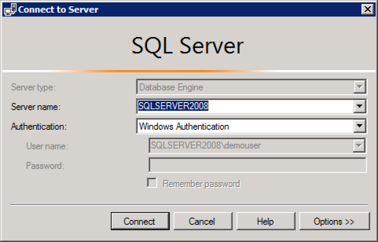

4. Once connected, right-click **Databases** under SQLSERVER2008 in the Object Explorer, and then select **Attach...** from the context menu.

    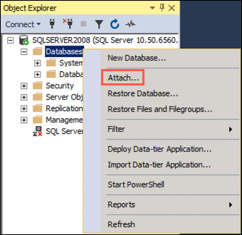

5. Now, attach the `ContosoInsurance` database using the downloaded `ContosoInsurance.mdf` and `ContosoInsurance_log.ldf` files. On the **General** page of the Attach Databases dialog, select the **Add** button, and in the Locate Database Files dialog, expand the ContosoInsurance folder, select `ContosoInsurance.mdf`, and then select **OK**.

    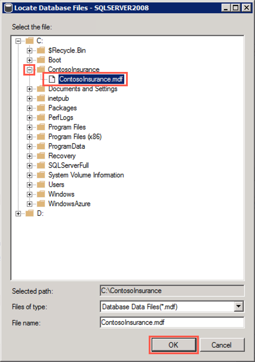

6. Back on the Attach Databases dialog, verify you see the ContosoInsurance Data and Log files under database details, and then select **OK**.

    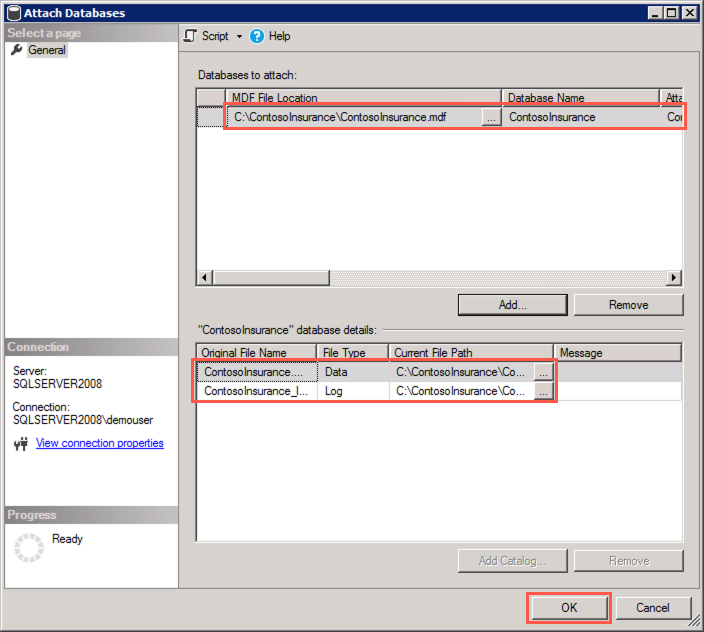

7. You should now see the `ContosoInsurance` database listed under Databases.

    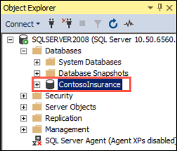

## Task 17: Install the Microsoft Data Migration Assistant on the SqlServer2008 VM

In this task, you install the Microsoft Data Migration Assistant (DMA) on the SqlServer2008 VM.

1. Install the Microsoft Data Migration Assistant v4.x by navigating to <https://www.microsoft.com/en-us/download/details.aspx?id=53595> in a web browser on the SqlServer2008 VM, and then select the **Download** button.

    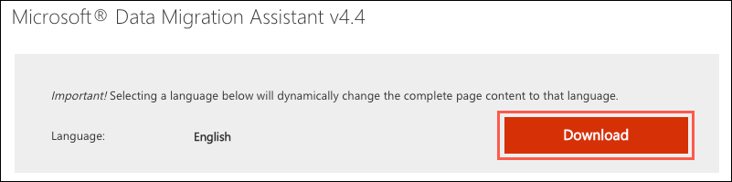

    > **Note**: Versions change frequently, so if the version number you see does not match the screenshot, download and install the most recent version.

2. Run the downloaded installer.

3. Select **Next** on each of the screens, accepting the license terms and privacy policy in the process.

4. Select **Install** on the Privacy Policy screen to begin the installation.

5. On the final screen, select **Finish** to close the installer.

    
