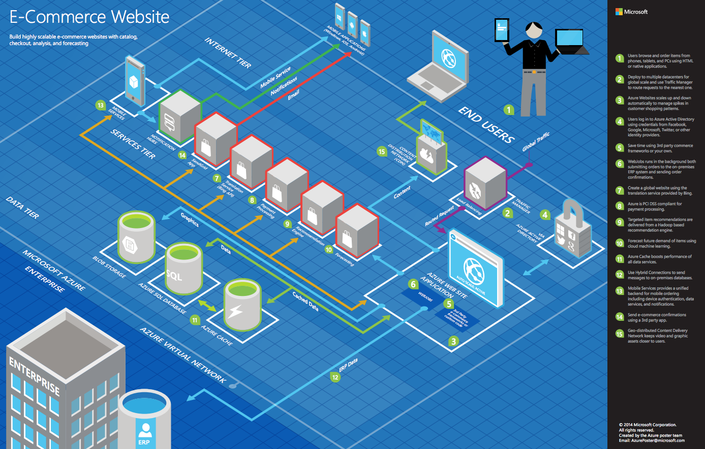
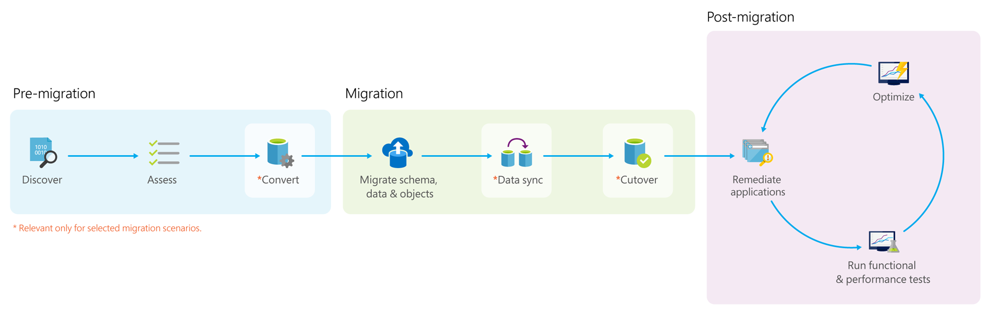
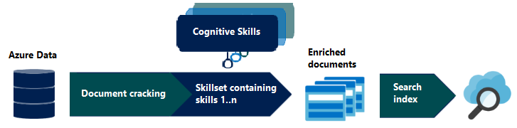
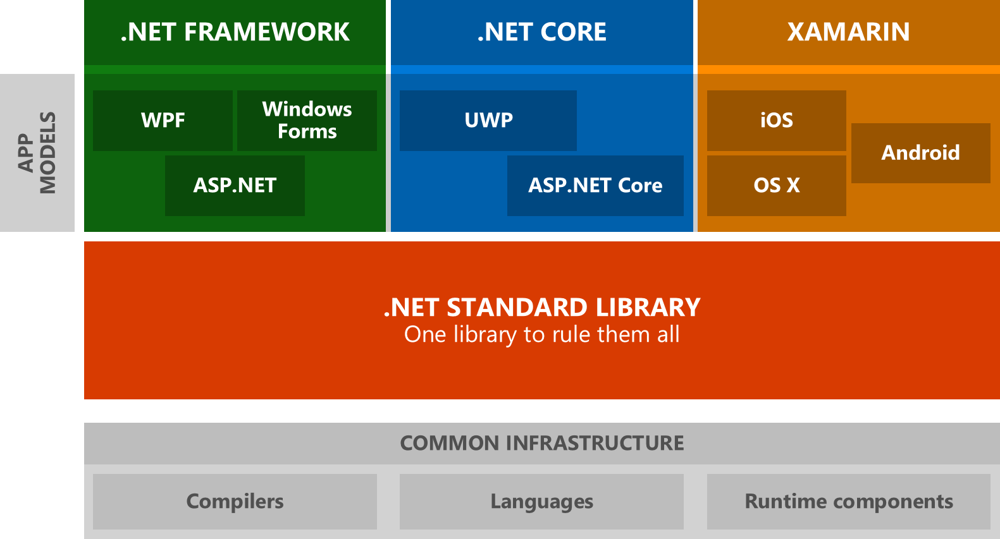

App modernization

Whiteboard design session trainer guide

February 2020

Information in this document, including URL and other Internet Web site references, is subject to change without notice. Unless otherwise noted, the example companies, organizations, products, domain names, e-mail addresses, logos, people, places, and events depicted herein are fictitious, and no association with any real company, organization, product, domain name, e-mail address, logo, person, place or event is intended or should be inferred. Complying with all applicable copyright laws is the responsibility of the user. Without limiting the rights under copyright, no part of this document may be reproduced, stored in or introduced into a retrieval system, or transmitted in any form or by any means (electronic, mechanical, photocopying, recording, or otherwise), or for any purpose, without the express written permission of Microsoft Corporation.

Microsoft may have patents, patent applications, trademarks, copyrights, or other intellectual property rights covering subject matter in this document. Except as expressly provided in any written license agreement from Microsoft, the furnishing of this document does not give you any license to these patents, trademarks, copyrights, or other intellectual property.

The names of manufacturers, products, or URLs are provided for informational purposes only and Microsoft makes no representations and warranties, either expressed, implied, or statutory, regarding these manufacturers or the use of the products with any Microsoft technologies. The inclusion of a manufacturer or product does not imply endorsement of Microsoft of the manufacturer or product. Links may be provided to third party sites. Such sites are not under the control of Microsoft and Microsoft is not responsible for the contents of any linked site or any link contained in a linked site, or any changes or updates to such sites. Microsoft is not responsible for webcasting or any other form of transmission received from any linked site. Microsoft is providing these links to you only as a convenience, and the inclusion of any link does not imply endorsement of Microsoft of the site or the products contained therein.

© 2020 Microsoft Corporation. All rights reserved.

Microsoft and the trademarks listed at <https://www.microsoft.com/legal/intellectualproperty/Trademarks/Usage/General.aspx> are trademarks of the Microsoft group of companies. All other trademarks are property of their respective owners.

**Contents**

<!-- TOC -->

- [Trainer information](#trainer-information)
  - [Role of the trainer](#role-of-the-trainer)
  - [Whiteboard design session flow](#whiteboard-design-session-flow)
  - [Before the whiteboard design session: How to prepare](#before-the-whiteboard-design-session-how-to-prepare)
  - [During the whiteboard design session: Tips for an effective whiteboard design session](#during-the-whiteboard-design-session-tips-for-an-effective-whiteboard-design-session)
- [App modernization whiteboard design session student guide](#app-modernization-whiteboard-design-session-student-guide)
  - [Abstract and learning objectives](#abstract-and-learning-objectives)
  - [Step 1: Review the customer case study](#step-1-review-the-customer-case-study)
    - [Customer situation](#customer-situation)
    - [Customer needs](#customer-needs)
    - [Customer objections](#customer-objections)
    - [Infographic for common scenarios](#infographic-for-common-scenarios)
  - [Step 2: Design a proof of concept solution](#step-2-design-a-proof-of-concept-solution)
  - [Step 3: Present the solution](#step-3-present-the-solution)
  - [Wrap-up](#wrap-up)
  - [Additional references](#additional-references)
- [App modernization whiteboard design session trainer guide](#app-modernization-whiteboard-design-session-trainer-guide)
  - [Step 1: Review the customer case study](#step-1-review-the-customer-case-study-1)
  - [Step 2: Design a proof of concept solution](#step-2-design-a-proof-of-concept-solution-1)
  - [Step 3: Present the solution](#step-3-present-the-solution-1)
  - [Wrap-up](#wrap-up-1)
  - [Preferred target audience](#preferred-target-audience)
  - [Preferred solution](#preferred-solution)
  - [Checklist of preferred objection handling](#checklist-of-preferred-objection-handling)
  - [Customer quote (to be read back to the attendees at the end)](#customer-quote-to-be-read-back-to-the-attendees-at-the-end)

<!-- /TOC -->

# Trainer information

Thank you for taking time to support the whiteboard design sessions as a trainer!

## Role of the trainer

An amazing trainer:

- Creates a safe environment in which learning can take place.

- Stimulates the participant's thinking.

- Involves the participant in the learning process.

- Manages the learning process (on time, on topic, and adjusting to benefit participants).

- Ensures individual participant accountability.

- Ties it all together for the participant.

- Provides insight and experience to the learning process.

- Effectively leads the whiteboard design session discussion.

- Monitors quality and appropriateness of participant deliverables.

- Effectively leads the feedback process.

## Whiteboard design session flow

Each whiteboard design session uses the following flow:

**Step 1: Review the customer case study (15 minutes)**

**Outcome**

Analyze your customer's needs.

- Customer's background, situation, needs and technical requirements

- Current customer infrastructure and architecture

- Potential issues, objectives and blockers

**Step 2: Design a proof of concept solution (60 minutes)**

**Outcome**

Design a solution and prepare to present the solution to the target customer audience in a 15-minute chalk-talk format.

- Determine your target customer audience.

- Determine customer's business needs to address your solution.

- Design and diagram your solution.

- Prepare to present your solution.

**Step 3: Present the solution (30 minutes)**

**Outcome**

Present solution to your customer:

- Present solution

- Respond to customer objections

- Receive feedback

**Wrap-up (15 minutes)**

- Review preferred solution

## Before the whiteboard design session: How to prepare

Before conducting your first whiteboard design session:

- Read the Student guide (including the case study) and Trainer guide.

- Become familiar with all key points and activities.

- Plan the point you want to stress, which questions you want to drive, transitions, and be ready to answer questions.

- Prior to the whiteboard design session, discuss the case study to pick up more ideas.

- Make notes for later.

## During the whiteboard design session: Tips for an effective whiteboard design session

**Refer to the Trainer guide** to stay on track and observe the timings.

**Do not expect to memorize every detail** of the whiteboard design session.

When participants are doing activities, you can **look ahead to refresh your memory**.

- **Adjust activity and whiteboard design session pace** as needed to allow time for presenting, feedback, and sharing.

- **Add examples, points, and stories** from your own experience. Think about stories you can share that help you make your points clearly and effectively.

- **Consider creating a "parking lot"** to record issues or questions raised that are outside the scope of the whiteboard design session or can be answered later. Decide how you will address these issues, so you can acknowledge them without being derailed by them.

***Have fun**! Encourage participants to have fun and share!*

**Involve your participants.** Talk and share your knowledge but always involve your participants, even while you are the one speaking.

**Ask questions** and get them to share to fully involve your group in the learning process.

**Ask first**, whenever possible. Before launching into a topic, learn your audience's opinions about it and experiences with it. Asking first enables you to assess their level of knowledge and experience, and leaves them more open to what you are presenting.

**Wait for responses**. If you ask a question such as, "What's your experience with (fill in the blank)?" then wait. Do not be afraid of a little silence. If you leap into the silence, your participants will feel you are not serious about involving them and will become passive. Give participants a chance to think, and if no one answers, patiently ask again. You will usually get a response.

# App modernization whiteboard design session student guide

## Abstract and learning objectives

In this whiteboard design session, you work with a group to design a solution for modernizing legacy on-premises applications and infrastructure by leveraging cloud services. As part of the modernization effort, application enhancements are added using a mix of web and mobile services, all secured using Azure Active Directory.

At the end of this whiteboard design session, your ability to design a modernization plan for organizations looking to move services from on-premises to the cloud will be improved.

## Step 1: Review the customer case study

**Outcome**

Analyze your customer's needs.

Timeframe: 15 minutes

Directions: With all participants in the session, the facilitator/SME presents an overview of the customer case study along with technical tips.

1. Meet your table participants and trainer.

2. Read all of the directions for steps 1-3 in the student guide.

3. As a table team, review the following customer case study.

### Customer situation

Contoso, Ltd. (Contoso) is a new company in an old business. The company was founded in Auckland, New Zealand, in 2011, by senior life insurance executives. The ambitious new company provides a full range of long-term insurance services to help underinsured people.

Almost from the start, the company grew far faster than anticipated. An avalanche of business meant that the initial processes created to manage policy documentation became overloaded. Employees struggled to cope, even as the headcount rose from five to 110 during the first two years. "By the beginning of 2013, we had over 750,000 pages of partly hand-written policy documents filed in our offices," says Charlene Mathis, General Manager, Contoso. "Customer-facing employees could not retrieve policies quickly, and we faced a service bottleneck. Slow response times impacted customer service, and the ability to locate documents quickly cost us time and money."

To overcome these challenges, the founders launched a project to build an application that could digitize and file all existing policy documents and file new policies as brokers submit them. They also had requirements to allow automated document forwarding from brokers, secure access for brokers, access to policy information, and ready policy retrieval for a dispersed workforce. The result of this project was a custom Windows Forms application was named PolicyConnect. Contoso employees use PolicyConnect to enter essential policy metadata, including insured amount, beneficiary information, policy type, and any deductible and out-of-pocket requirements, and associate that with the digitized policy documents.

PolicyConnect was built using a traditional n-tier application architecture. The data access layer houses methods for interacting with the underlying SQL Server 2008 R2 database. A business logic layer handles things like user login and policy rules. The presentation layer provides the user interface (UI). The design follows a service-oriented architecture, with a series of Windows Communication Foundation (WCF) services representing the services and capabilities required for each tier. The application stores associated policy documents as PDF files on a file server accessible via an SMB network share on their local area network. PolicyConnect accesses these files using a canonical path (customer last name and policy number). A SQL Server 2008 R2 database houses the policy metadata for each policy document, which is currently entered manually into PolicyConnect by Contoso staff members. Contoso provided the following diagram about its current topology:

The application currently supports access via a virtual private network (VPN) connection for users outside the Contoso local area network. As such, Contoso brokers are unable to view data or documents unless granted VPN access. This requirement has proven to be time-consuming and frustrating for brokers.

Contoso employees rely on email as a workflow engine relative to the document management tasks. One group is responsible for scanning and cataloging while another group is responsible for assigning the policies to the specified broker. Manually written emails are sent to brokers when their customer's policies have been scanned and indexed. They are using Office 365. The company executives have frequent challenges in gauging productivity and throughput, given the manual workflow. They feel that they are blocked in quickly getting to the insights they need because each new question seems to need more custom development.

Contoso recently started investigating ways to leverage the cloud to modernize its policyholder system and begin addressing several issues with the existing PolicyConnect system. However, they lack any tangible experience with the cloud and are looking for guidance on how they can best modernize and take advantage of cloud technologies.

Contoso stated that their highest priority is addressing the end-of-support for SQL Server 2008 R2. They would like to migrate their SQL Server 2008 R2 database to a fully-managed SQL database in Azure. Once the database is in the cloud, they want to take advantage of some of the primary benefits that enabled by using a platform-as-a-service (PaaS) database service. According to Contoso, it does not use any of the "fancy" SQL Server features and hopes the migration can be a slam dunk. They would also like to understand better the performance and security features they might be able to leverage once their database is running in Azure.

Another top priority is making the system available to employees and brokers via web and mobile applications and eliminating the requirement for establishing a VPN connection. They also want to store policies in cloud storage for retrieval via these web and mobile applications. Both the web and mobile applications should permit policyholders to log in, review their information, and retrieve a PDF copy of their policy. An application programming interface (API), shared by both application, provides access to data and policy documents. The goal is to deploy the web application, database, and API to the cloud. Also, they want to learn more about lightweight, serverless architectures that may help them implement some API functionality more rapidly. They mentioned a possible use case of providing access to policy documents in storage.

As part of the application modernization process, Contoso would also like to learn more about how Azure Cognitive Search might be able to improve their ability to find policy documents. PolicyConnect stores all policy documents as opaque PDF files on a network file share, and key metadata is entered into the PolicyConnect application manually. Searching is limited to file names, and the limited metadata entered manually. Presently, they cannot search for information contained within the policy documents. They have found that metadata entered manually has not provided the best results for being able to search for and retrieve policy information quickly.

Given the potential for these new applications to increase the load on its database, they want to employ best practices for mitigating the impact of repeated querying of the database. Along these lines, they would like to implement a scoreboard of sorts that tracks the most active users in 24 hours, as well as the approximate the number of operations that user performed within the system in perpetuity. Both metrics are attractive to management to be able to get a cursory understanding of who the heaviest users are and how much they use the system.

Contoso has multiple development teams that focus on separate business units (e.g., underwriting, sales, compliance, and brokers). IT leadership is excited to move as much business logic to APIs as possible. However, they are concerned that, over time, there may be duplication of effort as each team develops new or revises existing APIs. They would also like to open up a subset of APIs to a network of affiliated partners. They are interested in strategies to help them provide discoverability, security, and lifecycle management of an evolving API ecosystem. They would like advanced analytics and data visualizations of API usage to help manage the API inventory.

According to Charlene Mathis, "Mobile applications represent a way to empower our brokers and our employees by bringing our software to the palm of their hands. Our primary investment is in making the best mobile app version of PolicyConnect possible. But, we also want to provide a streamlined way for our internal departments to quickly build custom apps to automate time-saving micro-processes without having to involve our developers." One micro-process she mentioned is enabling employees to set rules. For example, when a VIP customer sends an email, they get an application notification on their mobile device. Another scenario would be enabling employees to set workflows, like automatically saving attachments in emails with policy documents to the proper location in cloud storage.

With this new system, Contoso would like to improve its security practices. In the previous version, each application tier maintained its configuration settings locally. For example, the data access layer would store the connection strings for SQL Server locally on disk. They would like to take an approach of externalizing secrets such as these from the web apps and APIs and storing them in an encrypted location accessible only to authorized services.

"Our founders want a document system that can be quickly adapted to meet changing business needs while keeping costs low," says Mathis. "They do not want to invest in on-site infrastructure if the resources and IT support involved ultimately slow our growth. They have a clear IT strategy: 'All systems to the cloud.'"

### Customer needs

1. Contoso wants to modernize the architecture of its solution while keeping it .NET-based.

2. They would like a .NET developer-friendly way to implement its PolicyConnect mobile app for Android and iOS.

3. They are looking for ways to empower their business users to create internal mobile apps that help them streamline their processes. They would like to add this capability without the time and resource investment that goes into implementing full-scale mobile apps.

4. They want to improve the management of application secrets.

5. They would like to make policy documents full-text searchable, with a minimal amount of implementation effort.

6. They are interested in leveraging serverless technologies to speed up API development. They have requested a proof-of-concept (POC) that can be used to retrieve policy documents from storage.

7. They want to migrate their SQL Server 2008 R2 database to a fully-managed SQL database in Azure. Once in Azure, they would like to take advantage of some of the primary benefits enabled by using a PaaS database service.

8. Contoso wants to understand how to deploy better caching in its solution, both to lessen the load on the database and for providing scalable scoreboards.

### Customer objections

1. We have seen services like IFTTT (If This, Then That) that let business users automate processes. Does Microsoft Azure offer something similar?

2. Our developers have heard of Logic Apps. Will Microsoft Flow replace these?

3. Is there a way to securely store application secrets in the cloud?

4. We noticed that Azure SQL Database does not support all the features available in SQL Server. We are not using these features currently, but are curious to know what the options are for these in Azure? Specifically, we were thinking about Linked Servers, Database Mail, SQL Server Agent Jobs, and Service Broker.

5. Moving everything to APIs sounds terrific, but how can we stay on top of our API inventory and manage discoverability, security, lifecycle, and monitoring into the future? Is there something we could use to develop a proof of concept quickly?

6. We have been using .NET Framework for years, and now in Visual Studio web have options for .NET Framework, .NET Standard, and .NET Core. As we look at creating our new web and API applications, how do we choose the correct framework?

### Infographic for common scenarios

## Step 2: Design a proof of concept solution

**Outcome**

Design a solution and prepare to present the solution to the target customer audience in a 15-minute chalk-talk format.

Timeframe: 60 minutes

**Business needs**

Directions:  With all participants at your table, answer the following questions and list the answers on a flip chart:

1. Who should you present this solution to? Who is your target customer audience? Who are the decision makers?

2. What customer business needs do you need to address with your solution?

**Design**

Directions: With all participants at your table, respond to the following questions on a flip chart:

*High-level architecture*

1. Without getting into the details (the following sections will address the particular details), diagram your initial vision for handling the top-level requirements for the mobile and web applications, data management, search, and extensibility.

*Mobile and web applications*

1. How should Contoso implement the PolicyConnect mobile app?

2. What Azure service would host the website?

3. What Azure service would host the services supporting the mobile app backend? Would you suggest a Mobile App or an API App? Why?

4. What Azure service would provide a lightweight, serverless API solution for retrieving policy documents from Azure blob storage?

5. How would you secure sensitive information used by the website and APIs? Be specific on the Azure Service used, how you would configure it, and how the web or API logic would retrieve its secrets at run time.

6. What recommendations can you make to help Contoso manage its API inventory as it grows in the future? Are there services in Azure that can provide a proof of concept *API Store* experience now and serve as path to development in the future?

*Data management*

1. What tools would you recommend Contoso use to migrate its database? How would you use these? Be specific.

2. What patterns and services would you use to reduce load on the database? Implement the scoreboards? Be specific on the Azure services used and how the application would take advantage of them.

3. Given their requirements, how would you enable full-text search on the stored policy documents?

*Search*

1. How can Azure Cognitive Search be used to extract more information from Contoso's policy documents?

2. Can Contoso's developers extend the capabilities of Azure Cognitive Search to include in-house developed cognitive skills to enrich their search index?

*Extensibility*

1. How would you enable its business users to create their own internal mobile apps that help them streamline their processes without the time and resource investment that goes into implementing full-scale mobile apps?

2. Given your answer to the previous question, how would a Contoso business user implement the scenario where a high-priority email is sent to his Office 365 email and in response an application notification appears on his device?

**Prepare**

Directions: With all participants at your table:

1. Identify any customer needs that are not addressed with the proposed solution.

2. Identify the benefits of your solution.

3. Determine how you will respond to the customer's objections.

Prepare a 15-minute chalk-talk style presentation to the customer.

## Step 3: Present the solution

**Outcome**

Present a solution to the target customer audience in a 15-minute chalk-talk format.

Timeframe: 30 minutes

**Presentation**

Directions:

1. Pair with another table.

2. One table is the Microsoft team and the other table is the customer.

3. The Microsoft team presents their proposed solution to the customer.

4. The customer makes one of the objections from the list of objections.

5. The Microsoft team responds to the objection.

6. The customer team gives feedback to the Microsoft team.

7. Tables switch roles and repeat Steps 2-6.

## Wrap-up

Timeframe: 15 minutes

Directions: Tables reconvene with the larger group to hear the facilitator/SME share the preferred solution for the case study.

## Additional references

|                 |           |
|-----------------|-----------|
| **Description** | **Links** |
| Hi-resolution version of blueprint | <https://msdn.microsoft.com/dn630664#fbid=rVymR_3WSRo> |
| Getting started with Xamarin and Mobile Apps | <https://azure.microsoft.com/documentation/articles/app-service-mobile-xamarin-forms-get-started/> |
| Key Vault Developer's Guide | <https://azure.microsoft.com/documentation/articles/key-vault-developers-guide/> |
| About Keys and Secrets | <https://msdn.microsoft.com/library/dn903623.aspx> |
| Register an Application with AAD | <https://azure.microsoft.com/documentation/articles/key-vault-get-started/#register> |
| How to Use Azure Redis Cache | <https://azure.microsoft.com/documentation/articles/cache-dotnet-how-to-use-azure-redis-cache/> |
| Intro to Redis data types & abstractions | <http://redis.io/topics/data-types-intro> |
| Intro to PowerApps | <https://docs.microsoft.com/powerapps/getting-started> |
| Get Started with Flow | <https://flow.microsoft.com/documentation/getting-started/> |
| Indexing Documents in Blob Storage | <https://azure.microsoft.com/documentation/articles/search-howto-indexing-azure-blob-storage/> |
| Working with Azure Functions Proxies | <https://docs.microsoft.com/azure/azure-functions/functions-proxies> |
| Azure API Management Overview | <https://docs.microsoft.com/azure/api-management/api-management-key-concepts> |
| What is "cognitive search" in Azure Cognitive Search? | <https://docs.microsoft.com/azure/search/cognitive-search-concept-intro> |

# App modernization whiteboard design session trainer guide

## Step 1: Review the customer case study

- Check in with your table participants to introduce yourself as the trainer.

- Ask, "What questions do you have about the customer case study?"

- Briefly review the steps and timeframes of the whiteboard design session.

- Ready, set, go! Let the table participants begin.

## Step 2: Design a proof of concept solution

- Check in with your tables to ensure that they are transitioning from step to step on time.

- Provide some feedback on their responses to the business needs and design.

  - Try asking questions first that will lead the participants to discover the answers on their own.

- Provide feedback for their responses to the customer's objections.

  - Try asking questions first that will lead the participants to discover the answers on their own.

## Step 3: Present the solution

- Determine which table will be paired with your table before Step 3 begins.

- For the first round, assign one table as the presenting team and the other table as the customer.

- Have the presenting team present their solution to the customer team.

  - Have the customer team provide one objection for the presenting team to respond to.

  - The presentation, objections, and feedback should take no longer than 15 minutes.

  - If needed, the trainer may also provide feedback.

## Wrap-up

- Have the table participants reconvene with the larger session group to hear the facilitator/SME share the following preferred solution.

## Preferred target audience

Charlene Mathis, General Manager, Contoso, Ltd.

The primary audience is the business and technology decision makers. From the case study scenario, it would include the Director of Analytics. Usually we talk to the infrastructure managers who report to the chief information officer (CIO), or to application sponsors, such as a line of business (LOB) vice president (VP), chief marketing officer (CMO), or to those who represent the business unit IT or developers who report to application sponsors.

## Preferred solution

After lawyers affirmed that Contoso, Ltd. could legally store customer data in the cloud, Contoso created a strategy that capitalized on the capabilities of Microsoft Azure.

*High-level architecture*

1. Without getting into the details, which you address below, diagram your initial vision for handling the top-level requirements for the mobile and web applications, data management, and extensibility.

    

    The solution begins with migrating Contoso's SQL Server 2008 R2 database to Azure SQL Database using the Azure Database Migration Service (DMS). Using the Data Migration Assistant (DMA) assessment, Contoso determined that they can migrate into a fully-managed SQL database service in Azure. The assessment revealed no compatibility issues or unsupported features that would prevent them from using Azure SQL Database. Next, they deploy the web and API apps into Azure App Services. Also, mobile apps, built for Android and iOS using Xamarin, are created to provide remote access to PolicyConnect. The website, hosted in a Web App, provides the user interface for browser-based clients, whereas the Xamarin Forms-based app provides the UI for mobile devices. Both the mobile app and website rely on web services hosted in a Function App, which sits behind API Management. An API App is also deployed to host APIs for the legacy Windows Forms desktop application. Light-weight, serverless APIs are provided by Azure Functions and Azure Functions Proxies to provide access to the database and policy documents stored in Blob Storage.

    Azure API Management is used to create an API Store for development teams and affiliated partners. Sensitive configuration data, like connection strings, are stored in Key Vault and accessed from the APIs or Web App on demand so that these settings never live in their file system. The API App implements the cache aside pattern using Azure Redis Cache. A full-text cognitive search pipeline is used to index policy documents in Blob Storage. Cognitive Services are used to enable search index enrichment using cognitive skills in Azure Cognitive Search. PowerApps is used to enable authorized business users to build mobile, and web create, read, update, delete (CRUD) applications. These apps interact with SQL Database and Azure Storage. Microsoft Flow enables them to orchestrations between services such as Office 365 email and services for sending mobile notifications. These orchestrations can be used independently of PowerApps or invoked by PowerApps to provide additional logic. The solution uses user and application identities maintained in Azure AD.

    > **Note:** The preferred solution is only one of many possible, viable approaches.

*Mobile and Web Applications*

1. How should Contoso implement the PolicyConnect mobile app?

    To keep the development of the mobile app ".NET developer-friendly," Contoso should use Xamarin within Visual Studio. Xamarin.Forms should be used to build the user interface once and produce a mobile application that has the native experience for Android and iOS. Xamarin.Forms is recommended for line-of-business apps, where advanced platform-specific rendering is not required, and maximum code reuse (\>90%) is desired across the target platforms.

2. What Azure service would host the web site?

    A Web App.

3. What Azure service would host the services supporting the mobile app backend? Would you suggest a Mobile App or an API App? Why?

    In this scenario, either one would work because API Apps and Mobile Apps expose the same functionality that Contoso needs to support the Web App and the APIs that are behind the Web App and the Xamarin mobile application.

    Azure Functions is also a good option for building highly-scalable serverless APIs. Azure Functions comes with a collection of built-in HTTP triggers and bindings, which make it easy to author endpoints in a variety of languages, including Node.JS, C#, and more. Function App projects can be added to Contoso's Visual Studio solution, allowing the code to be managed as part of their DevOps workflow.

4. What Azure service would provide a lightweight, serverless API solution for retrieving policy documents from Azure blob storage?

    Azure Functions Proxies provide an easy way to create serverless APIs. They provide a way to break large APIs into multiple function apps (as in a microservices architecture), while still presenting a single API surface for clients.

5. How would you secure sensitive information used by the website and APIs? Be specific on the Azure Service used, how you would configure it, and how the web or API logic would retrieve its secrets at run time.

    Rather than storing sensitive application secrets like credentials and database connection strings in the `appsettings.json` of the Web and API Apps, Contoso should use Key Vault to store these secrets. After provisioning its Web and API Apps, Contoso would need to register each in Azure Active Directory. This would yield it a Client ID and Key for each registered application (for example, the Web gets a pair, and the API app gets a different pair). This pair of credentials could then be provided to the Apps via the portal using the Settings \> Configuration blade of the main Web/API App and adding new entries to the Application settings tables.

    By doing so, Contoso is storing the credentials to access Key Vault in a manner that reduces the risk of storing sensitive settings in a config file, which can be accidentally shared or checked into source control. Contoso would need to use the PowerShell cmdlets to create a new Key Vault (`New-AzureKeyVault`) and to set ACLs on the Key Vault (`Set-AzureKeyVaultAccessPolicy`) that grant access to the applications. Contoso could use PowerShell to add the secrets required by the apps into Key Vault. Contoso would then need to use the Key Vault SDK for .NET, which requires the Key Vault Uniform Resource Identifier (URI) of their provisioned Key Vault instance, the Client ID and Key for the Web/API App together to acquire an access token from AAD, and then with a KeyVaultClient instance in hand get the secret from Key Vault. This logic would run when the application needs to access the secret information (for example, to open a connection to SQL Database).

6. What recommendations can you make to help Contoso manage its API inventory as it grows in the future? Are there services in Azure that can provide a proof of concept *API Store* experience now and serve as a path to development in the future?

    Contoso should use Azure API Management. API Management provides the core competencies to ensure a successful API program through developer engagement, business insights, analytics, security, and protection. APIM has features to help Contoso quickly build and scale an API ecosystem and grow into the future. APIs can be organized into Product groups to provide organization, and AAD integration comes out of the box. It will be relatively easy to develop new customer channels for affiliated partners and provide controlled discoverability and lifecycle management to development teams. Azure API Management does not have a strong opinion on change management but instead provides flexible options to handle API versioning and revisions.

*Data management*

1. What tools would you recommend Contoso use to migrate its database? How would you use these? Be specific.

    The database migration should be handled using the [Azure Database Migration Service's](https://docs.microsoft.com/azure/dms/dms-overview) (DMS). DMS is a fully managed service designed to enable seamless migrations from multiple database sources to Azure Data platforms with minimal downtime. It provides customers with a comprehensive, highly available migration solution. The service uses the Data Migration Assistant to generate assessment reports that provide recommendations to guide you through the changes required before performing a migration. When you're ready to begin the migration process, the Azure Database Migration Service performs all of the required steps, following best practices as determined by Microsoft.

    > In addition to SQL database migrations, DMS can also be used for migrating other database types, such as MongoDB to Cosmos DB and MySQL and PostgreSQL migrations to the Azure Data Platform.

    Contoso should use the online data migration capabilities of DMS to migrate their on-premises database into Azure SQL Database with minimal to no downtime. Data platform migrations should be approached with the same rigor and processes as a full software or hardware project, meaning a solid methodology is required for success.

    In planning their migration project, they should consider the process similar to that shown in the following graphic:

    

    *Pre-migration*:

    - **Discover**: Inventory your source database assets and perform an application stack discovery.
    - **Assess**: Assess source workloads and fix recommendations.
    - **Convert**: Convert the source schema to work in the target environment. This is only relevant for heterogeneous migrations.

    *Migration*:

    - **Migrate schema, data, and objects**: Migrate the source schema and then migrate the source data to the target.
    - **Sync data**: Sync your target schema and data with the source. This is only relevant for minimal-downtime migrations.
    - **Cutover**: Cutover from the source to the target environment. This is only relevant for minimal-downtime migrations.

    *Post-migration*:

    - **Remediate applications**: Iteratively make any necessary changes to your applications.
    - **Perform Tests**: Iteratively run functional and performance tests.
    - **Optimize**: Based on the tests you performed, address any performance issues, and then retest to confirm the performance improvements.

    In addition to DMS, Microsoft provides multiple tools for assisting with cloud migrations and upgrades of databases.

    *Database Migration Assistant (DMA)*

    The Data Migration Assistant (DMA) enables you to upgrade to a modern data platform by detecting compatibility and feature parity issues that can impact an upgrade or migration to your target version of SQL Server or Azure SQL Database. DMA also provides recommendations on performance and reliability improvements you can make once your databases have been migrated to your target environment. It allows you to move your schema, data, and uncontained objects (SQL Agent jobs, SSIS packages, roles, users, and logins) from your source server to your target server.

    *Database Experimentation Assistant (DEA)*

    The Database Experimentation Assistant (DEA) is an A/B testing solution for SQL Server upgrades. It assists in evaluating specific workloads against a targeted version of SQL Server or SQL Database. DEA is not a migration tool but can be used to help determine the appropriate target version of SQL Server or SQL Database for migrations.

    DEA guides you through running A/B testing by completing three steps:

    1. **Capture**: The first step of SQL Server A/B testing is to capture a trace on your source server. Trace files capture the entire query workload on that server.
    2. **Replay**: The second step of SQL Server A/B testing is to replay the trace file that was captured on your target servers, and then collect extensive traces from the replay for analysis.
    3. **Analysis**: The final step is to generate an analysis report by using the replay traces. The analysis report can help you gain insight into the implications of the proposed change.

    Using the analysis metrics provided by DEA, customers who are upgrading from an earlier version of SQL Server (starting with 2005) to a more recent version can identify compatibility errors, degraded queries and query plans, and other workload comparison data. The comparison data can lead to a higher confidence level and a more successful upgrade experience.

2. What patterns and services would you use to reduce the load on the database? Implement the scoreboards? Be specific on the Azure services used and how the application would take advantage of them.

    Contoso could use Azure Redis Cache and the cache-aside pattern to help mitigate load coming from large numbers of connections performing repetitive querying. In this approach, as data items are requested, the Azure Redis Cache is first checked to see if it exists there; if it is, then the cached copy is returned. Failing that, the application makes a request directly against SQL Database, but while returning the result to the client it also adds the data item into the Redis Cache. Scoreboards can be implemented effectively using Azure Redis Cache because of its support for fast atomic incrementing of the values for any given string key (for example, the key would be the username, the value the count). To reduce memory requirements for very large counts (such as possible collecting transaction counts per user in perpetuity), Contoso could use Redis' HyperLogLog to store the counted value for each user key. The HyperLogLog approximates the cardinality of a set that approximates the count of the number of unique items added (with an error rate less than 1 percent) and uses a fixed size of 12 KB (not including the bytes used to store the key).

*Search*

1. Given the Contoso requirements, how would you enable full-text search on the stored policy documents?

    Contoso could use Azure Cognitive Search and the Indexer for Azure Storage Blobs. For files stored in Azure Storage Blobs, this indexer will full-text index PDFs, Microsoft Office Documents (DOCX, DOC, XLSX, XLS, PPTX, PPT, and MSG), HTML, XML, ZIP, EML, JSON, and plain text files. Contoso could then use the Azure Cognitive Search .NET SDK from the API App to kick off searches.

2. How can Azure Cognitive Search be used to extract more information from Contoso's policy documents?

    Cognitive search could be used within Azure Cognitive Search to enrich the metadata added to the search index.

    Cognitive search is an AI feature in Azure Cognitive Search, used to extract text from images, blobs, and other unstructured data sources - enriching the content to make it more searchable in an Azure Cognitive Search index. Extraction and enrichment are implemented through cognitive skills attached to an indexing pipeline. AI enrichments are supported in the following ways:

    - **Natural language processing** skills include entity recognition, language detection, key phrase extraction, text manipulation, and sentiment detection. With these skills, unstructured text can assume new forms, mapped as searchable and filterable fields in an index.
    - **Image processing skills** include Optical Character Recognition (OCR) and identification of visual features, such as facial detection, image interpretation, image recognition (famous people and landmarks) or attributes like colors or image orientation. You can create text-representations of image content, searchable using all the query capabilities of Azure Cognitive Search.

    

    Cognitive skills in Azure Cognitive Search are based on machine learning models in Cognitive Services APIs: Computer Vision and Text Analysis.

    Natural language and image processing is applied during the data ingestion phase, with results becoming part of a document's composition in a searchable index in Azure Cognitive Search. Data is sourced as an Azure data set and then pushed through an indexing pipeline using whichever built-in skills you need.

3. Can Contoso's developers extend the capabilities of Azure Cognitive Search to include in-house developed cognitive skills to enrich their search index?

    The cognitive search architecture of Azure Cognitive Search is extensible, so if the built-in skills are not sufficient, you can create and attach custom skills to integrate custom processing. Building custom skills provides a way to insert unique transformations to your content.

    Custom skills execute independently, applying whatever enrichment step you require. For example, you could define field-specific custom entities, build custom classification models to differentiate business and financial contracts and documents or add a speech recognition skill to reach deeper into audio files for relevant content.

    There is a simple and clear interface for connecting a custom skill to the rest of the enrichment pipeline. The only requirement for inclusion in a skillset is the ability to accept inputs and emit outputs in ways that are consumable within the skillset as a whole.

*Extensibility*

1. How would you enable Contoso business users to create customized internal mobile apps that help them streamline their processes without the time and resource investment that goes into implementing full-scale mobile apps?

    PowerApps would enable business users at Contoso to create web and mobile apps to support CRUD functionality against data in SQL DB and Azure Storage Blobs. Microsoft Flow, which integrates with PowerApps but can also be used standalone, would enable them to create automated processes in ad hoc fashion. Business users could create these for private use or share them with the rest of the organization.

2. Given your answer to the previous question, how would a Contoso business user implement the scenario where a high-priority email is sent to the user's Office 365 email, and in response, an application notification appears on this user's device?

    This could be implemented with Microsoft Flow. The business user would log in to Microsoft Flow and create a new flow. It would begin with the Office 365---on new email, where the priority flag is set to High. Then a Push notification---send a push notification action would follow that can use the subject and sender of the email in the subject of the notification. The user would save this flow. To receive notifications, the user would need to install the Microsoft Flow app on a mobile device.

## Checklist of preferred objection handling

1. We have seen services like IFTTT (If This, Then That) that let business users automate processes. Does Microsoft Azure offer something similar?

    Yes, Microsoft Flow is a service that lets attendees and business professionals automate business processes.

2. Our developers have heard of Logic Apps. Will Microsoft Flow replace these?

    No, Logic Apps represent an "advanced" version of Microsoft Flow. The difference is the authoring experience (Logic Apps are implemented within the Azure Portal and Flows are implemented in the Flow portal) and that Logic Apps provide support for more developer centric tasks, such as integrating API Apps as custom actions, whereas Flow only provides pre-built actions.

    The following table helps you determine whether Microsoft Flow or Logic Apps is best for a particular integration:

    |     |                    |                |
    |-----|--------------------|----------------|
    |     | **Microsoft Flow** | **Logic Apps** |
    |Users | Office workers, business users, SharePoint administrators | Pro integrators and developers, IT pros |
    | Scenarios | Self-service | Advanced integrations |
    | Design tool | In-browser and mobile app, UI only | In-browser and Visual Studio, Code view available |
    | Application lifecycle management (ALM) | Design and test in non-production environments, promote to production when ready | Azure DevOps: source control, testing, support, automation, and manageability in Azure Resource Manager |
    | Admin experience | Manage Microsoft Flow environments and data loss prevention (DLP) policies, track licensing: Microsoft Flow Admin Center | Manage resource groups, connections, access management, and logging: Azure portal |
    | Security | Office 365 Security and Compliance audit logs, DLP, encryption at rest for sensitive data | Security assurance of Azure: Azure security, Azure Security Center, audit logs |

3. Is there a way to securely store application secrets in the cloud?

    Yes, Key Vault provides a mechanism to encrypt and securely store secrets within the confines of specialized hardware called Hardware Security Modules (HSM).

4. We noticed that Azure SQL Database does not support all the features available in SQL Server. We are not using these features currently, but are curious to know what the options are for these in Azure? Specifically, we were thinking about Linked Servers, Database Mail, SQL Server Agent Jobs, and Service Broker.

    Addressing each service, it is likely the case that a feature that was previously built into SQL Server and used from applications directly, now runs external to Azure SQL Database in the form of a separate Azure service. Linked servers are not supported by SQL Server, but cross-database read-only querying is possible using elastic database query. Database Mail, which was used to send email directly from SQL Server, is not supported, but there are multiple alternatives (such as using Office 365 and SendGrid) that applications can use to send email. Regarding SQL Server Agent Jobs, these background processes can usually be migrated to a Web Job (running within an App Service), Azure Functions, or to a Cloud Service Worker Role. Finally, regarding Service Broker, numerous alternative messaging options exist in Azure, including Azure Storage Queues and Azure Service Bus Brokered Messaging.

    If the features listed above are needed, Azure SQL Database Managed Instance could be a viable option. SQL MI is a fully-managed PaaS SQL Server Database Engine Instance hosted in Azure that provides near 100% compatibility with on-premises SQL Server database instances. Unlike SQL DB, it does not use an isolated multi-tenant model, but instead provides a native virtual network (VNet) implementation that addresses many common isolation and security concerns of on-premises SQL Server customers. As such, it is the best PaaS option for migrating existing SQL Server databases to the cloud.

    The managed instance model allows existing SQL Server customers to lift-and-shift their on-premises applications to the cloud with minimal application and database changes. As a deployment option of Azure SQL Database, it preserves all the PaaS capabilities that drastically reduce management overhead and TCO. While the majority of on-premises SQL features are supported, there are some features, like Filestream, that are not available. Unlike SQL DB, SQL MI does support distributed transactions, SQL Agent jobs, .NET CLR integration, and Service broker.

5. Moving everything to APIs sounds terrific, but how can we stay on top of our API inventory and manage discoverability, security, lifecycle, and monitoring into the future? Is there something we could use to develop a proof of concept quickly?

    Discoverability for development teams was a primary consideration in the development of Azure API Management. Access can be controlled through several provider models, including AAD. Concepts such as Policy Scopes and Expressions provide flexible options for fine-grained control and monitoring. In addition, when APIM is provisioned the instance will automatically have the capability to provide advanced analytics and Power BI visualizations, including ML-based analysis developed by Microsoft Research specifically for API management. A proof of concept that demonstrates all of these capabilities can be put together quickly and can easily be scaled up to create the API Store experience Contoso is looking for.

6. We have been using .NET Framework for years, and now in Visual Studio web have options for .NET Framework, .NET Standard, and .NET Core. As we look at creating our new web and API applications, how do we choose the correct framework?

    *.NET Framework*

    .NET Framework is the "full" version of .NET that is distributed with Windows. This should be used when building windows only applications, such as a Windows app.

    *.NET Core*

    .NET Core is a cross-platform version of .NET that can run on Windows, Mac, and Linux. This should be used when you are building applications that need to run on any platform, including ASP.NET Core (cross-platform web applications).

    > .NET Framework and .NET Core are two different implementations of the .NET runtime, but they have different profiles of the many APIs and assemblies Microsoft has created for .NET.

    *.NET Standard*

    .NET Standard solves the code sharing problem for .NET developers across all .NET managed frameworks by providing a specification for implementing the base class library (BCL).

    

## Customer quote (to be read back to the attendees at the end)

"Microsoft has done a brilliant job with the technology they have put into the cloud. Our Azure-hosted applications are modifiable, interoperable, and secure. We could not be happier running PolicyConnect on Azure."

-- Charlene Mathis, General Manager, Contoso, Ltd.
